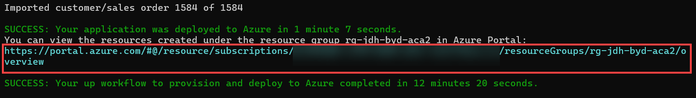
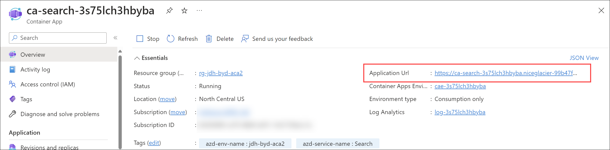
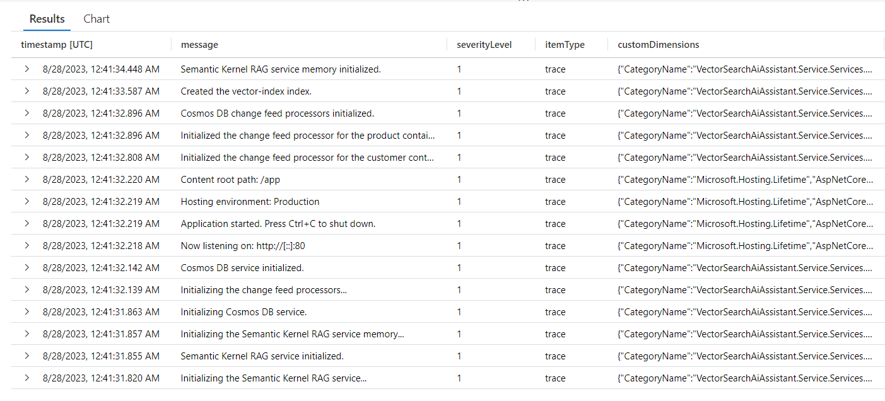
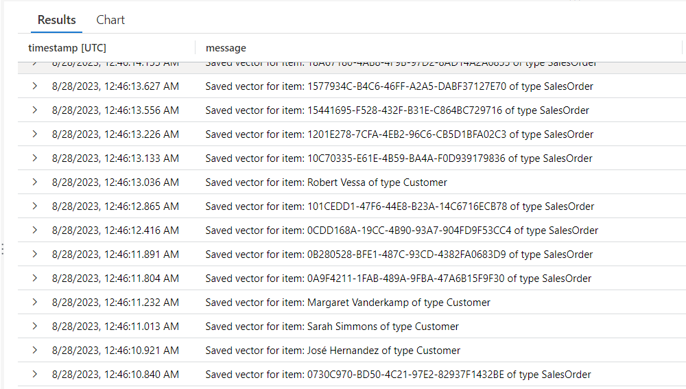
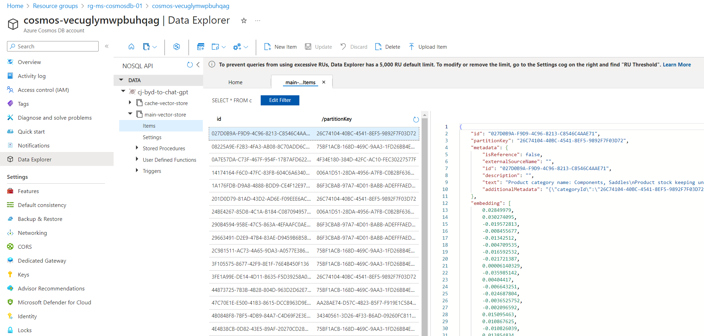

# Challenge 00 - Prerequisites - The Landing Before the Launch

**[Home](../README.md)** - [Next Challenge >](./Challenge-01.md)

## Introduction

Thank you for participating in the Build Your Own Copilot What The Hack. Over the next series of challenges you'll provision Azure resources, populate your Azure Cosmos DB database with initial data, create a vector index for the data, use Azure OpenAI models to ask questions about the data, and write some code. But before we get started, let's make sure we've got everything setup.

CosmicWorks has big plans for their retail site, but they need to start somewhere; they need a landing zone in Azure for all of their services. It will take a while to prepare their e-Commerce site to migrate to Azure, but they're eager to launch a POC of a simple chat interface where users can interact with a virtual agent to find product and account information.

They've created a simple ASP.NET Blazor web application for the UI elements and have asked you to to incorporate the backend plumbing to do the following:

- Store the chat history in an Azure Cosmos DB database
  - They expect the following types of messages: Session (for the chat session), Message (the user and assistant message).
  - A message should have a sender (Assistant or User), tokens (that indicates how many tokens were used), text (the text from the assistant or the user), rating (thumbs up or down) and vector (the vector embedding of the user's text).
- Source the customer and product data from the Azure Cosmos DB database.
- Use Azure OpenAI service to create vector embeddings and chat completions.
- Encapsulate the orchestration of interactions with OpenAI behind a back-end web service.
- Create a storage account to externalize prompts that will be used by your assistant.

For this challenge, you will deploy the services into the landing zone in preparation for the launch of the POC.

## Prerequisites

- [Azure Subscription](../../000-HowToHack/WTH-Common-Prerequisites.md#azure-subscription)
- Windows, MacOS, or Linux development machine on which you have **administrator rights**.

OR

- A GitHub account with access to [GitHub Codespaces](https://github.com/features/codespaces)

## Description

To complete this hack, you can set up the pre-requisite developer tools on your local workstation, or you can use GitHub Codespaces.

A GitHub Codespace is a development environment that is hosted in the cloud that you access via a browser. All of the pre-requisite developer tools are pre-installed and available in the codespace.

- [Setup GitHub Codespace](#setup-github-codespace)
- [Setup Local Workstation](#setup-local-workstation)

### Setup GitHub Codespace

You must have a GitHub account to use GitHub Codespaces. If you do not have a GitHub account, you can [Sign Up Here](https://github.com/signup)!

GitHub Codespaces is available for developers in every organization. All personal GitHub.com accounts include a monthly quota of free usage each month. GitHub will provide users in the Free plan 120 core hours, or 60 hours of run time on a 2 core codespace, plus 15 GB of storage each month.

You can see your balance of available codespace hours on the [GitHub billing page](https://github.com/settings/billing/summary).

- Your coach will provide you with a link to the Github Repo for this hack. Please open this link and sign in with your personal Github account.

**NOTE:** Make sure you do not sign in with your enterprise managed Github account.

- Once you are signed in, click on the green "Code" button. Then click on "Codespaces". Finally, hit "Create codespace on main".

Your Codespace environment should load in a new browser tab. It will take approximately 3-5 minutes the first time you create the codespace for it to load.

- When the codespace completes loading, you should find an instance of Visual Studio Code running in your browser with the files for the deploying the hackathon environment (within the `infra` folder) and the starter code (within the `src` folder).

**NOTE:** It is recommended to enable the suggested C# development extensions when prompted by VSCode after the environment fully loads.

### Setup Local Workstation

**NOTE:** If you are planning to use GitHub Codespaces, skip this section as all pre-reqs will be setup in the Codespace environment.

If you want to set up the developer environment on your local workstation, expand the section below and follow the requirements listed.

<details markdown=1>
<summary markdown="span"><strong>Click to expand/collapse Local Workstation Requirements</strong></summary>

Your coach will provide you with a Resources.zip file that contains resources you will need to complete the hack. If you plan to work locally, you should unpack it on your workstation. If you plan to use the Azure Cloud Shell, you should upload it to the Cloud Shell and unpack it there.

Please enable Azure OpenAI for your Azure subscription and install these additional tools:

- .NET 8 SDK
- Docker Desktop
- Azure CLI ([v2.51.0 or greater](https://docs.microsoft.com/cli/azure/install-azure-cli))
- Cross-platform (not Windows) PowerShell ([7.0 or greater](https://learn.microsoft.com/powershell/scripting/install/installing-powershell))
- Visual Studio 2022 or VS Code
- [Azure Developer CLI](https://learn.microsoft.com/azure/developer/azure-developer-cli/install-azd)
- [VS Code TODO Extension](https://marketplace.visualstudio.com/items?itemName=Gruntfuggly.todo-tree)

</details>
<br/>

### Deploy Azure Resources

Follow the steps below to deploy the solution to your Azure subscription.

> [!NOTE]
> Free Azure Trial does not have sufficient quota for Azure OpenAI to run this hackathon successfully and cannot be used.

> [!NOTE]
> Installation requires the choice of an Azure Region. Make sure to set region you select which is used in the `<location>` value below supports Azure OpenAI services. See [Azure OpenAI service regions](https://azure.microsoft.com/explore/global-infrastructure/products-by-region/?products=cognitive-services&regions=all) for more information.

> [!NOTE]
> This hackathon requires quota for Azure OpenAI models. To avoid capacity or quota issues, it is recommended before arriving for the hackathon, you deploy both `GPT-4o` and `text-embedding-3-large` models with **at least 10K token capacity** into the subscription you will use for this hackathon. You may delete these models after creating them. This step is to ensure your subscription has sufficient capacity. If it does not, see [How to increase Azure OpenAI quotas and limits](https://learn.microsoft.com/azure/ai-services/openai/quotas-limits#how-to-request-increases-to-the-default-quotas-and-limits)

1. Check to make sure you have the `Owner` role for the subscription assigned to your account.

> [!IMPORTANT]
> **Before continuing**, make sure have enough Tokens Per Minute (TPM) in thousands quota available in your subscription. By default, the script will attempt to set a value of 10K for each deployment. In case you need to change this value, you can edit the `params.deployments.sku.capacity` values (lines 161 and 172 in the `infra\aca\infra\main.bicep` file for **ACA** deployments, or lines 150 and 161 in the `infra\aks\infra\main.bicep` file for **AKS** deployments).

2. Run the following script to provision the infrastructure and deploy the API and frontend. This will provision all of the required infrastructure, deploy the API and web app services into Azure Container Apps and import data into Azure Cosmos DB.

    This script will deploy all services including a new Azure OpenAI account using Azure Container Apps. (This can be a good option for users not familiar with AKS)

    ```pwsh
    cd ./infra/aca
    azd up
    ```

    You will be prompted for the target subscription, location, and desired environment name. The target resource group will be `rg-` followed by the environment name (i.e. `rg-my-aca-deploy`)

    To validate the deployment to ACA run the following script:

    > ```pwsh
    >  az containerapp show -n <aca-name> -g <resource-group-name>
    >  ```

    After running `azd up` on the **ACA** deployment and the deployment finishes, you can locate the URL of the web application by navigating to the deployed resource group in the Azure portal. Click on the link to the new resource group in the output of the script to open the Azure portal.
    
    
    
    In the resource group, you will see the `ca-search-xxxx` Azure Container Apps service.
    
    
    
    Select the service to open it, then select the `Application Url` to open the web application in your browser.
    
    

> [!IMPORTANT]
> If you encounter any errors during the deployment, rerun `azd up` to continue the deployment from where it left off. This will not create duplicate resources, and tends to resolve most issues.

### Setup RBAC Permissions When Running In Your Development Environment

When you run the solution in your development environment (GitHub Codespace or Local Workstation), you will need to set role-based access control (RBAC) permissions on the Azure Cosmos DB account. You can do this by running the following command in the Azure Cloud Shell or Azure CLI:

Assign yourself to the "Cosmos DB Built-in Data Contributor" role:

```bash
az cosmosdb sql role assignment create --account-name YOUR_COSMOS_DB_ACCOUNT_NAME --resource-group YOUR_RESOURCE_GROUP_NAME --scope "/" --principal-id YOUR_AZURE_AD_PRINCIPAL_ID --role-definition-id 00000000-0000-0000-0000-000000000002
```

### Deployment Validation

Use the steps below to validate that the solution was deployed successfully.

Once the deployment script completes, the Application Insights `traces` query should display the following sequence of events:



Next, you should be able to see multiple entries referring to the vectorization of the data that was imported into Cosmos DB:



Finally, you should be able to see the Azure Cosmos DB vector store collection being populated with the vectorized data:



> [!NOTE]
> It takes several minutes until all imported data is vectorized and indexed.

## Success Criteria

To complete this challenge successfully, you should be able to:

- Verify that all services have been deployed successfully.
- Verify that you have a new Azure Cosmos DB workspace with the NoSQL API. It should have a database named `vsai-database` and containers named `completions` with a partition key of `/sessionId`, `customer` with a partition key of `/customerId`, `embedding` with a partition key of `/id`, `product` with a partition key of `/categoryId`, and `leases` with a partition key of `/id`.
