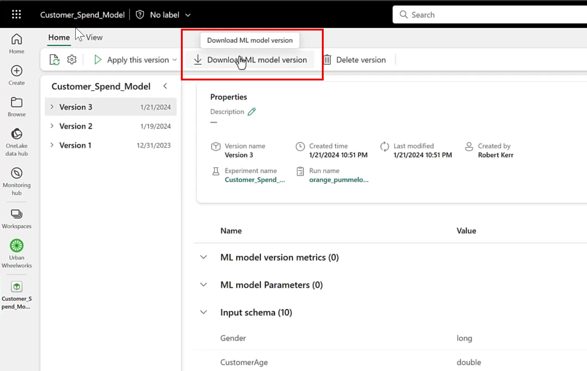
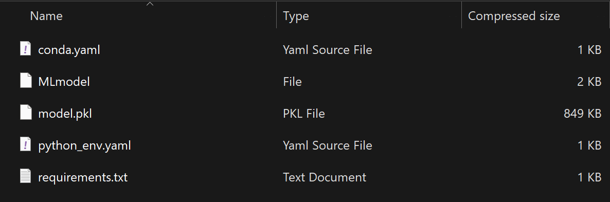
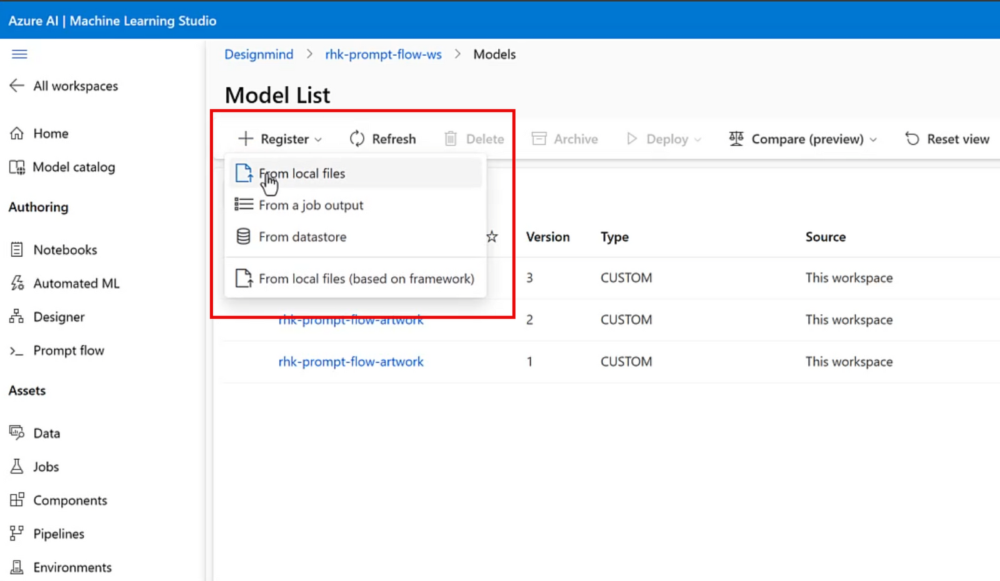
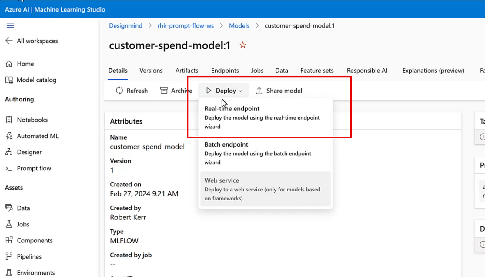
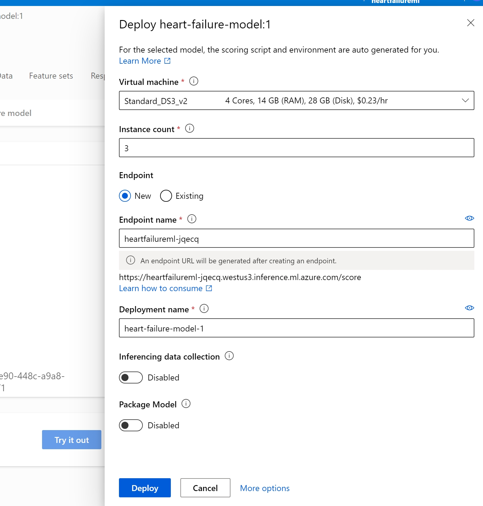
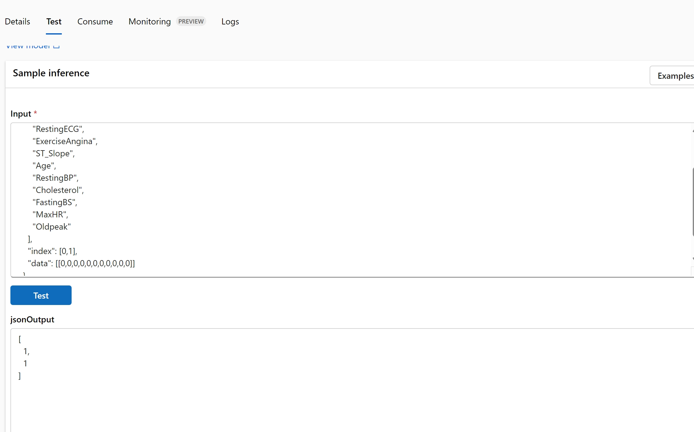
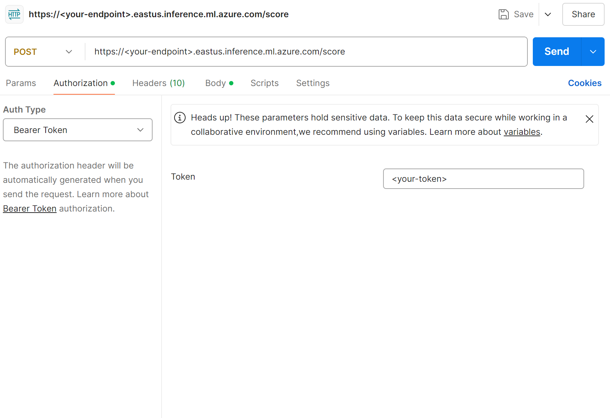
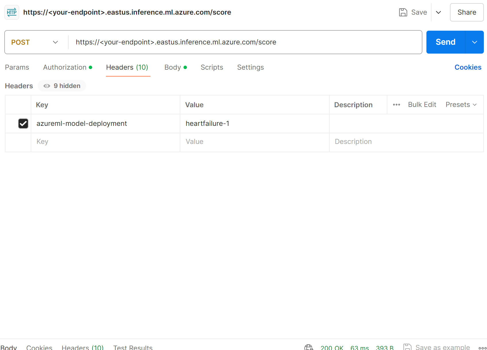
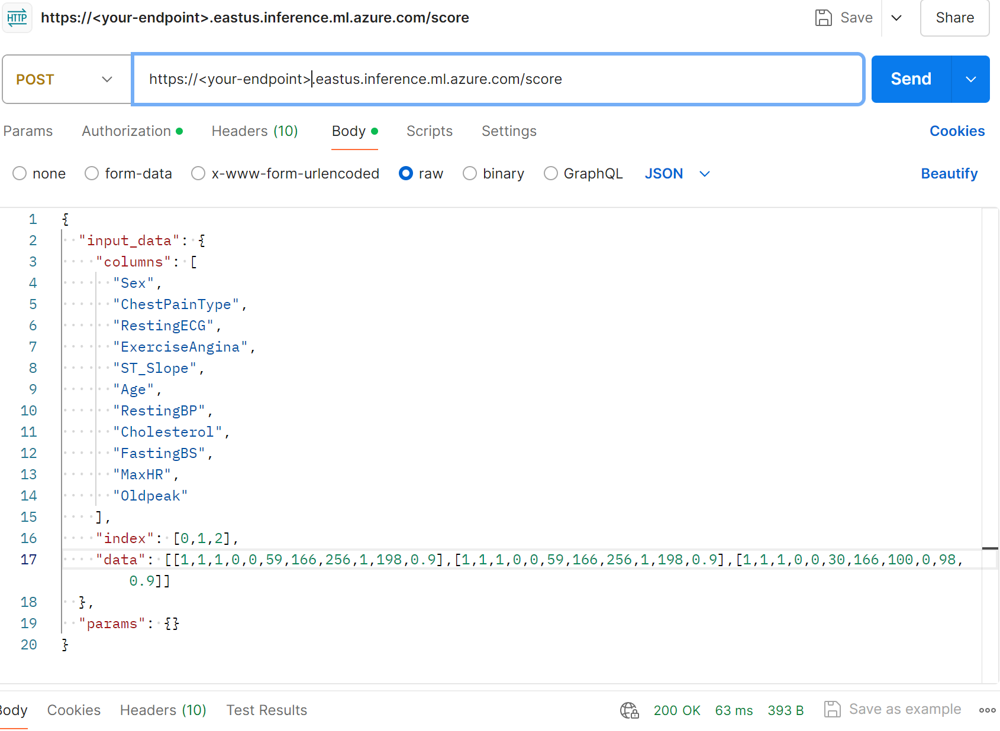

# Challenge 06 - (Optional) Deploy the model to an AzureML real-time endpoint - Coach's Guide 

[< Previous Solution](./Solution-05.md) - **[Home](./README.md)** - [Next Solution >](./Solution-07.md)

## Notes & Guidance

### Sections
- Download the ml model from the Fabric workspace
- Upload the model to a real-time inference endpoint on azure machine learning studio
- Using postman, send sample data to it to test it out.

### Student step-by-step instructions

- Go to your data science workspace where all the notebooks are stored.
- That workspace will have the ml model which you created in previous challenge
- Exporting a model from Fabric is easy--just tap the Download ML model version button in the UI.

- Fabric will combine the ML Model along with a Python Object Serialization file (a/k/a pickle file) having a `.pkl` extension, and YAML files (.yml) that describe to other platforms the structure and interface provided by the model. All these files are packaged into a .zip file, which will be placed in your Downloads folder.
- If you open the .zip file, you can review the model and metadata files before deploying them to other systems. Make sure you extract the folder before continuing, as you will not be able to upload a .zip file.
  
**NOTE**: due to some compatibility issues with MLFlow and Azure Machine Learning, you will need to modify some files locally before uploading your model to Azure Machine Learning. Once you have downloaded your model from Fabric, unzip the folder and open both the `conda.yaml` and `requirements.txt` files. Change the MLFlow version on both files to `2.7.0`. Save and close both files.
- After downloading the model, we have to deploy an Azure ML real-time inference endpoint to publish the model to the Internet via a RESTful web service.
- Navigate to your Azure Portal. Open the Azure Machine Learning workspace you previously deployed with the script in Challenge 0.
- Using the left menu in your workspace, navigate to **Assets**>**Models**.
- Register the model in the Azure ML workspace, and use the Azure ML Studio web UI to deploy the endpoint.
- To upload the model, use the **Register**/**From local files** menu in the Model List we navigated to (top left of the screen).
  

- On the upload model wizard, make sure you select MLFlow as your model type and upload the unzipped folder. Give a name and version in the next settings screen.
- After uploading the files, the new model is available in the Models page of the Azure ML Workspace. 
- Once the model is registered in the Azure ML workspace, click on the model name, and then select Real-time endpoint from the Deploy menu.
  
  
- A menu opens up to configure the compute to use for the endpoint, and to specify the deployment name.
- Specify the compute size desired for the endpoint, and the names for the endpoint and deployment, then tap the Deploy button.
  

- After the deployment completes (10-15 minutes, typically), make a quick "smoke test" within Azure ML Studio to ensure the deployment is functional, and we're using the correct data structures when calling it.
- The index denotes how many groups of inputs are being sent to receive predictions. If you want to send a single set of inputs, use 0 as index.
- The data is your 11 inputs, in the order that you can see in the columns list. Make sure you send your inputs in a list within the existing list, such as shown in the screenshot below. 
  
- Once the interactive test succeeds, it's time to move on to consume the model from outside the Azure ML environment.
- The consume tab in the endpoint menu shows the endpoint url, keys and headers (in the code example) to make an API call. You can find the Body in the code example, or you can copy it from the test tab. Use POST as your method to get the prediction.
-  Use postman to send data to deployed model endpoints to test the model. Follow the 3 following screenshots to configure your postman call.
 
 
 

### Coaches' guidance

- **This challenge should be treated as optional**. This challenge goes beyond the scope of Microsoft Fabric to illustrate the next step to rendering an ML model trained in Fabric operational beyond analytics/reporting.
- This is an elaborate challenge that requires switching from Fabric to Azure. Documentation has been provided to students so that they can reference some of the actions needed.
- The goal is for students to understand the difference between Fabric Data Science and Azure ML studio. As a secondary objective, students should familiarize themselves with real-time endpoints in Azure ML and on how to send API requests.
- Coaches can provide guidance if students can't figure out the next step, but they should help students understand the process, not only getting to the end.
- When deploying the endpoint, there is no specific requirements for what type of compute to use. It is recommended to use the cheapest available and to ensure that students delete it after completing the hack to avoid incurring additional costs.

## Success criteria

- The real-time endpoint has been deployed on Azure ML and students are able to submit API calls to it.

