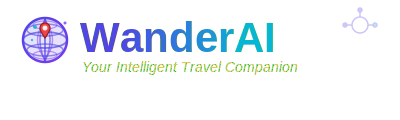

# What The Hack - Agent Framework Observability With New Relic

## Introduction

### Welcome to the Hack

You've just founded 🚀 **WanderAI**, an exciting new travel planning startup! 🌍✈️ 

Your mission: Build an **AI-powered travel planning assistant** that helps your customers discover amazing destinations and create personalized itineraries. But here's the catch—your investors want to see that your AI agents are **reliable, observable, and trustworthy**.

This hack is your journey from "cool prototype" to "production-ready AI service."

---

### 📖 The Story

Your startup's CTO (that's you!) has been tasked with building the **AI Travel Planner** service that will power WanderAI's platform. Your customers will use a web interface to describe their travel preferences, and your AI agents will craft perfect itineraries.

But you can't just ship magic. Your investors, your operations team, and your customers all need **visibility** into how these AI agents work:

- 🔍 **Are the agents making good recommendations?**
- ⚡ **How fast are they responding?**
- 🚨 **When something goes wrong, can we debug it?**
- ✅ **Are the plans actually good?**

This hack walks you through building the platform layer by layer, adding observability at each step.

1. 🌱 Learn the Foundation: "What makes an AI agent tick?"
    - Understand Microsoft Agent Framework concepts
    - Learn about tools, agents, and multi-agent orchestration

2. 🏗️ Build Your MVP: "Ship the first version of WanderAI!"
    - Create a Flask web app for travel planning
    - Build your first AI agent with tool calling
    - Get customer requests flowing through the system

3. 📊 Add Observability: "Can you see what's happening?"
    - Initialize built-in OpenTelemetry
    - Verify traces and metrics in the console
    - Send the same built-in telemetry to New Relic

4. 🧩 Custom Telemetry: "Add your own signals."
    - Add custom spans for tools and routes
    - Record custom metrics for business logic
    - Correlate logs with trace context in New Relic

5. 🎯 Optimize for Production: "Make it fast, reliable, and insightful."
    - Implement monitoring best practices
    - Build custom dashboards for your agents
    - Detect and alert on problems
    - Analyze AI response quality

6. 🧪 Quality Assurance for AI: "Prove your agents are trustworthy."
    - Build evaluation tests for your agents
    - Create a CI/CD quality gate
    - Ensure bad outputs never reach customers
    - Measure and improve AI quality over time

7. 🛡️ Platform Security Baseline: "Configure guardrails first."

    - Configure Microsoft Foundry Guardrails
    - Validate intervention points and risk actions
    - Monitor platform-level security outcomes

8. 🔐 Application Security Controls: "Defend in your code."

    - Add app-level prompt injection detection
    - Enforce blocking in request flow
    - Instrument and validate custom security controls

By the end of this hack, you'll have a fully instrumented AI agent system with production-level observability and security controls. You'll be ready to show your investors that WanderAI isn't just a cool demo—it's a robust, trustworthy service ready for the real world.

## Learning Objectives

🎓 What You'll Learn ... by completing this hack, you'll master:

1. ✅ AI Agent Architecture - How to structure AI systems for real-world use
2. ✅ Microsoft Agent Framework - Building multi-agent orchestrations
3. ✅ OpenTelemetry - Comprehensive observability instrumentation
4. ✅ New Relic Integration - Sending and analyzing observability data
5. ✅ Production Monitoring - Best practices for AI systems
6. ✅ AI Quality Assurance - Evaluating and gating AI outputs
7. ✅ Security and Trust - Protecting against prompt injection and ensuring agent reliability
8. ✅ Full Stack AI - From prototype to production-ready service

## Challenges

- Challenge 00: **[Prerequisites - Ready, Set, GO!](Student/Challenge-00.md)**
  - Prepare your environment in GitHub Codespaces.
- Challenge 01: **[Master the Foundations](Student/Challenge-01.md)**
  - Read & understand
- Challenge 02: **[Build Your MVP](Student/Challenge-02.md)**
  - Create basic agent + Flask web app
- Challenge 03: **[Add OpenTelemetry Instrumentation](Student/Challenge-03.md)**
  - Built-in telemetry to console and New Relic
- Challenge 04: **[New Relic Integration](Student/Challenge-04.md)**
  - Custom spans/metrics/logging in New Relic
- Challenge 05: **[Monitoring Best Practices](Student/Challenge-05.md)**
  - Learn industry best practices for monitoring AI-driven applications.
- Challenge 06: **[LLM Evaluation & Quality Gates](Student/Challenge-06.md)**
  - Ensure excellence
- Challenge 07: **[AI Security: Platform-Level Guardrails](Student/Challenge-07.md)**
  - Configure and validate Foundry Guardrails
- Challenge 08: **[AI Security: Application-Level Prompt Injection Controls](Student/Challenge-08.md)**
  - Build custom detection and blocking in `web_app.py`
  
🎉 Launch WanderAI! 🎉

## Prerequisites

- Your own Azure subscription with **owner** access. See considerations below for additional guidance.
- A GitHub Enterprise account if using internal repositories, or a standard GitHub account if using public repositories.
- Basic knowledge of Python and web development.
- Familiarity with AI concepts and large language models (LLMs) is helpful but not required.

## Estimated Time to Complete

Approximately 3-5 hours, depending on your familiarity with the technologies involved.

## Contributors

- [Harry Kimpel (New Relic)](https://github.com/harrykimpel)
