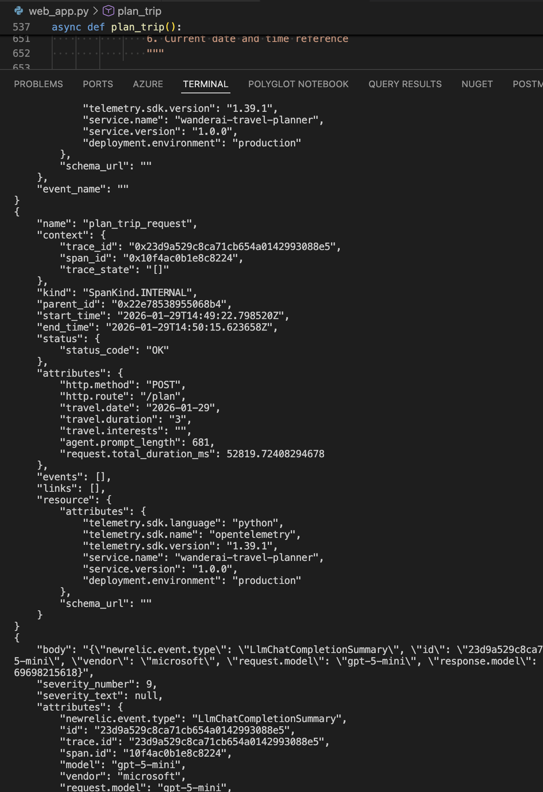
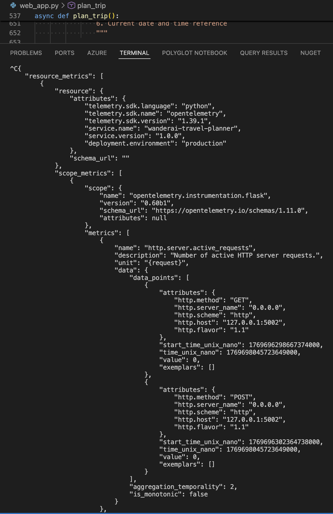
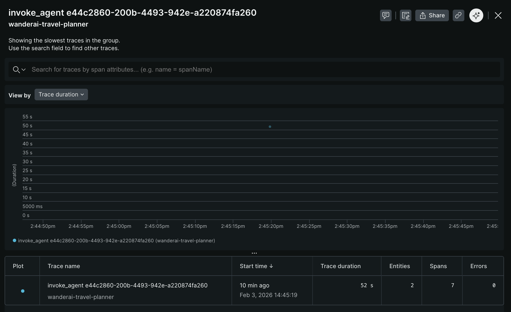
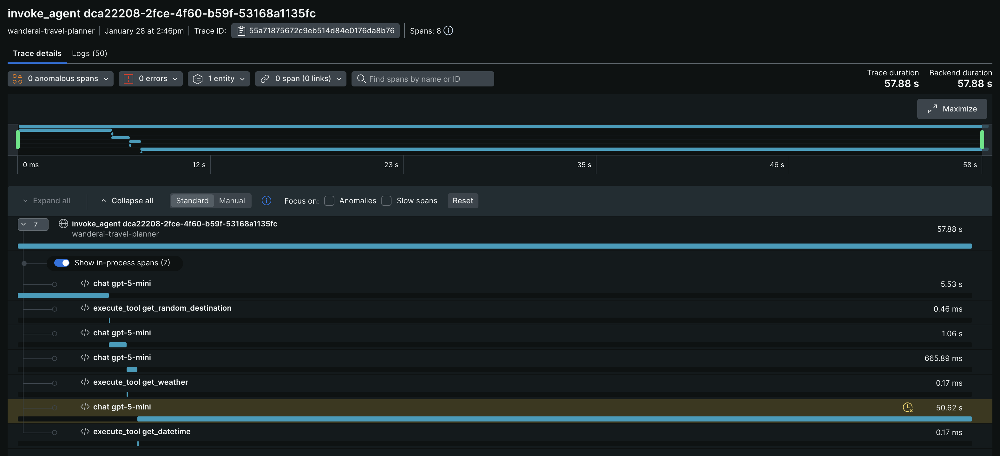
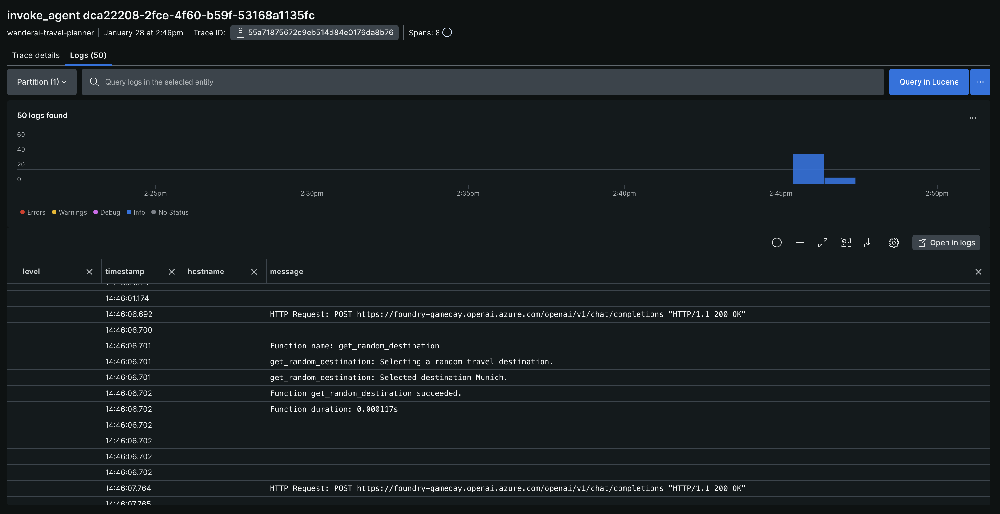
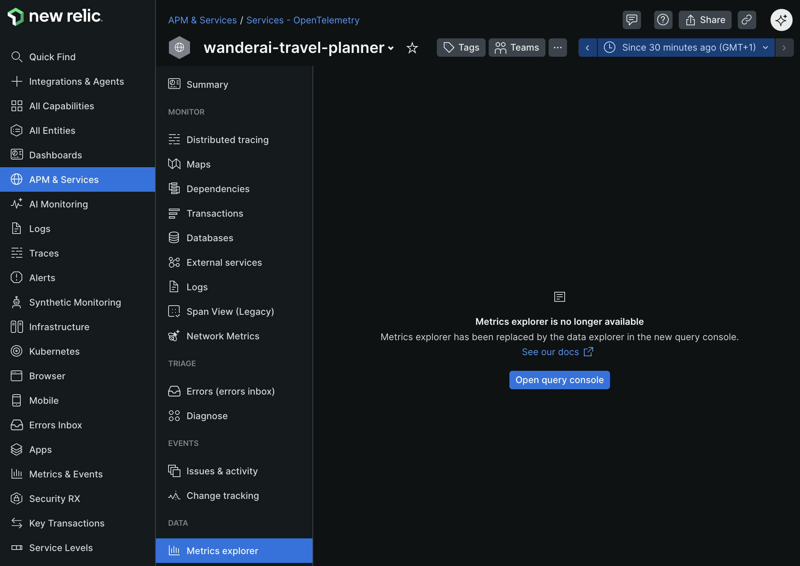
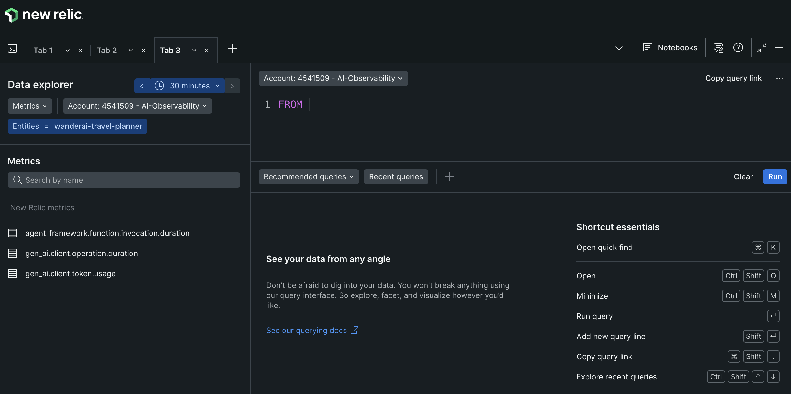

# Challenge 03 - Add OpenTelemetry Instrumentation

[< Previous Challenge](./Challenge-02.md) - **[Home](../README.md)** - [Next Challenge >](./Challenge-04.md)

## Introduction

Now that you have a working MVP, it's time to add observability to your WanderAI agents using [OpenTelemetry](https://opentelemetry.io/). Right now, if something goes wrong with your agent, you have no visibility into which tool was called, how long operations take, or how to correlate logs to specific requests.

OpenTelemetry is the industry standard for observability in modern applications. By instrumenting your application, you'll be able to see traces showing the full journey of each request, capture timing information, and add structured context to your logs.

Microsoft Agent Framework already integrates with OpenTelemetry out of the box, and more specifically Agent Framework emits traces, logs, and metrics according to the [OpenTelemetry GenAI Semantic Conventions](https://opentelemetry.io/docs/specs/semconv/gen-ai/).

In this challenge, you will initialize OpenTelemetry, verify telemetry in the **console**, and then confirm the **same telemetry in New Relic** before moving on to custom instrumentation in the next challenge.

## Description

Your goal is to add basic OpenTelemetry instrumentation to your travel planning application and validate the results:

- **Initialize OpenTelemetry** - Set up the tracer provider and configure resource attributes to identify your service
- **Verify Console Telemetry** - Confirm traces and metrics show up in your terminal
- **Send Telemetry to New Relic** - Switch exporters to OTLP and confirm the same signals in New Relic

### What You're Adding

**OpenTelemetry Initialization:**

- Set up the observability framework using the Agent Framework's built-in helper
- Focus on the recommended section first (console exporter), then move to OTLP for New Relic

Refer to the [Agent Framework Observability Guide](https://learn.microsoft.com/en-us/agent-framework/user-guide/observability?pivots=programming-language-python) for details on initialization. It is recommended to start the simplest approach first, such as console exporter.

Once you updated your application to successfully emit traces to the **console** (hint: this should only include adding two lines of code to your app), start your app again and evaluate the console output.

Run the Flask app with the `run.sh` command. Then submit a travel request through the web UI. You should see traces being printed in the console output.

If everything is set up correctly, when you run your Flask app and submit a travel request, you should see detailed traces in the console output and in New Relic, including tool calls and route handling.

After some time, you should also see some metrics appear in the console.

If you see traces and logs being emitted there, proceed to send the same telemetry to New Relic.

**Send the same telemetry to New Relic:**

- Switch your exporters from **console** to **OTLP**
- Set the required environment variables for New Relic (OTLP endpoint + header API key)
- Re-run the app and make another travel request
- Verify the same traces and metrics appear in New Relic

> Note: You’re still using **built-in** Agent Framework OpenTelemetry here — no manual spans or other custom instrumentation yet.

If everything is set up correctly, when you run your Flask app and submit a travel request, you should see detailed traces in New Relic showing the full journey of the request, including tool calls and route handling.

Verify that your app appears in [New Relic](https://one.newrelic.com/) (it can take a few minutes for data to appear) as an entity within the `APM & Services` / `Services - OpenTelemetry` section. The name of the entity should match the `OTEL_SERVICE_NAME` you set in the `.env` file. Dig into `Distributed tracing` section and look for traces generated by your application. You should see a trace group with a name like `invoke_agent xxx`.

Click into the trace group to see all the individual traces for that group.

Investigate and observe the details of a single trace.

At trace level, you can also see logs associated with each span, which provides additional context for debugging and analysis.

After some time, you should also see some metrics appear in New Relic. While you are still looking at the `APM & Services` / `Services - OpenTelemetry` section and have your WanderAI entity open, navigate to the `Metrics explorer` sub-menu to see the collected metrics.

From here, click on the `Open query console` button to show all of the metrics that are currently being collected.

**Sensitive Data Logging (Optional):**

If you are curious, Agent Framework also allows you to configure logging of sensitive data (prompts, responses, function call arguments, and results). This will log sensitive data to the console and/or New Relic along with the traces. Be cautious when enabling this in production environments.

## Success Criteria

To complete this challenge successfully, you should be able to:

- [ ] Verify that OpenTelemetry SDK is initialized in your application
- [ ] Demonstrate that traces appear in the console when you make requests
- [ ] Validate that traces and metrics appear in New Relic using the OTLP exporter

## Learning Resources

- [Microsoft Agent Framework Observability](https://learn.microsoft.com/en-us/agent-framework/user-guide/observability?pivots=programming-language-python)
- [OpenTelemetry Concepts](https://opentelemetry.io/docs/concepts/)
- [OpenTelemetry Python Documentation](https://opentelemetry.io/docs/instrumentation/python/)
- [OpenTelemetry Python API - Tracing](https://opentelemetry.io/docs/instrumentation/python/manual/)
- [OTLP Protocol](https://opentelemetry.io/docs/specs/otel/protocol/)

## Tips

- Start small - Verify console telemetry first
- Check the console - Traces should print when requests complete
- Verify in New Relic - You should see the same traces and metrics
- Test without the agent first - Make sure basic Flask routes work before adding agent complexity
- The Agent Framework provides a helper function named `configure_otel_providers()` that simplifies setup
