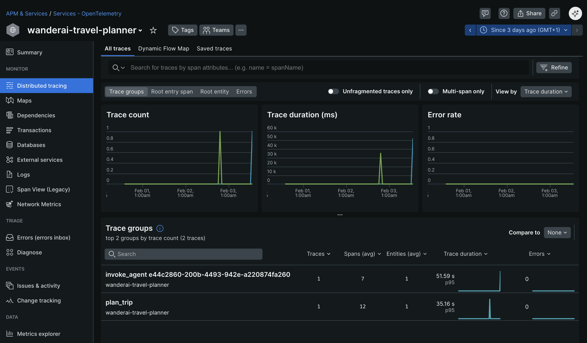
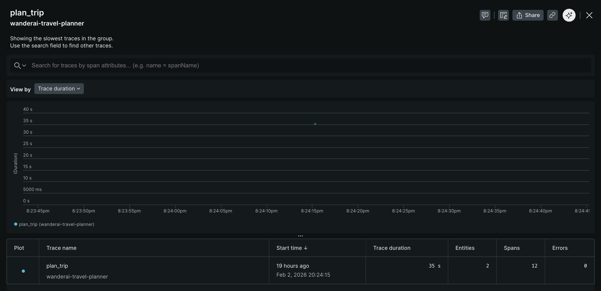
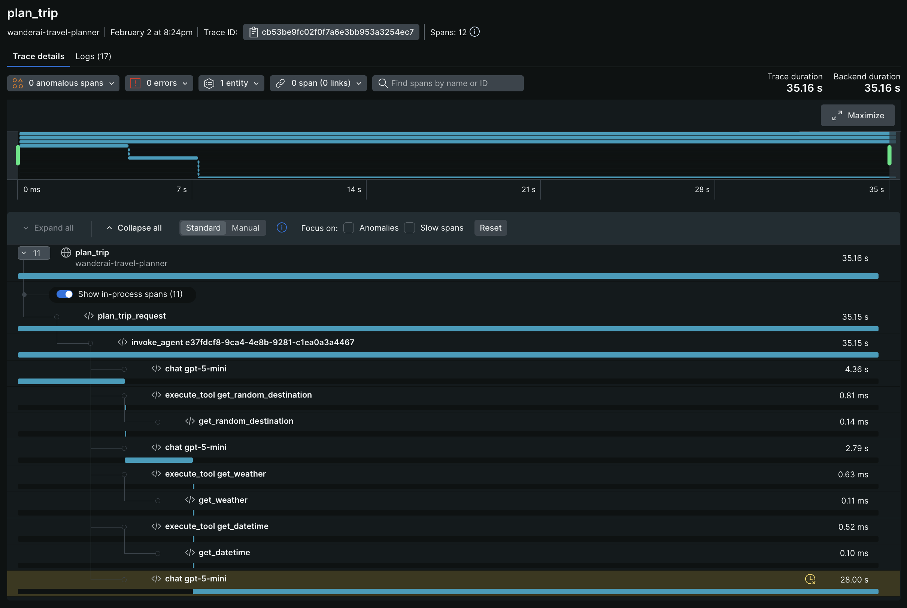

# Challenge 04 - Custom Instrumentation with OpenTelemetry

[< Previous Challenge](./Challenge-03.md) - **[Home](../README.md)** - [Next Challenge >](./Challenge-05.md)

## Introduction

In Challenge 03, you verified that the Agent Framework automatically generates traces and metrics for your AI agent operations. Now it's time to add **custom instrumentation** to capture application-specific insights.

Custom instrumentation allows you to:

- Create spans for specific business operations (e.g., "plan_trip", "validate_itinerary")
- Record custom metrics (e.g., number of destinations, planning duration)
- Add structured logging context for better debugging
- Correlate application events with AI agent activities

By the end of this challenge, you'll have visibility into both the automatic Agent Framework telemetry **and** your custom business logic, all flowing to New Relic.

## Description

Your goal is to add custom spans, metrics, and structured logging to your travel planning application:

- **Add Custom Spans** - Instrument tool calls and business logic with manual spans
- **Add Custom Metrics** - Record meaningful measurements (trip planning duration, destination counts, etc.)
- **Add Structured Logging** - Correlate logs with spans using trace context
- **Verify in New Relic** - Confirm custom telemetry appears alongside auto-generated signals

### What You're Adding

**Tool Instrumentation:**

By leveraging the above approach you will notice that the Agent Framework automatically instruments tool calls. However, to get more detailed insights, you will manually add spans around each tool function:

- Get a tracer for creating spans
- Wrap each tool function (`get_random_destination`, `get_weather`, `get_datetime`) with `tracer.start_as_current_span()` to create custom spans
- Add relevant attributes to spans (e.g., location, destination)
- Log information within the span context

**Route Instrumentation:**

Instrument your Flask routes to capture the full request lifecycle. Add spans for request handling, data validation, and response preparation.

- Wrap the /plan route handler with a span
- Add request-specific attributes (destination, duration, etc.)
- Handle errors and mark spans appropriately

**Logging Configuration:**

Configure structured logging that automatically includes trace context. This allows you to correlate logs with specific spans in New Relic, making it easier to debug issues.

Example: When a user requests a trip plan, you should see:

1. An auto-generated Agent Framework span for the agent orchestration
2. Custom spans for each tool call
3. Custom spans for business logic (validation, filtering)
4. Logs with trace context attached to relevant spans

## Success Criteria

To complete this challenge successfully, you should be able to:

- [ ] Add custom spans around tool implementations
- [ ] Add custom spans around Flask routes
- [ ] Configure structured logging with trace context
- [ ] Verify custom spans appear in New Relic traces
- [ ] Verify custom metrics appear in New Relic
- [ ] Correlate logs to spans in New Relic using trace context

When you submit a travel request, you should see a complete trace in New Relic showing:

- Auto-generated Agent Framework spans
- Custom spans for tools and routes
- Logs correlated with spans
- Custom metrics displayed alongside auto-generated metrics

Restart your app again and execute a generate request for a travel plan. Verify that your app appears in [New Relic](https://one.newrelic.com/) (it can take a few minutes for additional data to appear) as an entity within the `Services - OpenTelemetry` section. The name of the entity should match the OTEL_SERVICE_NAME you set in the `.env` file. Dig into `Distributed tracing` section and look for traces generated by your application. You should see an additional trace group with a name like `plan_trip` (or similar if you used a different name in for the custom span).

Click into the trace group to see all the individual traces for that group.

Investigate and observe the details of a single trace.

## Learning Resources

- [Microsoft Agent Framework Observability](https://learn.microsoft.com/en-us/agent-framework/user-guide/observability?pivots=programming-language-python)
- [OpenTelemetry Python Manual Instrumentation](https://opentelemetry.io/docs/instrumentation/python/manual/)
- [OpenTelemetry Spans](https://opentelemetry.io/docs/concepts/signals/traces/#spans)
- [OpenTelemetry Metrics](https://opentelemetry.io/docs/concepts/signals/metrics/)
- [New Relic Distributed Tracing](https://docs.newrelic.com/docs/distributed-tracing/concepts/introduction-distributed-tracing/)
- [New Relic Log Management](https://docs.newrelic.com/docs/logs/get-started/get-started-log-management/)

## Tips

- Use `get_tracer()` and `get_meter()` from Agent Framework for consistency
- Add spans at logical boundaries (function entry/exit)
- Use span attributes to capture relevant context (destination names, flight prices, etc.)
- Structure logs as JSON for easier parsing in New Relic
- Test custom spans in the console before switching to New Relic OTLP
- Use span status to indicate success/failure of operations
- Correlate logs with spans using trace IDs automatically provided by OpenTelemetry
