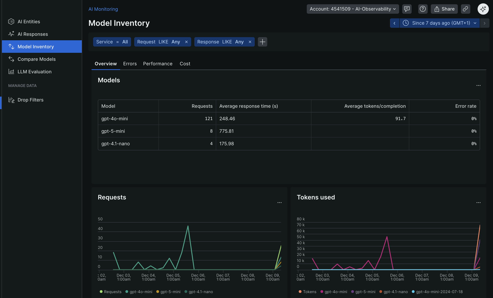
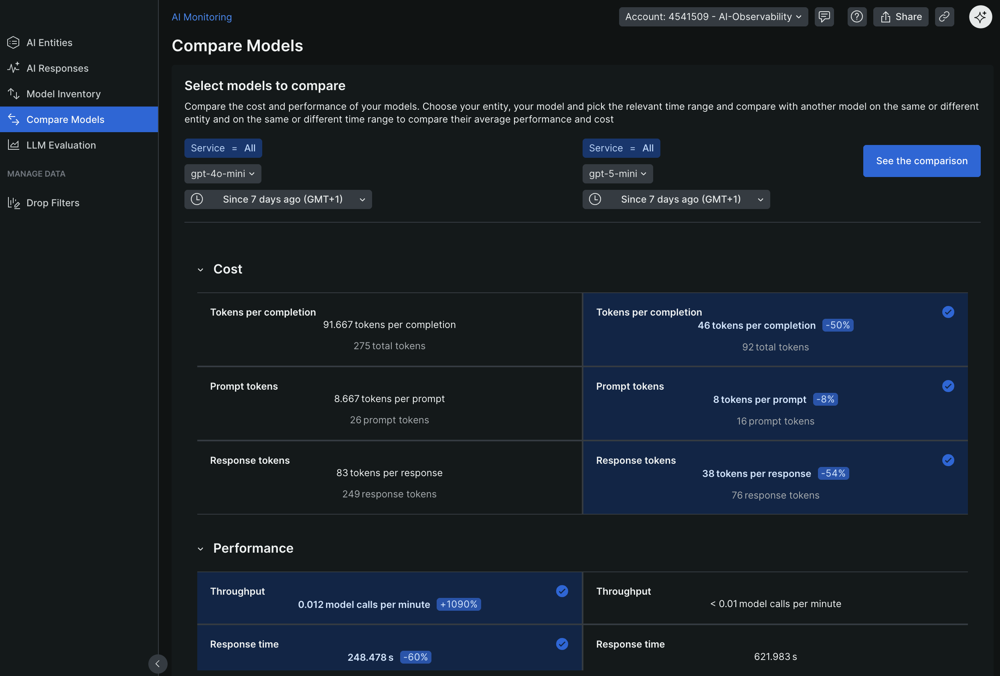
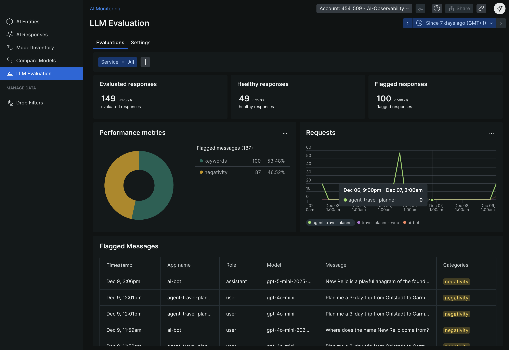
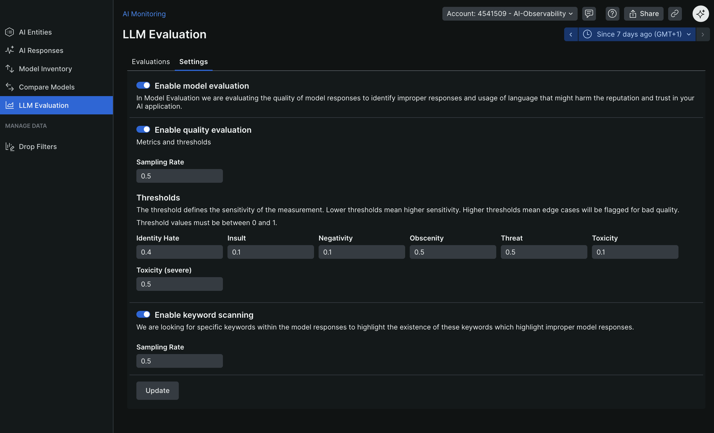
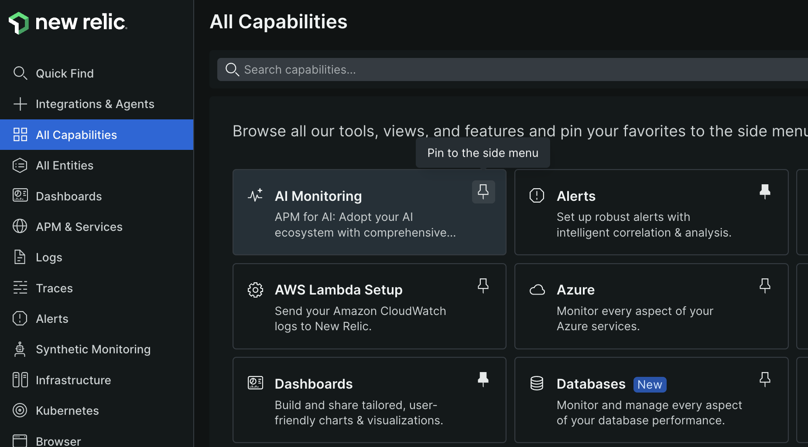

# Challenge 06 - LLM Evaluation and Quality Gates

[< Previous Challenge](./Challenge-05.md) - **[Home](../README.md)** - [Next Challenge >](./Challenge-07.md)

## Introduction

You can't just ship AI without testing. What if the agent returns a non-existent destination? What if the itinerary is way too long or short? What if recommendations are unsafe (war zones, extreme weather)? What if the response includes toxicity or negativity?

In this challenge, you'll build an automated quality gate for your AI agents using New Relic's AI Monitoring platform. Quality gates ensure that only high-quality travel plans reach your customers.

## Description

Your goal is to implement a comprehensive evaluation and quality assurance system for your AI-generated travel plans. This involves several layers of evaluation working together.

### Layer 1: Custom Events for New Relic AI Monitoring

OpenTelemetry defines an [Event](https://github.com/open-telemetry/opentelemetry-specification/blob/main/specification/logs/data-model.md#events) as a `LogRecord` with a non-empty [`EventName`](https://github.com/open-telemetry/opentelemetry-specification/blob/main/specification/logs/data-model.md#field-eventname). [Custom Events](https://docs.newrelic.com/docs/data-apis/custom-data/custom-events/report-custom-event-data/) are a core signal in the New Relic platform. However, despite using the same name, OpenTelemetry Events and New Relic Custom Events are not identical concepts:

- OpenTelemetry `EventName`s do not share the same format or [semantics](https://github.com/open-telemetry/semantic-conventions/blob/main/docs/general/events.md) as Custom Event types. OpenTelemetry Event names are fully qualified with a namespace and follow lower snake case, e.g. `com.acme.my_event`. Custom Event types are pascal case, e.g. `MyEvent`.
- OpenTelemetry Events can be thought of as an enhanced structured log. Like structured logs, their data is encoded in key-value pairs rather than free form text. In addition, the `EventName` acts as an unambiguous signal of the class / type of event which occurred. Custom Events are treated as an entirely new event type, accessible via NRQL with `SELECT * FROM MyEvent`.

Because of these differences, OpenTelemetry Events are ingested as New Relic `Logs` since most of the time, OpenTelemetry Events are closer in similarity to New Relic `Logs` than New Relic Custom Events.

However, you can explicitly signal that an OpenTelemetry `LogRecord` should be ingested as a Custom Event by adding an entry to `LogRecord.attributes` following the form: `newrelic.event.type=<EventType>`.

For example, a `LogRecord` with attribute `newrelic.event.type=MyEvent` will be ingested as a Custom Event with `type=MyEvent`, and accessible via NRQL with: `SELECT * FROM MyEvent`.

The foundation of enterprise AI evaluation is capturing AI interactions as structured events. New Relic's AI Monitoring uses a special attribute `newrelic.event.type` that automatically populates:

- **Model Inventory** - Track every LLM and version used
    [New Relic Model Inventory](https://docs.newrelic.com/docs/ai-monitoring/explore-ai-data/view-model-data/#model-inventory)
    
- **Model Comparison** - Compare quality across models
    [New Relic Model Comparison](https://docs.newrelic.com/docs/ai-monitoring/explore-ai-data/compare-model-performance/)
    
- **Quality Evaluation** - Detect issues like toxicity and safety concerns
    [New Relic LLM Evaluation](https://docs.newrelic.com/docs/ai-monitoring/explore-ai-data/view-model-data/#llm-evaluation)
    

    
- **Insights Dashboards** - See AI behavior and trends

You need to emit three custom events after each LLM interaction:

- **`LlmChatCompletionMessage`** for the user prompt (role: "user", sequence: 0)
  - `newrelic.event.type` - `LlmChatCompletionMessage`,
  - `appName` - Service name
  - `duration` - duration of the interaction
  - `host` - hostname of the service
  - `id` - user ID (if available)
  - `request_id` - unique ID for the request (e.g., UUID)
  - `span_id` - OpenTelemetry span ID for trace correlation
  - `trace_id` - Links feedback to the specific AI interaction
  - `response.model` - model used for the response
  - `token_count` - number of tokens in the prompt
  - `vendor` - LLM vendor used (e.g., "openai", "azure", "anthropic")
  - `ingest_source` - "Python" (or your language of choice)
  - `content` - the user prompt text
  - `role` - "user" for the prompt
  - `sequence` - 0 for user prompt
  - `is_response` - boolean indicating if this event is a user prompt (False) or an LLM response (True)
  - `completion_id` - unique ID for the LLM completion (e.g., UUID)
  - `user_id` (optional) - If available
- **`LlmChatCompletionMessage`** for the LLM response (role: "assistant", sequence: 1)
  - `newrelic.event.type` - `LlmChatCompletionMessage`,
  - `appName` - Service name
  - `duration` - duration of the interaction
  - `host` - hostname of the service
  - `id` - user ID (if available)
  - `request_id` - unique ID for the request (e.g., UUID)
  - `span_id` - OpenTelemetry span ID for trace correlation
  - `trace_id` - Links feedback to the specific AI interaction
  - `response.model` - model used for the response
  - `token_count` - number of tokens in the response
  - `vendor` - LLM vendor used (e.g., "openai", "azure", "anthropic")
  - `ingest_source` - "Python" (or your language of choice)
  - `content` - the LLM response text
  - `role` - "assistant" for the response
  - `sequence` - 1
  - `is_response` - boolean indicating if this event is a user prompt (False) or an LLM response (True)
  - `completion_id` - unique ID for the LLM completion (e.g., UUID)
  - `user_id` (optional) - If available
- **`LlmChatCompletionSummary`** for the summary of the interaction
  - `newrelic.event.type` - `LlmChatCompletionSummary`,
  - `appName` - Service name
  - `duration` - duration of the interaction
  - `host` - hostname of the service
  - `id` - user ID (if available)
  - `request_id` - unique ID for the request (e.g., UUID)
  - `span_id` - OpenTelemetry span ID for trace correlation
  - `trace_id` - Links feedback to the specific AI interaction
  - `request.model` - model used for the request
  - `response.model` - model used for the response
  - `token_count` - number of tokens (input + output)
  - `vendor` - LLM vendor used (e.g., "openai", "azure", "anthropic")
  - `ingest_source` - "Python" (or your language of choice)

### Layer 2: Rule-Based Evaluation

Implement deterministic checks against business rules:

- Response must include day-by-day structure
- Response must include weather information
- Response length must be within reasonable bounds (not too short, not too long)
- Response must include required sections (accommodation, transportation)

### Layer 3: Integration into Your Application

Integrate the evaluation system into your Flask application:

- Run evaluation after generating each travel plan
- Track evaluation metrics (passed/failed, scores)
- Optionally block low-quality responses from reaching users
- Capture and log user feedback with trace correlation

### Layer 4: User Feedback Collection

Capture real user feedback to measure actual satisfaction with AI-generated travel plans:

- Add thumbs up/down buttons to the travel plan results in the WanderAI application UI
- Create a feedback endpoint that captures user ratings (positive/negative)
- **Critical**: Include the `trace_id` from the agent interaction in the feedback log record
- Emit a custom event with `newrelic.event.type: 'LlmFeedbackMessage'` containing:
  - `newrelic.event.type` - `LlmFeedbackMessage`,
  - `appName` - Service name
  - `trace_id` - Links feedback to the specific AI interaction
  - `feedback` - User's feedback (e.g., "positive", "negative", "neutral")
  - `rating` - User's thumbs up (1) or thumbs down (-1)
  - `vendor` - LLM vendor used (e.g., "openai", "azure", "anthropic")
  - `user_id` (optional) - If available
  - Any additional metadata (e.g., feedback text, category)

This feedback data will help you:

- Correlate user satisfaction with evaluation scores
- Identify which types of travel plans users prefer
- Track quality trends over time
- Build a dataset for fine-tuning and improvement

### Layer 5: LLM-Based Quality Evaluation (Optional)

Use another LLM to evaluate responses for:

- **Safety** - Recommendations should avoid dangerous conditions
- **Accuracy** - Plausible destinations and activities
- **Completeness** - Addresses all user requirements

### Accessing New Relic AI Monitoring

Once you emit the custom events, you can access New Relic's curated AI Monitoring experience:

- **Model Inventory** - See all models used, versions, vendors
- **Model Comparison** - Compare performance across models
- **LLM Evaluation** - See toxicity, negativity, and quality issues detected automatically

**Hint**: You may need to pin the "AI Monitoring" section in New Relic's sidebar via "All capabilities" to see it.

## Success Criteria

To complete this challenge successfully, you should be able to:

- [ ] Demonstrate that custom events (`LlmChatCompletionMessage`, `LlmChatCompletionSummary`) are being sent to New Relic
- [ ] Show that the Model Inventory in New Relic displays your models
- [ ] Verify that rule-based evaluation is running on generated travel plans
- [ ] Demonstrate that evaluation metrics are being tracked (passed/failed counts, scores)
- [ ] Show that you can view AI monitoring data in New Relic's AI Monitoring section
- [ ] Demonstrate implementing thumbs up/down feedback buttons in the WanderAI UI
- [ ] Demonstrate that `LlmFeedbackMessage` events with `trace_id` correlation are sent to New Relic
- [ ] Show that you can query feedback data and correlate it with AI interactions using `trace_id`

## Learning Resources

- [New Relic AI Monitoring](https://docs.newrelic.com/docs/ai-monitoring/intro-to-ai-monitoring/)
- [New Relic Custom Events](https://docs.newrelic.com/docs/data-apis/custom-data/custom-events/report-custom-event-data/)
- [New Relic data dictionary - LlmChatCompletionMessage](https://docs.newrelic.com/attribute-dictionary/?dataSource=APM&event=LlmChatCompletionMessage)
- [New Relic data dictionary - LlmChatCompletionSummary](https://docs.newrelic.com/attribute-dictionary/?dataSource=APM&event=LlmChatCompletionSummary)
- [New Relic data dictionary - LlmFeedbackMessage](https://docs.newrelic.com/attribute-dictionary/?dataSource=APM&event=LlmFeedbackMessage)
- [LLM Evaluation Best Practices](https://docs.newrelic.com/docs/ai-monitoring/explore-ai-data/view-model-data/)
- [OpenTelemetry Log Data Model](https://opentelemetry.io/docs/reference/specification/logs/data-model/)

## Tips

- Start with the custom events first - they unlock the AI Monitoring features in New Relic
- Include trace correlation (span_id, trace_id) in your custom events to link them to your traces
- Rule-based evaluation is fast and deterministic - use it for basic quality checks
- LLM-based evaluation is more expensive but catches subtle issues
- Consider caching evaluation results for identical responses
- Look for the "AI Monitoring" section in New Relic's sidebar (you may need to pin it via "All capabilities")
- **For feedback**: Store the `trace_id` from the agent response in your frontend so it can be sent back with user feedback
- Use NRQL queries like `SELECT * FROM LlmFeedbackMessage WHERE trace_id = 'xxx'` to correlate feedback with interactions
- Join feedback data with LLM events: `FROM LlmChatCompletionSummary, LlmFeedbackMessage WHERE trace_id = trace_id`

## Advanced Challenges (Optional)

- Set up a CI/CD pipeline with GitHub Actions that runs evaluation tests before deployment
- Implement A/B testing to compare two agent versions and their quality scores
- Create custom dashboards showing evaluation trends over time with feedback correlation
- Build a dashboard that shows the relationship between automated evaluation scores and user feedback ratings
- Implement automatic prompt tuning based on evaluation results and user feedback patterns
- Add detailed feedback options (e.g., "too expensive", "unsafe destination", "missing activities") beyond thumbs up/down
- Set up alerts when feedback ratings drop below a threshold for specific destinations or time periods
