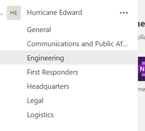

# Challenge 1: Collaboration Coach's Guide

[< Previous Challenge](./00-prereqs.md) - **[Home](./readme.md)** - [Next Challenge>](./02-firstresponders.md)

## Notes & Guidance
Being the coaches guide, this content includes comments, guidance, possible gotchas related to the challenges facing the partipants. The success criteria for the challenge has been duplicated here, but within them, you will find the notes for coaches. In many cases, there is no single solution so coaches are encouraged to be flexibile and focus on the outcome. Did the team accomplish the spirit of the task not necessarily did they do it in the way it is described here?
## Success Criteria

1. **Your team has configured Teams to store the information related to an emergency so that it is centralized for the specified roles.**
	* creation of a team in Microsoft Teams for the mock emergency event with the personas designated for the group
	* channels for different swim lanes in the team: General, Communications & Public Affairs, Engineering, First Responders, Headquarters, Legal, Logistics\
	
1. **All members of the response team can easily find the common operating procedure document for reference.**
	* create a Word document in the General channel's files. Pin it as a tab in the channel so it is easy to find
1. **Contoso users can easily search for information across roles related to the emergency.**
	* have the participants show the search experience within Microsoft Teams and how to filter the results to that emergency
1. **During any shift change, an onboarded Contoso user can easily pick up and continue discussions from the previous shift.**
	* the persistent chat of teams is the real winner here. any chat thread will do to check off that the group understands the value

1. **Your team has deployed a way for the response team to track shared actions.**
	* a good choice for this requirement is to add Planner to the Channel and create a new plan for the Big Board
	* they should have added a few buckets and tasks to show a working understanding of how this meets the response team's needs

## Advanced Challenges (Optional)

*Too comfortable?  Eager to do more?  Try these additional challenges!*

1. **Demonstrate that a non-Contoso account (representing local authorities) can be invited and access Contoso content related to the emergency.**
	* prove that they can invite an external personal email account to the team
	* note that changing the Guest Access setting in Microsoft Teams can take up to 24 hours to enable
1. **Your team demonstrates a solution for the Public Affairs team to brief the media including Q&A with stored recordings available to HQ for review.**
	* the group should schedule a Teams Live Event with external user access and moderated Q&A. \
	\
	\
	
	
	* Ask them to join, start, and end the event.\
	\
	
	
	* Have them locate the recording (it can take a few minutes to process), post it to Stream, and add a tab in the Headquarters channel to show those videos.\
	
	
	* When going to Stream - it is important to post it in the context of the group that corresponds to the emergency team. This keeps security in alignment. Locate the Group/Team in Stream first before creating the channel and uploading.\
	\
	\
	
	

