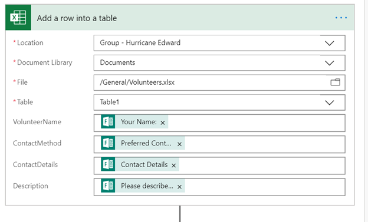
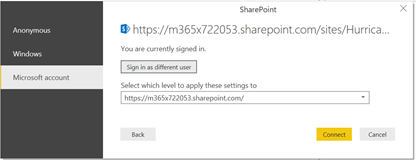

# Challenge 3: Citizen Services Coach's Guide

[< Previous Challenge](./02-firstresponders.md) - **[Home](./readme.md)** 

## Notes & Guidance
Being the coaches guide, this content includes comments, guidance, possible gotchas related to the challenges facing the partipants. The success criteria for the challenge has been duplicated here, but within them, you will find the notes for coaches. In many cases, there is no single solution so coaches are encouraged to be flexibile and focus on the outcome. Did the team accomplish the spirit of the task not necessarily did they do it in the way it is described here?
## Success Criteria

1. **A volunteer can provide information about themselves which is routed to a Contoso staff member for verification.**
	* Since this needs to be something that is facing the public, probably the most obvious choice is to have a Microsoft Form as the data input. Then a Flow which ask for approval. You also need some way to store the approved volunteers. A SharePoint List, Dataverse or even a Spreadsheet will work. Though I guess you could just pin the results of the Form as a tab.\
	 
	* Some notes on a SharePoint path: Created a SharePoint list in the Emergency Site to store the approved folks. Renamed Title column to VolunteerName. I just used Text columns to keep everything simple for ContactMethod and ContactDetails. Multiline Text for Description.\
	
	* If you are just using a Spreadsheet. Set one up in the General folder along with an Excel Table for the data.\
	
	* For Power Automate, there is a workflow template "Approve a Microsoft Forms Response to Add a Row in an Excel Spreadsheet"
	* For approval, just specify one of the partipant user accounts.\
	
	* Adding the form's data to the Excel workbook can be done link this:\
	
	* The Share button in Microsoft Forms give you a link for ANYONE as opposed to just signed in users. Note that this could create a problem with the Flow’s final email shapes as we don’t always have an email address from the user. Since our staff is talking to them, that follow up email could probably be removed.

1. **A collection of verified volunteers is available to the response team.**
	* This could be accomplished by adding the spreadsheet or SharePoint list as a tab

1. **A citizen can provide the details of a missing person to the response team.**
	* Basically identical to the above without an approval. I started with the Form Processing with Email and SharePoint template
	* You may run into a problem taking a data value like the age of a person in Forms and storing it in a SharePoint list expecting a number. Forms data is captured as strings and you need to convert it. In Power Automate, this can be done with an int() expression.\
	

1. **The response team can see the missing person data.**
	* Also the same as the above. You could just pin the results of the form as a tab, pump it to a spreadsheet, or a SharePoint list. Using a SharePoint list would make the dashboard below probably the easiest. Be sure something is pinned as a tab.

## Advanced Challenges (Optional)

*Too comfortable?  Eager to do more?  Try these additional challenges!*
1. **A report of the missing person data is available filtering the data by city and/or gender.**
	* The most obvious choice for this is to use Power BI. Note the team must have the Power BI desktop tool installed locally to build the report.
	* Depends on the source of the data. If a SharePoint list, use the Connect to a SharePoint list data source. If using Excel, use the Connect to a SharePoint folder and choose the spreadsheet.\
	\
	
	* Almost every group missed establishing the security context of the connection and gets accessed denied errors. Be sure the connection is a user context: not anonymous.\
	
	* Once the connection is established, choose the data you want in the report.\
	
	* The team can then build a report that looks something like this:\
	
	* Publish to Power BI (online service). We want this to be in the same security boundary as the Emergency Team. If you don’t see the workspace – access it in the browser first.
	* The add a tab to show the report.\
	

