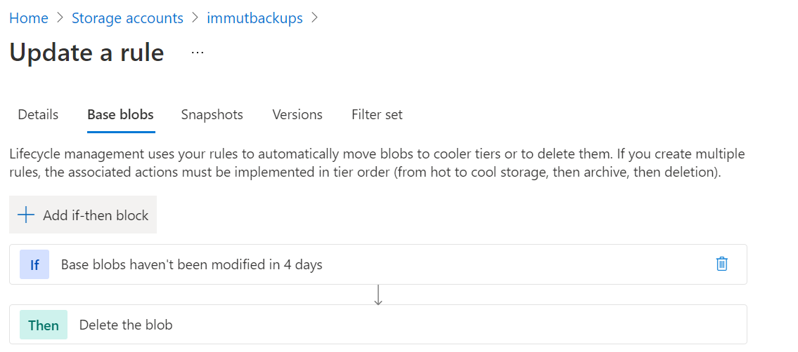

# Challenge 4: Coach's Guide

[< Previous Challenge](./03-SAP-Security.md) - **[Home](README.md)** - [Next Challenge >](./05-PowerApps.md)

## Notes & Guidance

|**Section**|**Sub-Section**|**Comments** |
|-----------|---------------|------------|
|Temp.| All|For the temporary backup solution, you will need to take a full file level backup for both the SYSTEM and the tenant Databases. |
|Backup|Update the Backup Schedule Table|Data: Daily, Twice-Daily retain for 3 days. Log Backups: 15 min retain for 2 days (log backups already contain the last 24 hrs of log backups so 2 days instead of 3. Shared: Same as Data|
|Backup|Adjust Log Backups volume size and HANA volume path change|Change it to 250 GiB from the initial 100 GiB size. This will match with daily log backups requirement. Use HANA Studio to change the log backup basepath parameters - change for both SYSTEM and Tenant DBs.  |
|Backup|Log Backup Timeout| Same method for changing as the log backup volume location parameters. |
|Backup|Build snapshot solution (azacsnap)|Using azacsnap. Install azacsnap from the repo provided. Install the tool on the management VM/Jump Server Linux, update config JSON, and add to cron tab. You only need one config JSON for this. Put data volumes in the data section, and log backup in "other" section of the config JSON. Refer to the ANF Blogs (no need to use aztools referenced in the blog. Azacsnap for data would run twice a day (pick your time, say 6am and 6pm). Log backup frequency of 15 min (900) will yield log backups every 15 mi, but schedule (in cron) it a minute past the log backups i.e. 16th, 31st, 46th and 01st min of the hour.  |
|Backup|Execute adhoc snapshot|Since the crontab schedule may not immediately trigger snapshots, we want to take an ad-hoc data volume snapshot so that we can proceed with the next steps of offloading to blob container. Use the azansnap command you wrapped in the crontab and execute it thought the command line.   |
|Backup|Offload with azcopy|Create a Managed ID for HANA VM and assign Blob Owner, Reader and Contributor permissions for the Blob Storage Account. Install azcopy on the HANA VM. Run once to show how the on-demand azcopy would move both data and log backups over to respective containers. For data volumes, you will sync the contents of the .snapshot directory under /hana/data/SID/mnt00001/.snapshot, and for the log backups, you will sync the actual log backups files for SYSTEM and tenants by simply syncing the entire /backup/log directory. Refer to the blog for more information. SLES 12 has a bug and may prevent you from running azcopy in a managed id session. You will need to run ```azcopy login --identity```, followed by ```keyctl show```, you will find no azcopy key at the moment. Run ```keyctl session workaroundSession```, then run this ```keyctl show``` again, and now you should see the azcopy related key. Now you are good to proceed with azcopy sync command.  |
|Backup|Retention for blobs|Add a lifecyle management policy rule to delete the blobs filtered for the two containers to be deleted if modified older than 7 days. |  
|Backup|Restore test|Create the security user using HANA Studio. Take an ad-hoc snapshot on data volume per instructions. Delete the security user. Start HANA recovery using a specific backup option, and then choose with the backup catalog and destination type as snapshot. Once you get to the catalog screen, you should see the ad-hoc snapshot as greyed out initially, use the revert to snapshot option in ANF and not the new volumes option - this way, you won't need to swap out the old volumes with the new ones. Once you have reverted the data volume, refresh the catalog in hana recovery screen and now you should see that ad-hoc snapshot as green. Follow standard hana recovery process thereafter.  Once SYSTEM DB is recovered, start tenant recovery. Finally, validate the the accidentally deleted user is now recovered. |  
|DR|Assess Requirements|No action, just laying out requirements. The DR region is East, so that's where the ANF replication will be outbound for. Since, RPO is <30 min, we will use 10 min CRR interval.|
|DR|Set up CRR|Refer to the blog and CRR MS Docs reference link. Set up replication for data and log backups (we will not be needing to use shared volume for this OpenHack). Set the frequency for replication to be 10 min. |
|DR|Create a placeholder file|We will not be validating the availability of this file or the security user as part of the validation. This is just in case the participant decides to do the optional steps of provisioning a VM, installing the HANA DB, and then doing the recovery at the DR site|
|DR|Take an ad-hoc backup| Use azacsnap|
|DR|Execute DR|Without deleting the replication, you will not be able to revert to a snapshot on the existing replicating volumes. When changing performance tiers, create a new storage pool of premium tier first and then move the volume from standard to this new premium storage pool. This will conclude the DR validation from the challenge's perspective|


## Resources

- [Create Data Backups and Delta Backups (SAP HANA Studio) - SAP Help Portal](https://help.sap.com/viewer/6b94445c94ae495c83a19646e7c3fd56/2.0.04/en-US/c51a3983bb571014afa0c67026e44ca0.html)

- [Resize a capacity pool or a volume - Microsoft Docs](https://docs.microsoft.com/en-us/azure/azure-netapp-files/azure-netapp-files-resize-capacity-pools-or-volumes#:~:text=%20Resize%20a%20volume%20%201%20From%20the,to%20resize%20or%20delete%20the%20volume.%20More%20)

- [Change the Log Backup Interval - SAP Help Portal](https://help.sap.com/viewer/6b94445c94ae495c83a19646e7c3fd56/2.0.04/en-US/6e9eadcd57464e74b9395004cb1aba9a.html)
[SAP Applications on Microsoft Azure - NetApp PDF](https://www.netapp.com/pdf.html?item=/media/17152-tr4746pdf.pdf)

- [Install the Azure Application Consistent Snapshot tool for Azure NetApp Files - Microsoft Docs](https://docs.microsoft.com/en-us/azure/azure-netapp-files/azacsnap-installation)

- [HANA on ANF Blog Series - Microsoft Tech. Community](https://aka.ms/anfhanablog)

- [Authorize access to blobs with AzCopy and Managed ID - Microsoft Docs](https://docs.microsoft.com/en-us/azure/storage/common/storage-use-azcopy-authorize-azure-active-directory)

- [SAP HANA Azure virtual machine storage configurations - Microsoft Docs](https://docs.microsoft.com/en-us/azure/virtual-machines/workloads/sap/hana-vm-operations-storage)

- [Create and Authorize a User - SAP Help Portal](https://help.sap.com/viewer/6b94445c94ae495c83a19646e7c3fd56/2.0.00/en-US/c0555f0bbb5710148faabb0a6e35c457.html)

- [Optimize costs by automating Azure Blob Storage access tiers](https://docs.microsoft.com/en-us/azure/storage/blobs/storage-lifecycle-management-concepts?tabs=azure-portal#azure-portal-list-view)

- [Requirements and considerations for using Azure NetApp Files volume cross-region replication - Microsoft Docs](https://docs.microsoft.com/en-us/azure/azure-netapp-files/cross-region-replication-requirements-considerations)


