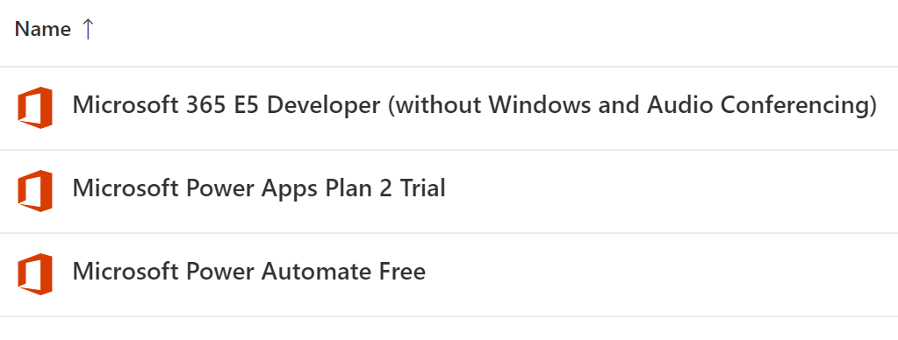

# Challenge 5: Coach's Guide

[< Previous Challenge](./04-k8sdeployment.md) - **[Home](README.md)** - [Next Challenge >](./06-deploymongo.md)

## Notes & Guidance

## Step 1 - **Build infrastructure**

- Make sure that fully activated SAP S/4 Hana system is installed. User name and password are working in SAP business client.
- Select a VM to install On-premise data gateway that can access SAP S/4 Hana system on dispatcher and gateway ports. Typical port ranges are 33**,32**,36**.
- Make sure correct on-premise data gateway and SAP .Net connectors are installed. Both should be of same platform type. (Either X64 / X86, mixing will not work. In doubt install SAP .Net connector for both X86 and X64 and restart on-premise data gateway).
- Register the on-premise datagateway with correct user and make sure that user can see connector in power platform at https://make.powerapps.com under gateways. If this is not visible, power application cannot communicate with SAP system. 

## Step 2 - **Develop power automate (flows)**

- Make sure user enabled Microsoft power Apps Plan2 Trail and Microsoft Power Automate Free. E5 developer is also preferred. 

**Getting Material list from SAP**

- Create power automate (flow) with name Get_SAP_MaterialList (note: Name can be anything). Insert steps PowerApps, Call SAP Function and response as shown below: Note that SAP ERP connection can be created from Flow as well by selecting the registered on-premise gateway. Student/Participant might have created the connection in advance. In that case, he has to use the existing connection. 
- 
- Input SAP system details in call SAP function step along with BAPI Name and its import parameters. See below screenshot.
- 
- 
- 
- Highlighted input details in the above screenshots are required fields for the BAPI_MATERIAL_GETLIST and can be customized as per requirement. Plant and sales organization numbers can be any existing numbers in SAP system. In the response, select MATNRLIST. Framing response is little critical. Follow steps mentioned under "Using the connector in an App" at https://powerapps.microsoft.com/en-us/blog/introducing-the-sap-erp-connector/.

**Getting Material information from SAP**

- Create power automate (flow) with name Get_SAP_Material (note: Name can be anything). Note that this step requires input from power application which is not yet ready. Create the flow and come back later to complete. Insert 3 steps in PowerApps as similar to earlier but with different SAP BAPI. Flow may look like below:

- 
- 
- 

**Build Power Application**

- Create power application with tablet layout. Sample screen can look like as shown below:
- 
- Create collection object to store loaded material list from SAP while this application is loading. Click on form, select onvisible propery and connect it to power automate (flow) named "Get_SAP_Materiallist". To do this, click on menu item Action select power automate. Now select the flow Get_SAP_Materiallist. 
- 

	- `kubectl edit deployment content-web`

- In the YAML file, they will have to update the **spec.replicas** value. They can use this command to edit the deployment resource:
	- `kubectl edit deployment content-web`
- They can watch cluster events by using the following command:
	- `kubectl get events --sort-by='{.lastTimestamp}' --watch`
- The error they will encounter is that there aren’t enough CPUs in the cluster to support the number of replicas they want to scale to.
- The three fixes to address resource constraints are:
	- Use the Azure portal or CLI to add more nodes to the AKS cluster.
	- Use the cluster autoscaler to automatically add more nodes to the cluster as resources are needed.
	- Change the deployment and reduce the needed CPU number from “0.5” to “0.125” (500m to 125m).
		- This is the preferred solution as long as the application remains responsive!
		- **NOTE** In the case the last option doesn't work, delete the old pods and reapply the deployments. Kubernetes deploys new pods before tearing down old ones and if we are out of resources, no new pods will be deployed.
- **NOTE:** In case they do **NOT** get an error and are able to scale up, check how many nodes they have in their cluster and the size of the node VMs. Over provisioned clusters will not fail.
	- If a team doesn’t get a failure, just have them double the number of Web and API app instances.  

