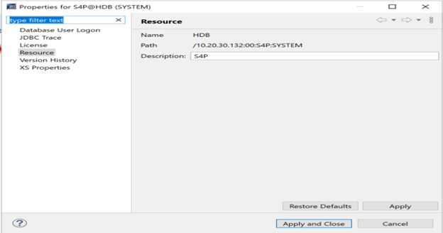

# Challenge 7: Coach's Guide

[< Previous Challenge](./06-deploymongo.md) - **[Home](README.md)** - [Next Challenge >](./08-storage.md)

## Notes & Guidance

There are few  actvities for the PowerBI APp intergation with SAP HANA DB ..
at theigh level we can summerize the actvities in three sections ...

Activity 1:  

Make sure that   SAP S/4 appliance is installed and have access details in right SAP client. 

Activity 2:   

Now download  and install  the Power BI client  and SAP HANA studio on SAP   windows jump box to configure the DB connection and create the direct query using power BI desktop, 
 
Activity 3:  

Now  configure the poweBI app connection to SAP HANA DB using Azure  and SAP documenations steps using  HANA studio and power BI desktop clients.
steps include --
   1. Create the additiona SAP schema and user , Assign appropriate previleges and roles to newly created users in HANA stusion to conenct SAP S/4 schema.
   2. IN power BI clinet GUI add the user name / password of HANA db users and connection strings with tables name to poulate the data
   3. Once the data populate in power BI client, use appropariate colume , row and filter criteria to create the quesry to show vistulaization using PIE or nbar char.
   4. publish the power BI app for the end user so they can use on their desktop for future use.

Login in SAP HANA Database using HANA Studio: 

 

 

Or  

Following pop up will appear  - 

 

 

Select  "Launch" Button ... 

 

After selecting launch ... 

 

Select "Apply and Close " 

 

Select description "Open Hack ID"  - apply and close 

  

  

  

 

 

It will create  "OpenhackID" entry in the SAP studio 

 

 

  

Initial screen of SAP HANA studio will pop up  

  

 

 

Right click on the left space under systems and select “Add System” 

  

  

 

Enter  the system information as below  

 

Enter system user ID and  password for SAP HANA DB  

 

 

 

Add SAP system S4P 

 

 

 

Enter the "SYSTEM" DB user and password  

 

 

 

 

Setup new User ID in SAP HANA Database: 

Create a new user ID SAPOPENHACK in SAP HANA, this user will be used to connect Power BI to SAP HANA Database 

 

 

 

 

Create new user  SAPOPENHACK 

 

 

Enter  "SAPOPENHACK" ID and Password -- 

Add " ABAP admin" "content admin" public" roles  

 

 

 

Add "catalog read",  "data admin" and "export" system privileges .. 

 

 
Add following object privileges ---  create and select 

 

 

Save the configuration  

 

 

When we update the “Object Privileges” with TBTCO and granter is SYSTEM it won’t save it and gives an error. So remove that object and login into S4P with SAPHANADB  ( User ID) and then goto securityàUsers-àSAPOPENHACK and add the object privileges with TBTCO. 

 

Image 21

 

HANA configuration is complete … now Let's work on Power BI connection and report... 

Setup the connection in Power BI desktop to SAP HANA Database: 

Install Power BI Desktop 

Image 22

 

Open Power BI desktop 

 Image 23

Click on “Get data from another source” and select “ Connect” 

 

 Image 24

 

On following screen, type SAP Keyword 

 

Image 25
 

Enter SAP DB information on following screen  

 Image 25

Enter port information as follows  

 
Image26 

Select custom and SQL query as follows  

 
Image 27

Will pop up with information about SAP table TBTCO as follows  

Image 28 

 

Select “Load” after the screen appears 

 
Image 29
 

 

Select "transform data " on opo up screen as shwon in following screen  

Image 30

Image 31

Image 32

Creating visualization in Power BI using the SAP table TBTCO 

Create a Matrix. 

Image 33

 

 

Add fields “JOBNAME” and “AUTHCKMAN” in Rows 

Add field “STATUS” in Columns 

Add “EVENTID” in Values 

Image 34

 

 

Create a new Table in the visualization 

  

Drag and drop fields "JOBNAME", "JOBCLASS", "JOBLOG", "REAXSERVER" and "ENDDATE" under values 

 

Image 35

Create a Pie chart: 

  

Drag and drop field “AUTHCKMAN” under Legend and  field “JOBCOUNT” under Values ( with count). 

Image 36
 

Create a Filter or Slicer 

Drag and drop field “AUTHCKMAN” under Field. 

Image 37
 
Image 38
Image 39

Save the report 

Image 40
 

Once the report is saved need to publish to Power Apps 
