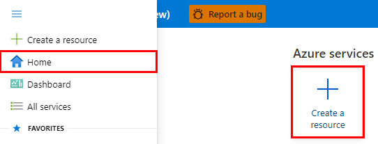
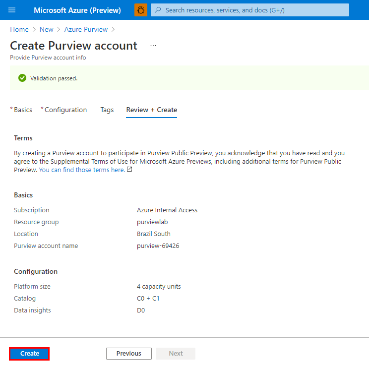
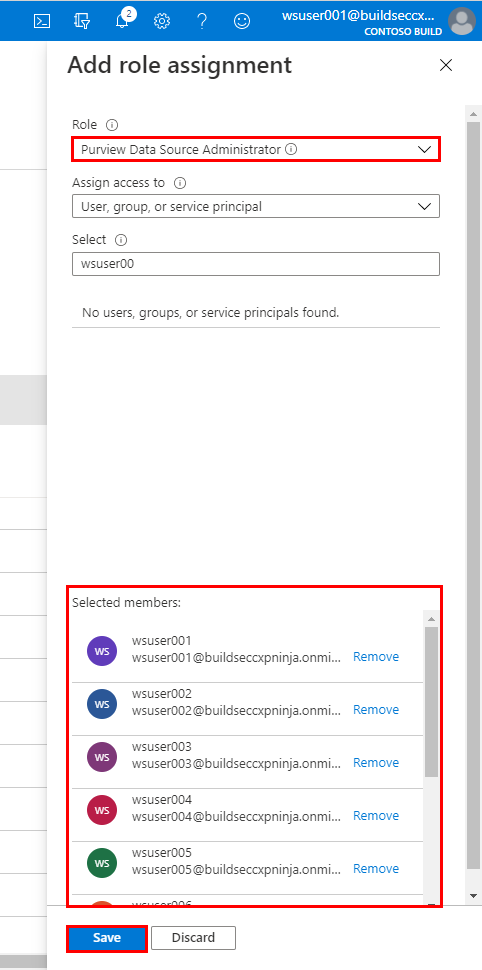

# Solution 7 - Data Governance

[< Previous Challenge](./Solution06.md) - **[Home](../README.md)** - [Next Challenge>](./Solution08.md)

## Introduction

This challenge focuses on registering and scanning data source(s) using Azure Purview to automatically catalog and classify data assets that exist within the fictional data estate. The challenge involves step by step approach on provisioning an Azure Purview account instance, user management via role-based access controls, onboarding data sources, and enrichment via Azure Purview Studio.

## Environment Setup

The challenge environment setup requires that participants have pre-provisioned at least one supported Azure Purview data source with sample data. A quick and effective option includes Azure SQL Database ([serverless tier](https://docs.microsoft.com/en-us/azure/azure-sql/database/serverless-tier-overview)) with **Sample** data which will include the AdventureWorksLT sample database.

# Create an Azure Purview Account
  > **Note:** Before proceeding, ensure your Azure subscription has the following resource providers registered: **Microsoft.Purview**, **Microsoft.Storage**, and **Microsoft.EventHub**.
## 1. Create an Azure Purview Account

1. Sign in to the [Azure portal](https://portal.azure.com) with your Azure account and from the **Home** screen, click **Create a resource**.

      

2. Search the Marketplace for "Azure Purview" and click **Create**.

    

3. Provide the necessary inputs on the **Basics** tab.  

    > Note: The table below provides example values for illustrative purposes only, ensure to specify values that make sense for your deployment.

    | Parameter  | Example Value |
    | --- | --- |
    | Subscription | `Azure Internal Access` |
    | Resource group | `purviewlab` |
    | Purview account name | `purview-69426` |
    | Location | `Brazil South` |

    

4. Provide the necessary inputs on the **Configuration** tab.

    | Parameter  | Example Value | Note |
    | --- | --- | --- |
    | Platform size | `4 capacity units` | Sufficient for non-production scenarios. |

    > :bulb: **Did you know?**
    >
    > **Capacity Units** determine the size of the platform and is a **provisioned** (fixed) set of resources that is needed to keep the Azure Purview platform up and running. 1 Capacity Unit is able to support approximately 1 API call per second. Capacity Units are required regardless of whether you plan to invoke the Azure Purview API endpoints directly (i.e. ISV scenario) or indirectly via Purview Studio (GUI).
    > 
    > **vCore Hours** on the other hand is the unit used to measure **serverless** compute that is needed to run a scan. You only pay per vCore Hour of scanning that you consume (rounded up to the nearest minute).
    >
    > For more information, check out the [Azure Purview Pricing](https://azure.microsoft.com/en-us/pricing/details/azure-purview/) page.

    

5. On the **Review + Create** tab, once the message in the ribbon returns "Validation passed", verify your selections and click **Create**.

    

6. Wait several minutes while your deployment is in progress. Once complete, click **Go to resource**.

    

<a href="#challenge-7---data-governance">↥ back to top</a>

## 2. Grant Access to Azure Purview's Data Plane

1. Navigate to your Azure Purview account and select **Access Control (IAM)** from the left navigation menu.

    

2. Click **Add role assignments**.

    

3. Populate the role assignment prompt as per the table below, select the targeted Azure AD identities, click **Save**.

    | Property  | Value |
    | --- | --- |
    | Role | `Purview Data Curator` |
    | Assign access to | `User, group, or service principal` |
    | Select | `<Azure AD Identities>` |

    

    > :bulb: **Did you know?**
    >
    > Azure Purview has a set of predefined Data Plane roles that can be used to control who can access what.

    | Role  | Catalog | Sources/Scans | Description | 
    | --- | --- | --- | --- |
    | Purview Data Reader | `Read` |  | Access to Purview Studio (read only). |
    | Purview Data Curator | `Read/Write` |  | Access to Purview Studio (read & write). |
    | Purview Data Source Administrator |  | `Read/Write` | No access to Purview Studio. Manage data sources and data scans. |

4. Navigate to the **Role assignments** tab and confirm the **Purview Data Curator** role been has been assigned. Tip: Filter **Scope** to `This resource` to limit the results.

    

5. Repeat the previous steps by adding a second role to the same set of Azure AD identities, this time with the **Purview Data Source Administrator** role.

    

<a href="#challenge-7---data-governance">↥ back to top</a>

## 3. Open Purview Studio

1. To open the out of the box user experience, navigate to the Azure Purview account instance and click **Open Purview Studio**.

    

<a href="#challenge-7---data-governance">↥ back to top</a>

# Create an Azure Purview Account