# 🎨 Visual Elements Showcase

This page demonstrates all the enhanced visual elements available in the What The Hack repository.

---

## 📊 Progress Bars

<div class="progress">
  <div class="progress-bar" style="width: 25%">25% Complete</div>
</div>

<div class="progress">
  <div class="progress-bar" style="width: 75%">75% Complete</div>
</div>

<div class="progress">
  <div class="progress-bar" style="width: 100%">100% Complete!</div>
</div>

---

## 🚨 Alert Boxes

<div class="alert alert-info">
<strong>💡 Info:</strong> This is an informational message with helpful tips!
</div>

<div class="alert alert-success">
<strong>✅ Success:</strong> Great job! You've completed this step successfully.
</div>

<div class="alert alert-warning">
<strong>⚠️ Warning:</strong> Please pay attention to this important information.
</div>

<div class="alert alert-danger">
<strong>🚫 Error:</strong> Something went wrong. Please check your configuration.
</div>

---

## 🏷️ Badges

Technology badges:


Status badges:
<span class="badge badge-primary">Primary</span>
<span class="badge badge-success">Success</span>
<span class="badge badge-warning">Warning</span>
<span class="badge badge-danger">Danger</span>
<span class="badge badge-info">Info</span>

---

## 🎯 Step Indicators

<span class="step">1</span> **First Step** - This is the first step in the process

<span class="step">2</span> **Second Step** - This is the second step

<span class="step">3</span> **Final Step** - This is the final step

---

## 📋 Status Indicators

<span class="status status-complete">✅ Complete</span>
<span class="status status-pending">⏳ Pending</span>
<span class="status status-error">❌ Error</span>

---

## 🔘 Buttons

<a href="#" class="btn btn-primary">Primary Button</a>
<a href="#" class="btn btn-success">Success Button</a>
<a href="#" class="btn btn-warning">Warning Button</a>
<a href="#" class="btn btn-info">Info Button</a>

---

## 📦 Cards

<div class="card">

### 🎯 Card Example

This is a modern card container with enhanced styling. It includes:
- Beautiful box shadows
- Hover effects
- Gradient top border
- Responsive design

Cards are perfect for grouping related content together.

</div>

---

## 🗂️ Collapsible Sections

<details>
<summary>🔧 Advanced Configuration</summary>
<div>

This is a collapsible section that can contain:
- Detailed configuration steps
- Advanced troubleshooting information
- Optional content that doesn't clutter the main flow
- Code examples and technical details

```bash
# Example command
az group create --name myResourceGroup --location eastus
```

</div>
</details>

<details>
<summary>📚 Additional Resources</summary>
<div>

Here you can include:
- Links to documentation
- Video tutorials
- Related articles
- Community resources

</div>
</details>

---

## 📊 Enhanced Tables

| Feature | Status | Description |
|---------|:------:|-------------|
| 🎨 Modern Theme | <span class="badge badge-success">✅ Active</span> | Cayman theme with gradients |
| 📱 Responsive Design | <span class="badge badge-success">✅ Active</span> | Mobile-optimized |
| 🌙 Dark Mode | <span class="badge badge-success">✅ Active</span> | Auto-detection |
| 📈 Mermaid Diagrams | <span class="badge badge-success">✅ Active</span> | Interactive diagrams |
| ♿ Accessibility | <span class="badge badge-success">✅ Active</span> | WCAG compliant |

---

## 📈 Mermaid Diagrams

```mermaid
graph TD
    A[🚀 Start Challenge] --> B{Choose Path}
    B -->|Easy| C[📚 Follow Guide]
    B -->|Advanced| D[🔧 Custom Setup]
    C --> E[✅ Success]
    D --> F[🧪 Test Configuration]
    F --> G{Tests Pass?}
    G -->|Yes| E
    G -->|No| H[🐛 Debug Issues]
    H --> F
    
    style A fill:#e1f5fe
    style E fill:#e8f5e8
    style H fill:#ffebee
```



---

## 💬 Enhanced Blockquotes

> **💡 Pro Tip**
> 
> This is an enhanced blockquote with modern styling. It includes beautiful gradients, shadows, and improved typography for better readability.

> **🎯 Key Insight**
> 
> Use these visual elements to make your documentation more engaging and easier to follow. Visual hierarchy helps users scan content quickly and find what they need.

---

## 🖥️ Code Blocks

```bash
# Example terminal commands
npm install
npm start

# With syntax highlighting
git add .
git commit -m "✨ Add new features"
git push origin main
```

```javascript
// JavaScript example with enhanced styling
function enhanceMarkdown() {
    const elements = document.querySelectorAll('.enhanced');
    elements.forEach(el => {
        el.classList.add('modern-styling');
    });
}
```

---

## ✨ Conclusion

These visual enhancements transform plain markdown into engaging, modern documentation that:

- 📈 **Improves user experience** with better visual hierarchy
- 🎯 **Increases engagement** through interactive elements
- 📱 **Works on all devices** with responsive design
- ♿ **Supports accessibility** with proper contrast and structure
- 🎨 **Looks professional** with modern design patterns

Ready to use these in your own challenges? Check out the [Enhanced Template](../000-HowToHack/WTH-Challenge-Enhanced-Template.md)!