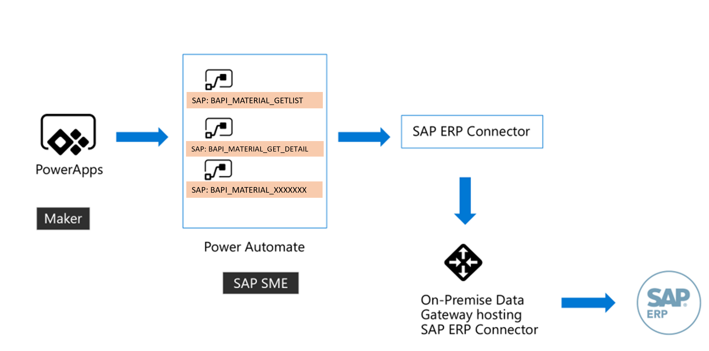
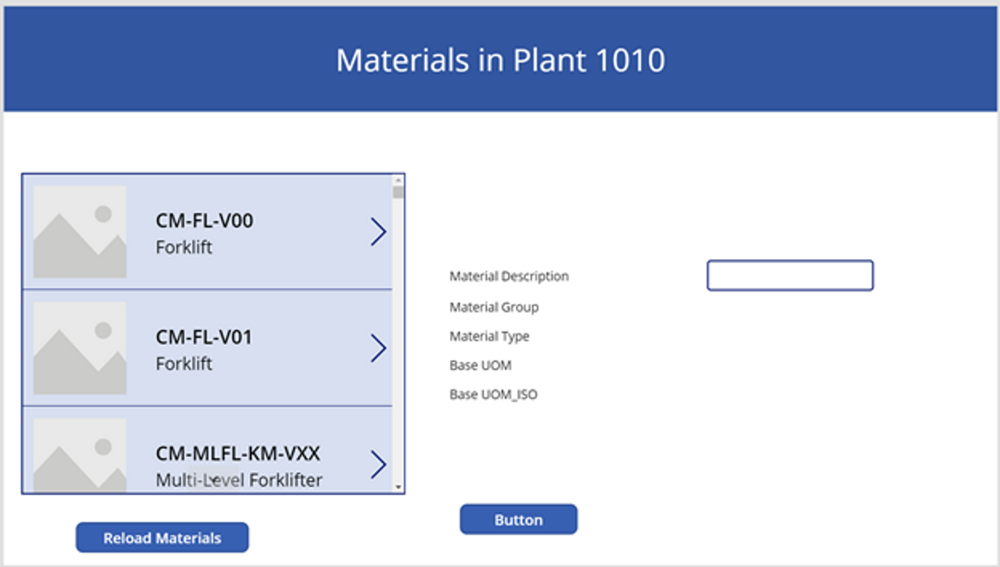

# Challenge 5: Build Mobile Application around SAP

[< Previous Challenge](./04-BusinessContinuity-and-DR.md) - **[Home](../README.md)** - [Next Challenge >](./06-Start-Stop-Automation.md)

## Introduction

Contoso Inc has established SAP landscape for several years. Now Contoso Inc wants to enable users with simplified mobile user interface that requires data from multiple sources and one of the data source is S/4 Hana system. Assume that production workers on site want to know material information on their mobile devices. How do you build mobile application using No/Low code platform that can interact with SAP system seemlessly? In this challenge, we'll find that out.

## Description

Build a simple power application for Tablet that can  fetch available materials from the user sales organization and plant. Application should also allow user to select material from the list and display complete details for that material upon selection. High level architecture for this application may look like as shown below. 

This challenge requires you to build foundational infrastructure along with power application. 

## Tips

- On-premise datagateway along with SAP .Net connector has to be installed to access SAP system. You need S-User to download SAP .Net connector and other components can be downloaded freely. Reference named "SAP ERP connector in power application" mentioned in reference section has all required URLs to download the components. [Note: If you are a Internal Microsoft employee, ask coach for SAP .Net connector location.]
- BAPI Names to fetch data from **SAP S/4 Hana system**.
	- Materials list can be fetched from SAP system using BAPI named `BAPI_MATERIAL_GETLIST`.
		- You can use below selection criteria to fetch materials using above BAPI.
		- Material selection: `I CP * (Example: MATNRSELECTION SIGN = I, MATNRSELECTION OPTION = CP, and MATNRSELECTION MATNR LOW = *)`
		- Plant selection: `I EQ 1010`
		- Sales organization selection: `I EQ 1010`
		- You can leave rest of the selection criteria empty. 
		- `MATNRLIST` in the received outfrom SAP system has list of materials. 
	- Material information can be fetched from SAP system using BAPI named `BAPI_MATERIAL_GET_DETAIL`

- Power Automate is very useful to connect SAP system and fetch data. 
- Request & Response step can be used to pass information from power automate (flow) to power application. 
- Sample end application may look like below: (It is only to give an idea but can be much better than this).

## Success Criteria

- Working ERP connection in the power automate (or flow).
- Successful Run of the power application and display selected material information. 

## Learning Resources

- [SAP ERP Connector in power applications](https://powerapps.microsoft.com/en-us/blog/introducing-the-sap-erp-connector/)

- [Power Apps canvas applications](https://docs.microsoft.com/en-us/powerapps/maker/canvas-apps/) 

- [Create collection object in power apps](https://docs.microsoft.com/en-us/powerapps/maker/canvas-apps/create-update-collection)

- [Using power (flows) Automate in power apps](https://docs.microsoft.com/en-us/powerapps/maker/canvas-apps/using-logic-flows)

- [SAP BAPI](https://help.sap.com/doc/saphelp_nw73/7.3.16/en-US/4d/c89000ebfc5a9ee10000000a42189b/content.htm?no_cache=true)

- [Access URL for power application](https://make.powerapps.com/)

- [Access Azure portal](https://portal.azure.com/) 

