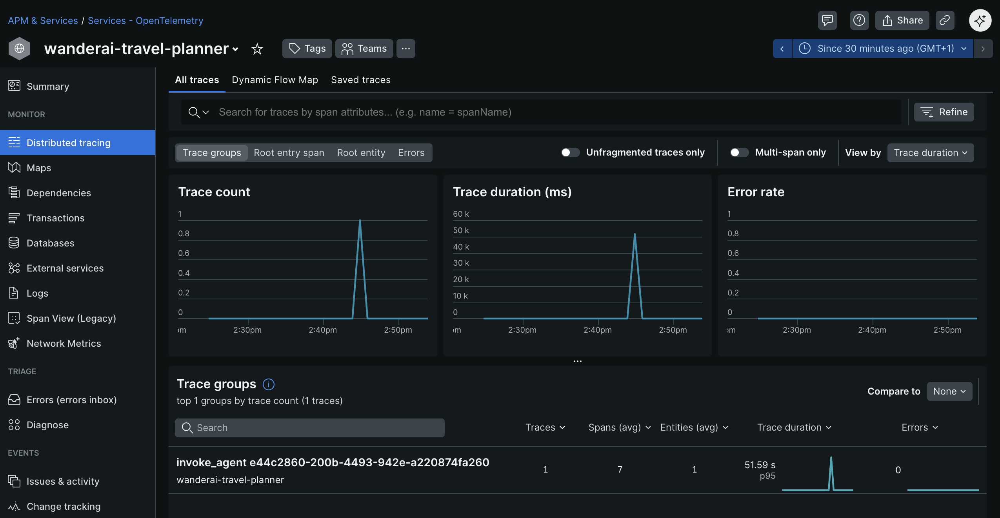

# Challenge 04 - New Relic Integration

[< Previous Challenge](./Challenge-03.md) - **[Home](../README.md)** - [Next Challenge >](./Challenge-05.md)

## Introduction

Console output is great for development, but in production you need a backend that can store, search, and analyze your telemetry at scale. New Relic is an observability platform that receives OpenTelemetry data and provides powerful tools for viewing traces, correlating across services, and collaborating with your team on debugging.

In this challenge, you will connect your OpenTelemetry-instrumented application to New Relic so your entire team can see and analyze agent behavior in real-time.

## Pre-requisites

You will need:

- A New Relic account (free tier works fine)
- Your New Relic License Key (found in Account Settings)
- The New Relic OTLP endpoint URL (US: `https://otlp.nr-data.net`, EU: `https://otlp.eu01.nr-data.net`)

## Description

Your goal is to configure your application to send traces, metrics, and logs to New Relic using the OpenTelemetry Line Protocol (OTLP) exporter.

**Environment Configuration:**

- Configure the OTLP endpoint URL for your region (US or EU)
- Set up the authentication header with your New Relic License Key
- Configure service identification attributes

**Update OpenTelemetry Initialization:**

- Replace the console exporter with the OTLP exporter
(- Configure exporters for traces, metrics, and logs)
- Ensure your resource attributes identify your service properly

**Validate the Integration:**

- Make test requests to your application
- Verify traces appear in the New Relic UI
- Search and filter traces to confirm your data is flowing correctly

### What to Configure

Your `.env` file needs these OTel-specific variables:

- `OTEL_EXPORTER_OTLP_ENDPOINT` - The New Relic OTLP endpoint for your region
- `OTEL_EXPORTER_OTLP_HEADERS` - Authentication header with your License Key
- `OTEL_SERVICE_NAME` - Your service name (e.g., "travel-planner")
- `OTEL_SERVICE_VERSION` - Your service version
- comment the line `ENABLE_CONSOLE_EXPORTERS=True` by adding a # at the beginning of the line

Python OpenTelemetry SDK will automatically read these environment variables when you initialize the OTLP exporter. However, you need to modify the `requirements.txt` to include `opentelemetry-exporter-otlp-proto-grpc` package.

Restart your app again and execute a generate request for a travel plan. Verify that your app appears in [New Relic](https://one.newrelic.com/) (it can take a few minutes for data to appear) as an entity within the `Services - OpenTelemetry` section. The name of the entity should match the OTEL_SERVICE_NAME you set in the `.env` file. Dig into `Distributed tracing` section and look for traces generated by your application. You should see a trace group with a name like `plan_trip` (or similar, depending upon the name of your span for the `/plan` route handler). In case you did not create a custom span for the `/plan` route handler, you should see `invoke_agent xxx`. Investigate and observe the details of a single trace.

By clicking into the `Logs` tab of the trace details, you should also be able to see any logs that were emitted during the request, correlated to the trace.

If you see traces in New Relic, you can then proceed to instrument the tool functions and Flask routes as described below.

## Success Criteria

To complete this challenge successfully, you should be able to:

- [ ] Verify that traces appear in New Relic within seconds of making requests
- [ ] Demonstrate that tool spans are visible in the trace details (get_weather, get_datetime, etc.)
- [ ] Show the service map in New Relic displaying your application
- [ ] Verify that custom attributes are visible in trace details
- [ ] Demonstrate that you can search and filter traces using NRQL queries

## Learning Resources

- [New Relic OTLP Ingest](https://docs.newrelic.com/docs/opentelemetry/opentelemetry-introduction/)
- [Configuring OTLP Endpoint](https://docs.newrelic.com/docs/opentelemetry/best-practices/opentelemetry-otlp/)
- [New Relic AI Monitoring](https://docs.newrelic.com/docs/ai-monitoring/intro-to-ai-monitoring/)
- [OpenTelemetry OTLP Exporters](https://opentelemetry.io/docs/instrumentation/python/exporters/)

## Tips

- Never commit your `.env` file with your License Key to git
- Use the BatchSpanProcessor for efficient sending of traces
- Make requests and watch traces appear live in the New Relic UI
- Add custom attributes that will be useful for debugging (destination, duration, model name)
- The OTLP exporters automatically read configuration from environment variables starting with `OTEL_EXPORTER_OTLP_*`

## Advanced Challenges (Optional)

- Configure separate exporters for traces, metrics, and logs
- Set up metric collection alongside traces
- Configure log forwarding with trace correlation
- Explore the New Relic Service Map to visualize your application
