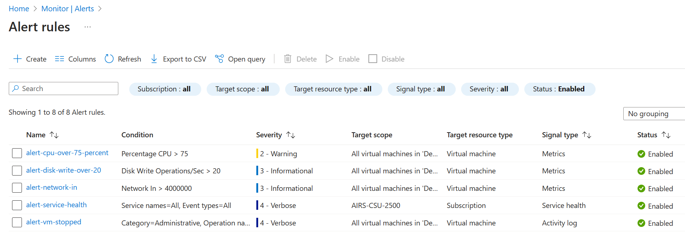
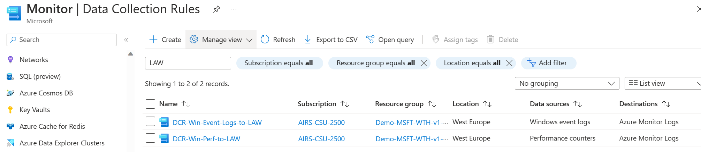

# Challenge 02 - Setting up Monitoring via Automation - Coach's Guide 

[< Previous Solution](./Solution-01.md) - **[Home](./README.md)** - [Next Solution >](./Solution-03.md)

## Notes & Guidance

You can find fully configured Bicep files, `alert-full-solution.bicep` and `ama-full-solution.bicep`, in the `Coach/Solutions/Challenge-02` folder. Use these files to help students if they face problems.

#### Deploy alerts via Bicep

Action group Resource Id can be found in Azure Portal:
- In Azure Monitor navigate to Alerts, then Action groups.
- Select the Action group to open its properties.
- Click on JSON View.

- At the top you will see the Resource ID that will have the following structure:  
`/subscriptions/<sub-id>/resourceGroups/<rg-name>/providers/microsoft.insights/actionGroups/<action-group-name> `
  
At the end of the Challenge students should present 5 new alerts that will look similar to this:

#### Test Activity log alert

- Login to your portal and stop you Visual Studio VM  

- Check the Activity Log and see the new events of type **Deallocate Virtual Machine** (may take a min or two to show up)

- If the alert is configured correctly, it should fire and an email will be sent.

#### Deploy Azure Monitor Agent via Bicep
  
In the file, the students should update the names of the Log Analytics workspace law-wth-monitor-d-XX and the Virtual Machine Scale Set vmss-wth-monitor-d-XX. Otherwise they will get an error message during deployment.
  
If everithing is configured correctly, you should be able to see the AzureMonitorWindowsAgent extension if you navigate to the VMSS and select Extensions+applications.

You should also be able to see the 2 new DCRs created in Azure Monitor.
  

  
**The Bonus part (Optional)**

**Will the Alert get fired if the VM was turned off from the OS? or if the VM was not available? why?**
No, as opposed to deallocation, powering off a Microsoft Azure virtual machine (VM) will release the hardware but it will preserve the network resources (internal and public IPs) provisioned for it. Even if the VM`s network components are preserved, once the virtual machine is powered off, the cloud application(s) installed on it will become unavailable. The only scenario in which you should ever choose the stopped state instead of the deallocated state for a VM in Azure is if you are only briefly stopping the server and would like to keep the dynamic IP address for your testing. If that doesn’t perfectly describe your use case, or you don’t have an opinion one way or the other, then you’ll want to deallocate instead so you aren’t being charged for the VM.

First team to a screenshot of the new Alert Rules wins the challenge!!
Good luck!
