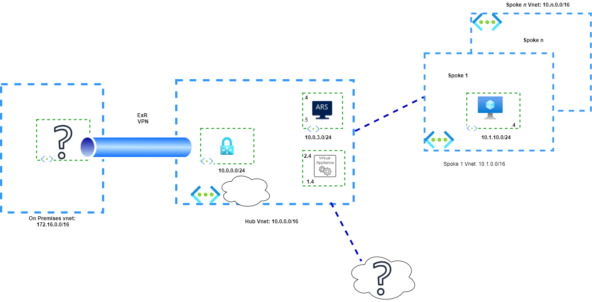

# Challenge 00 - Prerequisites - Ready, Set, GO

**[Home](../README.md)** - [Next Challenge >](./Challenge-01.md)

## Introduction

A smart Azure engineer always has the right tools in their toolbox. In addition, a good grasp on the key fundamental networking concepts. In this case, the Border Gateway Protocol (BGP).

## Description

In this challenge we'll be setting up all the tools we will need to complete our challenges.

- Make sure that you have joined the Teams group for this track. Please ask your coach about the correct Teams channel to join.
- Ask your coach about the subscription you are going to use to fulfill the challenges
- Install the recommended toolset, being one of this:
  - The Powershell way (same tooling for Windows, Linux or Mac):
    - [Powershell core (7.x)](https://docs.microsoft.com/en-us/powershell/scripting/overview)
    - [Azure Powershell modules](https://docs.microsoft.com/en-us/powershell/azure/new-azureps-module-az)
    - [Visual Studio Code](https://code.visualstudio.com/): the Windows Powershell ISE might be an option here for Windows users, but VS Code is far, far better
    - [vscode Powershell extension](https://marketplace.visualstudio.com/items?itemName=ms-vscode.PowerShell)
  - The Azure CLI way:
    - [Windows Subsystem for Linux](https://docs.microsoft.com/windows/wsl/install-win10), if you are running Windows and want to install the Azure CLI under a Linux shell like bash or zsh
    - [Azure CLI](https://docs.microsoft.com/cli/azure/install-azure-cli)
    - [Visual Studio Code](https://code.visualstudio.com/): the Windows Powershell ISE might be an option here for Windows users, but VS Code is far, far better
    - [VScode Azure CLI extension](https://marketplace.visualstudio.com/items?itemName=ms-vscode.azurecli)
  - The Azure Portal way: not really recommended, but you can still use the portal to fulfill most of the challenges. Do not complain about having to do more than once the same task across the challenges :)

**NOTE:** You can use Azure Powershell and CLI on the Azure Cloud Shell, but running the commands locally along Visual Studio Code will give you a much better experience

## Learning Resources

### Border Gateway Protocol

It is of paramount importance that you are aware that 100% of the Azure Route Server functionality revolves around basic to advanced Border Gateway Protocol (BGP) concepts. With that in mind, take as a first priority to grasp the BGP concepts as much as possible. In the other hand, do not feel overwhelmed if concepts are not very clear at the beginning, after all, there are books dedicated entirely to BGP as a dynamic routing protocol.

- [BGP Fundamentals](https://www.linkedin.com/learning/cisco-ccnp-encor-350-401-cert-prep-1-architecture-virtualization-and-infrastructure/fundamental-bgp-concepts?autoplay=true&u=3322)

- [Great overview of BGP concepts outside configurations](https://www.youtube.com/watch?v=ydE-HprufbA)

 
### Route Server and Azure Route Server

- [Route Server RFC](https://datatracker.ietf.org/doc/html/rfc7947)
- [Azure Route Server](https://docs.microsoft.com/azure/route-server/overview)
- [John Savill Review on Route Server](https://www.youtube.com/watch?v=c1f4rmkrF6M&t=1668s)

### Review of Vnet Routing and BGP on VPN Gateways

- [Virtual Network Routing](https://docs.microsoft.com/azure/virtual-network/virtual-networks-udr-overview)
- [About BGP with Azure VPN Gateway](https://docs.microsoft.com/en-us/azure/vpn-gateway/vpn-gateway-bgp-overview)

## Success Criteria

- You have an Azure shell at your disposal (Powershell, WSL(2), Mac, Linux or Azure Cloud Shell)
- Running az login or Connect-AzAccount allows to authenticate to Azure
- You have reviewed foundational knowledge in Virtual Network Routing, Azure VNG , Azure Route Server, BGP fundamentals.
