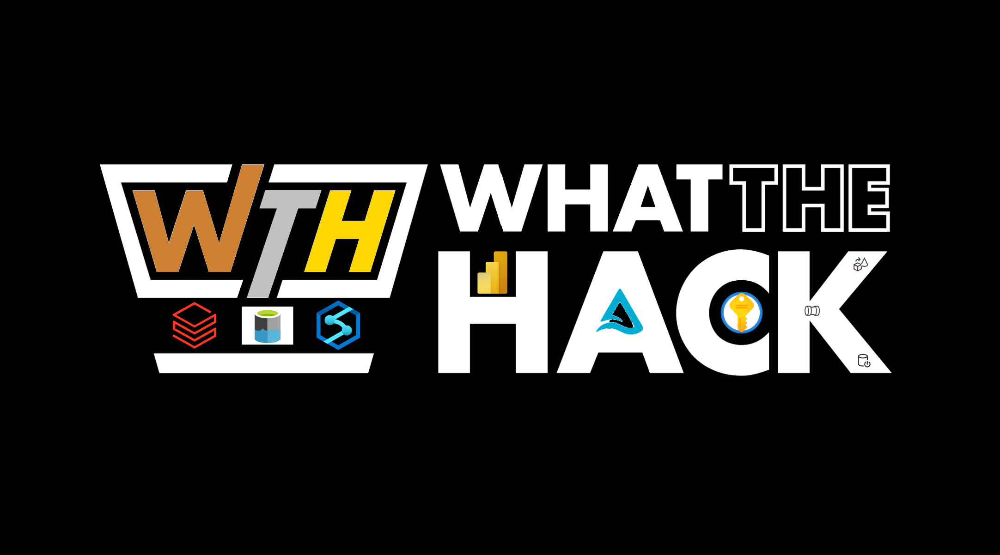

# What The Hack - Bronze-Silver-Gold-Using-Synapse-and-Databricks

## Introduction

The IoT Hack of the Century will take you on a whirlwind tour in the world of IoT and how it is being used in the modern world of mineral extraction in exotic locations like the Arctic and the wilds of South Africa.

## Learning Objectives

In this hack you will be solving the common business problem that companies in the mineral extraction industry face and how IoT solutions from Azure are brought to bare

1. Provision an IoT Hub
2. Set up an IoT Edge device
3. Bring Azure Sphere to your solution for scale and resiliency

## Challenges

- Challenge 00: **[Prerequisites - Ready, Set, GO!](Student/Challenge-00.md)**
	 - Understand the basics of Synapse
	 - Understand the basics of Databricks
	 - Understand the Delta Lake Concepts.
- Challenge 01: **[Setup the Environment and Hydrate the Bronze Lake](Student/Challenge-01.md)**
	 - Standup and configure the Synapse and Databricks Environments.
	 - Hydrate the Bronze Data Lake
	 - Encrypt all connection details in Key Vault
- Challenge 02: **[Hydrate the Silver Delta Lake](Student/Challenge-02.md)**
	 - Move the data from the Bronze Layer to the Silver Layer 
	 - Apply Delta Format to the Silver Layer
- Challenge 03: **[Go for the Gold](Student/Challenge-03.md)**
	 - Take data from the Silver Layer and make it business analyst ready
- Challenge 04: **[Visualize the Results](Student/Challenge-04.md)**
	 - Create Power BI Assets to showcase your results

## Prerequisites

- Your own Azure subscription with Owner access
- Willingness to learn from your colleagues
- A wicked' cool Teams background.

## Contributors

- [Jack Bender](https://www.linkedin.com/in/jack-bender/)
- [Farhan Arif](https://www.linkedin.com/in/frhnarif/)
