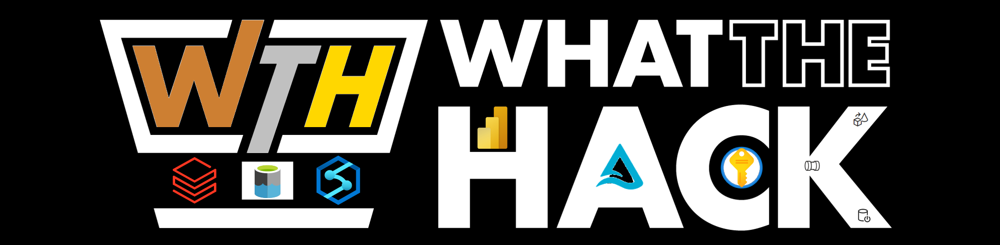

# What The Hack - Bronze-Silver-Gold-Using-Synapse-and-Databricks

## Introduction

With many customers moving towards a modern three-tiered Data Lake architecture it is imperative that we understand how you can utilize Synapase and Databricks to build out the bronze, silver and gold layers to serve data to Power Bi for dashboards and reporting while also ensuring that the bronze and silver layers are being hydrated correctly for ML/AI workloads.

## Learning Objectives

In this hack you will be solving the common big data archicture issue of bringing multiple data sources together and serve them up with a Delta based technology so that both Azure Synapse and Databricks can consume the data and what are the similarities and differences between them.

## Challenges

- Challenge 00: **[Prerequisites - Ready, Set, GO!](Student/Challenge-00.md)**
	 - Understand the basics of Synapse
	 - Understand the basics of Databricks
	 - Understand the Delta Lake Concepts.
- Challenge 01: **[Setup the Environment and Hydrate the Bronze Lake](Student/Challenge-01.md)**
	 - Standup and configure the Synapse and Databricks Environments.
	 - Hydrate the Bronze Data Lake
	 - Encrypt all connection details in Key Vault
- Challenge 02: **[Hydrate the Silver Delta Lake](Student/Challenge-02.md)**
	 - Move the data from the Bronze Layer to the Silver Layer 
	 - Apply Delta Format to the Silver Layer
- Challenge 03: **[Go for the Gold](Student/Challenge-03.md)**
	 - Take data from the Silver Layer and make it business analyst ready
- Challenge 04: **[Visualize the Results](Student/Challenge-04.md)**
	 - Create Power BI Assets to showcase your results

## Prerequisites

- Your own Azure subscription with Owner access
- Willingness to learn from your colleagues
- A wicked' cool Teams background.  There will be prizes for each day.

## Contributors

- [Jack Bender](https://www.linkedin.com/in/jack-bender/)
- [Farhan Arif](https://www.linkedin.com/in/frhnarif/)
