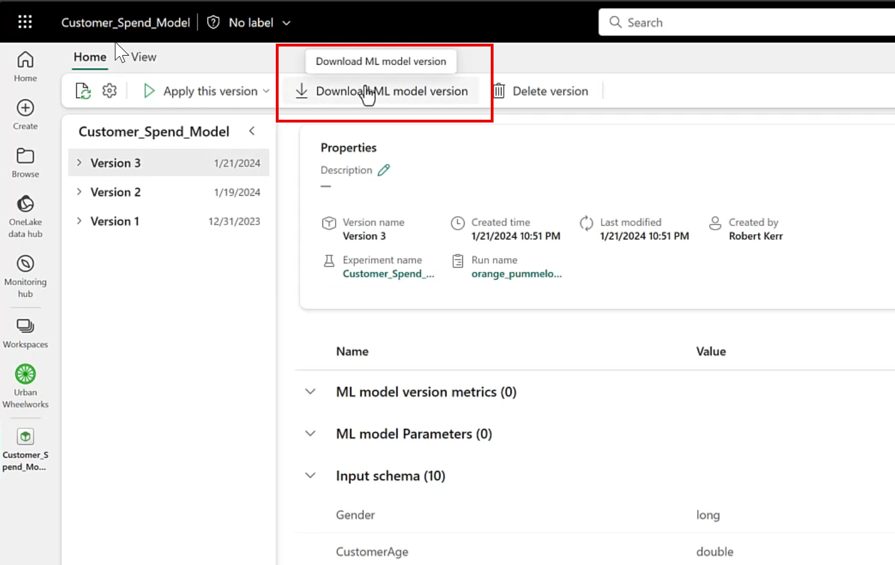

# Challenge 04 - <Title of Challenge> - Coach's Guide 

[< Previous Solution](./Solution-03.md) - **[Home](./README.md)** - [Next Solution >](./Solution-05.md)

## Setup Steps
- Download the ml model from Fabric workspace
- Upload the model on azure machine learning studio
- Using postman, send the testing data to it to test it out.

## Notes & Guidance
- Go to your data science worksapce where all the notebooks are stored.
- That worksapce will have the ml model which you created in previous challenege
- Exporting a model from Fabric is easy--just tap the Download ML model version button in the UI.

- Fabric will combine the ML Model along with a Python Object Serialization file (a/k/a pickle file) having a .pkl extension, and YAML files (.yml) that describe to other platforms the structure and interface provided by the model. All these files are packaged into a .zip file, which will be placed in your Downloads folder.
- If you open the .zip file, you can review the model and metadata files before deploying them to other systems.
  
