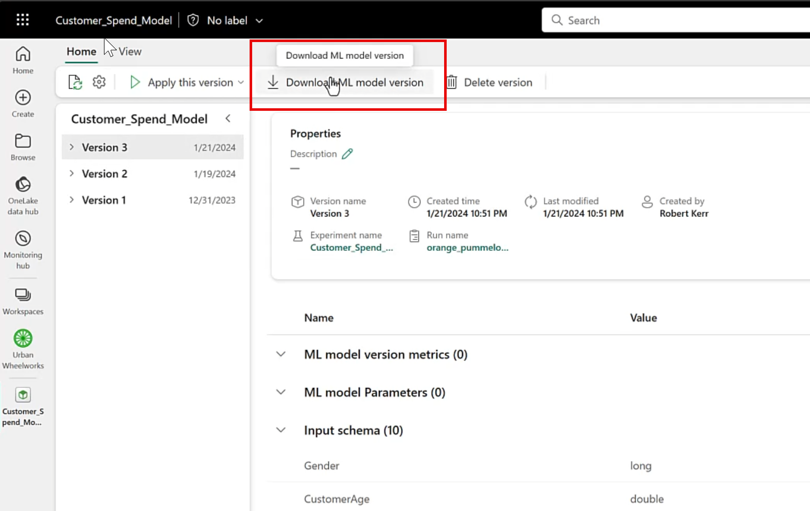
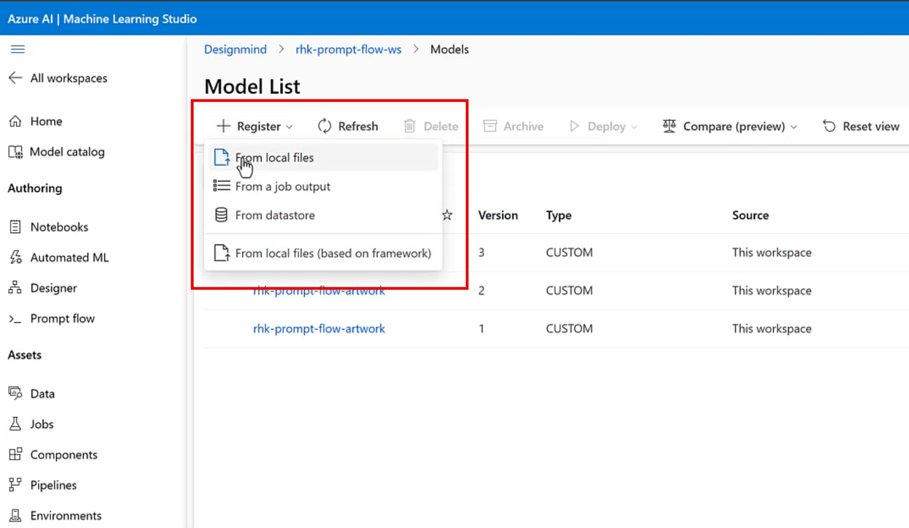
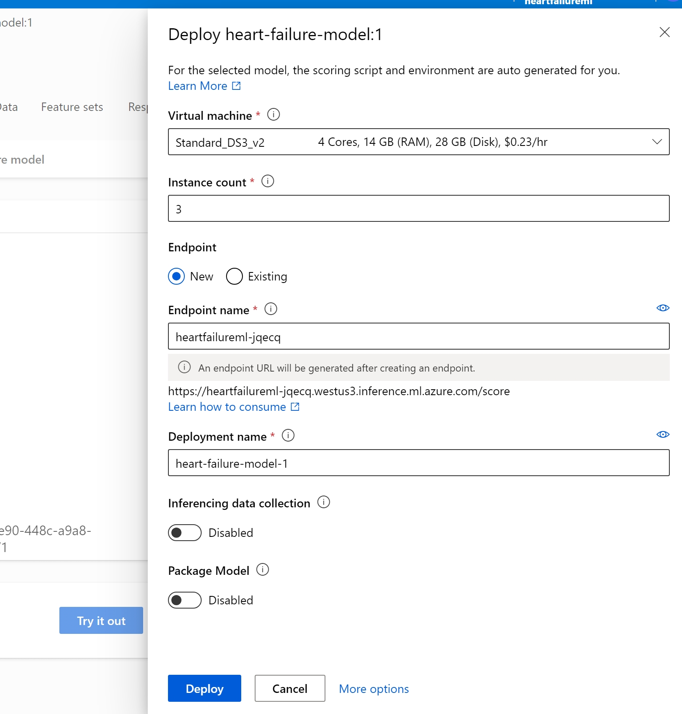

# Challenge 06 - <Title of Challenge> - Coach's Guide 

[< Previous Solution](./Solution-05.md) - **[Home](./README.md)** - [Next Solution >](./Solution-07.md)

## Setup Steps
- Download the ml model from Fabric workspace
- Upload the model on azure machine learning studio
- Using postman, send the testing data to it to test it out.

## Notes & Guidance
- Go to your data science worksapce where all the notebooks are stored.
- That worksapce will have the ml model which you created in previous challenege
- Exporting a model from Fabric is easy--just tap the Download ML model version button in the UI.

- Fabric will combine the ML Model along with a Python Object Serialization file (a/k/a pickle file) having a .pkl extension, and YAML files (.yml) that describe to other platforms the structure and interface provided by the model. All these files are packaged into a .zip file, which will be placed in your Downloads folder.
- If you open the .zip file, you can review the model and metadata files before deploying them to other systems.
  

- After downloading the model, we have to deploy an Azure ML real-time inference endpoint to publish the model to the Internet via a RESTful web service.
- Register the model in and Azure ML workspace, and use the Azure ML Studio web UI to deploy the endpoint.
- To upload the model, use the Register/From local files menu in Azure AI Machine Learning Studio, and then press the Register button at the bottom of the screen.
  

- After uploading the files, the new model is available in the Models page of the Azure ML Workspace.
- Once the model is registered in the Azure ML workspace, click on the model name, and then select Real-time endpoint from the Deploy menu.
  
  
- A model opens up to configure the compute to use for the endpoint, and to specify the deployment name.
- Specify the compute size desired for the endpoint, and the names for the endpoint and deployment, then tap the Deploy button.
  

- After the deployment completes (10-15 minutes, typically), make a quick "smoke test" within Azure ML Studio to ensure the deployment is functional, and we're using the correct data structures when calling it.
  
- Once the interactive test succeeds, it's time to move on to consume the model from outside the Azure ML environment.
- Use postman to send data to deployed model endpoints to test the model.
