# Challenge 02 - Dynatrace Observability on AKS - Coach's Guide 

[< Previous Solution](./Solution-01.md) - **[Home](./README.md)** - [Next Solution >](./Solution-03.md)

## Notes & Guidance
### Overview
Re-hosting (also referred to as lift and shift) is a common migration use case. Re-architecture and Re-platform are steps that break the traditional architectures and replace individual components with cloud services and microservices.

We just learned how we can get great information on services, processes and user requests using Dynatrace and OneAgent. This helps us now decide what individual features or complete applications based on business benefits we need to migrate and modernize. The idea here is to focus on feature-based business benefit with functional migration.
### Objectives of this Lab 

🔷 Install the Dynatrace Operator and sample application

🔷 Review how the sample application went from a simple architecture to multiple services 

🔷 Examine the transformed application using service flows and back traces 


## Review - Modernize the Sample App 

As we saw earlier, the sample application is a three-tiered application --> frontend, backend, database.

For our lab, another version of the application exists that breaks out each of these backend services into separate services. By putting these services into Docker images, we gain the ability to deploy the service into modern platforms like Azure Kubernetes and Cloud managed services such as the ones from Azure shown below.


The picture below shows how the components of the sample application interact with Dynatrace. 


**#1 . Sample Application**
Sample app representing a "services" architecture of a frontend and multiple backend services implemented as Docker containers that we will review in this lab.

**#2 . Kubernetes**
Azure Kubernetes Service (AKS) is hosting the application. The Kubernetes cluster had the Dynatrace OneAgent Operator installed. (see below for more details).  Two AKS nodes make up the Kubernetes cluster. The Dynatrace OneAgent was preinstalled by the OneAgent operator and is sending data to your Dynatrace SaaS environment. (see below for more details)

**#3 . Dynatrace Operator**
Dynatrace OneAgent is container-aware and comes with built-in support for out-of-the-box monitoring of Kubernetes. Dynatrace supports full-stack monitoring for Kubernetes, from the application down to the infrastructure layer.

**#4 . Dynatrace**
Dynatrace tenant where monitoring data is collected and analyzed.

**#5 . Full-Stack Dashboard**
Made possible by the Dynatrace OneAgent that will automatically instrument each running node & pod in AKS.

**#6 . Kubernetes Dashboard**
The Kubernetes page provides an overview of all Kubernetes clusters showing monitoring data like the clusters’ sizing and utilization.

## Deploy Kubernetes Dynatrace Operator

One key Dynatrace advantage is ease of activation. OneAgent technology simplifies deployment across large enterprises and relieves engineers of the burden of instrumenting their applications by hand. As Kubernetes adoption continues to grow, it becomes more important than ever to simplify the activation of observability across workloads without sacrificing the deployment automation that Kubernetes provides. Observability should be as cloud-native as Kubernetes itself.

In our workshop, we will install the Dynatrace Operator that streamlines lifecycle management.  You can read more about it here in this <a href="https://www.dynatrace.com/news/blog/new-dynatrace-operator-elevates-cloud-native-observability-for-kubernetes/" target="_blank"> Dynatrace Blog </a>

Organizations will often customize the Dynatrace Operator installation and you can read more about the options in the <a href="https://www.dynatrace.com/support/help/technology-support/container-platforms/kubernetes/monitor-kubernetes-environments/" target="_blank"> Dynatrace Doc</a> but, we are going to use a single command that we can get from the Dynatrace interface to show how easy it is to get started.


### Tasks to complete this step
- Install Dynatrace Operator
   1. To navigate to Kubernetes page, follow these steps and refer to the picture below:<br>
      1.1 Within Dynatrace, click on the `Deploy Dynatrace` menu<br>
      1.2 Click on the `Start Installation` button<br>
      1.3 Click on the `Kubernetes` button
       
        
      1.4 On the `Monitor Kubernetes / Openshift`  configuration page, enter `workshop` for the name field. This is not the cluster name, it will show up as the Kubernetes page name in Dynatrace <br>
      1.5 Click the `Create tokens` button for both Operator and Data Ingest Token <br>
      1.6 Select the `Skip SSL Certificate Check` to be ON

         

         <aside class="positive"> 📓 The `dynakube.yaml` file was automatically generated in Azure cloudshell during the provision script you ran in Lab0. Therefore we'll use a modified version of the commands</aside>        

      1.7. First, copy and paste command below into your Azure Cloud Shell to orient you in correct directory for `dynakube.yaml` file.

         ```
         cd ~/azure-modernization-dt-orders-setup/gen
         ```
      1.8. Next, copy the commands from the `Monitor Kubernetes / Openshift`  configuration page of Dynatrace UI or from below to continue with the Kuberentes Operator Install steps.

         ```
         kubectl create namespace dynatrace
         kubectl apply -f https://github.com/Dynatrace/dynatrace-operator/releases/download/v0.7.2/kubernetes.yaml
         kubectl -n dynatrace wait pod --for=condition=ready -l internal.dynatrace.com/app=webhook --timeout=300s
         kubectl apply -f dynakube.yaml
         ```
         <aside class="negative">
            If you receive any errors running the commands above, please ensure you're in the `/azure-modernization-dt-orders-setup/gen` folder as highlighted in step 1.7 above.
         </aside>

         <aside class="positive"> 
         When we run the `kubectl` commands above, it does the following: <br>
            - Creates a namespace called `dynatrace` in your cluster containing the Dynatrace Operator supporting pods<br>
            - Setup the OneAgent on each of the cluster nodes as to provide full-stack Dynatrace monitoring<br>
            - Setup a Dynatrace ActiveGate that runs as a container in the `dynatrace` namespace that is used in the polling of Kubernetes API<br>
            - Enables preset out-of-the-box Kubernetes dashboards that will be populated with the Kubernetes data pulled from the API<br>
         </aside>

   2. Once the commands above run successfully, then monitor the installation until all the pods are in `Running` state.

      ```
      kubectl -n dynatrace get pods
      ```

   1. Rerun the command until the output looks like this:

      ```
      NAME                                            READY   STATUS    RESTARTS    AGE
      dynatrace-operator-b54bf4694-t4k28               1/1     Running   0          2m45s
      dynatrace-webhook-5679588856-zpr7k               1/1     Running   0          2m45s
      dynatrace-workshop-cluster-activegate-0          1/1     Running   0          2m43s
      dynatrace-workshop-cluster-oneagent-24njq        1/1     Running   0          2m45s
      dynatrace-workshop-cluster-oneagent-86gh7        1/1     Running   0          3m59s
      ```


## Deploy sample application

In this step we'll walk through deploying the sample app that is now "modernized" into a microservices based app to the Azure Kubernetes cluster.  

We'll use a shell script to deploy the sample application.  Below you'll learn some details around what that shell script is doing and YAML file parmeters that Dynatrace uses to define and configure your application in Kubernetes.

 **📓`Shell Script to deploy sample app to Kubernetes`**

By now you understand the various automation files, lets go ahead and open up the <a href="https://github.com/dt-alliances-workshops/azure-modernization-dt-orders-setup/blob/master/app-scripts/start-k8.sh" target="_blank"> `start-k8.sh` </a> to review what the script did for you:

This script automates a number of `kubectl` commands for the following:

1. Create a namespace called `staging` where all these resources will reside
1. Grant the Kubernetes default service account a viewer role into the `staging` namespace
1. Create both the `deployment` and `service` Kubernetes objects for each of the sample

- You can read more details on the Kubernetes installation in the <a href="https://www.dynatrace.com/support/help/technology-support/container-platforms/kubernetes/other-deployments-and-configurations/leverage-tags-defined-in-kubernetes-deployments/" target="_blank"> Dynatrace Documentation </a>


**📓 `Sample App YAML file for deploymenent`**
<br>To review what is configured for the sample application, go ahead and click on the link for YAML file: <a href="https://github.com/dt-alliances-workshops/azure-modernization-dt-orders-setup/tree/master/app-scripts/manifests/frontend.yml" target="_blank">frontend.yml</a> 

`Notice the labels and annotations:`

```
metadata:
      labels:
        app.kubernetes.io/name: frontend
        app.kubernetes.io/version: "1"
        app.kubernetes.io/component: frontend
        app.kubernetes.io/part-of: dt-orders
        app.kubernetes.io/managed-by: helm
        app.kubernetes.io/created-by: dynatrace-demos
      annotations:
        owner: Team Frontend
        chat-channel: dev-team-frontend 
```

Notice the defined container and version.  These containers are stored in <a href="https://hub.docker.com/u/dtdemos" target="_blank"> DockerHub </a>.

```
spec:
    containers:
    - name: frontend
    image: dtdemos/dt-orders-frontend:1
```

Notice the `DT_CUSTOM_PROPS` environment variable:

```
env:
    - name: DT_CUSTOM_PROP
        value: "project=dt-orders service=frontend"
```

The `DT_CUSTOM_PROPS` is a special Dynatrace feature, that the OneAgent will automatically recognize and make Dynatrace tags for the process. You can read more details in the <a href="https://www.dynatrace.com/support/help/shortlink/process-group-properties#anchor_variables" target="_blank"> Dynatrace Documentation </a>


**📓 `Kubernetes Role Binding`**

In Kubernetes, every pod is associated with a service account which is used to authenticate the pod's requests to the Kubernetes API. If not otherwise specified the pod uses the default service account of its namespace.

* Every namespace has its own set of service accounts and thus also its own namespace-scoped default service account. The labels of each pod for which the service account has view permissions will be imported into Dynatrace automatically.

* In order for Dynatrace to read the Kubernetes properties and annotations, you need to grant the Kubernetes default service account a viewer role into the `staging` namespace to enable this. We only have one namespace, but you will need to repeat these steps for all service accounts and namespaces you want to enable for Dynatrace within your environments.

For the workshop, we already updated the required file with the `staging` namespace. Next you will run the setup script that will apply it to your cluster. Go ahead and open this folder and look at the <a href="https://github.com/dt-alliances-workshops/azure-modernization-dt-orders-setup/blob/master/app-scripts/manifests/dynatrace-oneagent-metadata-viewer.yaml" target="_blank"> dynatrace-oneagent-metadata-viewer.yaml </a> file.  


### Tasks to complete this step
- Deploy the Sample App to Kubernetes
   1. In the Azure Cloud Shell, run these commands:
      ```
      cd ~/azure-modernization-dt-orders-setup/app-scripts
      ./start-k8.sh
      ```
   2. The Kubernetes take a few minutes to come to a running, rerun this command until all the pods are in `Running` status.
      ```
      kubectl -n staging get pods
      ```

      The output should look like this:

      ```
      NAME                               READY   STATUS    RESTARTS   AGE
      browser-traffic-5b9456875d-ks9vw   1/1     Running   0          30h
      catalog-7dcf64cc99-hfrpg           1/1     Running   0          2d8h
      customer-8464884799-vljdx          1/1     Running   0          2d8h
      frontend-7c466b9d69-9ql2g          1/1     Running   0          2d8h
      load-traffic-6886649ddf-76pqf      1/1     Running   0          2d8h
      order-6d4cd477cb-9bvn4             1/1     Running   0          2d8h
      ```

## Review Sample application on Kubernetes

In this step we will review the Sample app that we modernized and deployed to Kubernetes.  Refer to this picture for a more detailed description of our setup. 

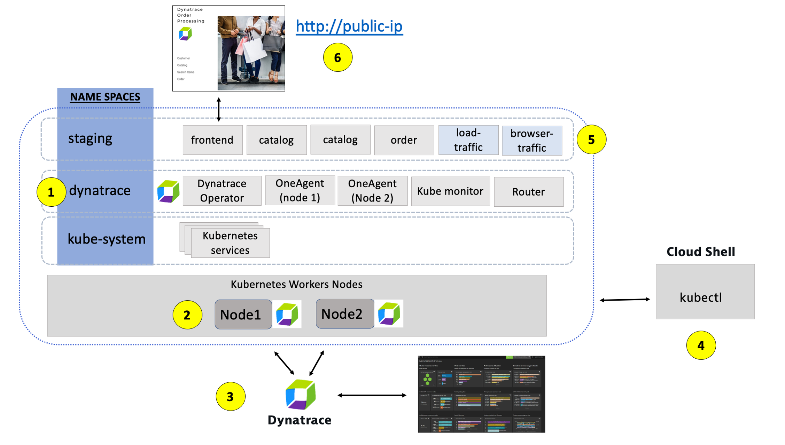

**1 - Dynatrace Namespace**

This <a href="https://kubernetes.io/docs/concepts/overview/working-with-objects/namespaces/" target="_blank"> Kubernetes Namespace </a> contains the pods and services that make up the Dynatrace Operator.

**2 - Kubernetes nodes**

Kubernetes runs your workload by placing containers into Pods to run on [Nodes]<a href="https://kubernetes.io/docs/concepts/architecture/nodes/" target="_blank"> Nodes </a>.

**3 - Dynatrace**

Dynatrace tenant where monitoring data is collected and analyzed.

**4 - Cloud shell**

The shell is configured with the <a href="https://kubernetes.io/docs/reference/kubectl/overview/" target="_blank"> kubectl </a> command line tool that lets you control Kubernetes clusters.

**5 - Sample application namespace**

This <a href="https://kubernetes.io/docs/concepts/overview/working-with-objects/namespaces/" target="_blank"> Kubernetes Namespace </a> contains the sample application pods and services.

**6 - Sample application**

The frontend service is exposed as a public IP and is accessible in a browser.

### Tasks to complete this step
1. Validate Sample App is accessible via browser
   - To view the application, we need to get the IP address assigned to the Kubernetes service for the sample application. 
      1. Go back to the window where you have Azure Cloud shell open
      2. From the Azure Cloud Shell SSH command prompt type this command
         ```
         kubectl -n staging get svc
         ```
      3. From the output, copy the entire value from EXTERNAL-IP and 
         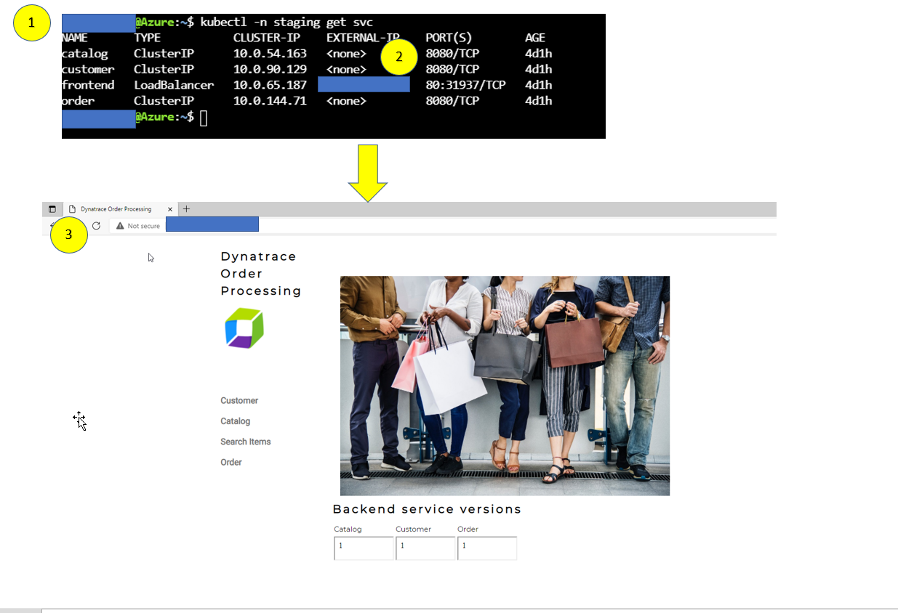 
      4. Open a browser window. Type in IP address similar to this `http://11.22.33.11` for the example above.  The output and application should look like the above browser window

2. Explore the Sample App on Kubernetes
      - Use the menu on on the home page to navigate around the application and notice the URL for key functionality. You will see these URLs later as we analyze the application.

            * Customer List = customer/list.html
            * Customer Detail = customer/5.html
            * Catalog List = catalog/list.html
            * Catalog Search Form = catalog/searchForm.html
            * Order List = order/list.html
            * Order Form = order/form.html

         📓 The application looks like this monolith, but notice how the home page shows the versions of the three running backend services. You will see these version updated automatically as we deploy new versions of the backend services.


## Review Kubernetes within Dynatrace

In this step we will walk through the different Dynatrace dashboards that are available out of the box for monitoring Kubernetes.

### Tasks to complete this step
1. Validate AKS ActivateGate visible in Dynatrace UI</summary>
   1.1. Go to the Dynatrace UI.
   1.2. From the Dynatrace Menu, click `Manage --> Deployment status` to review OneAgent Deployment status
   1.3. Within the `Deployment status` page, next click on the `ActiveGate` option to review the Active Gate. <br>      

      📓 From Dynatrace menu on the left, go to Manage -> Deployment Status -> ActiveGates, you will notice there is a `dynatrace-workshop-cluster-activegate-0` connected to your Dynatrace environment now.  This actigate gate routes all the agent traffic from apps that are running on that AKS cluster.**


2. Review Kubernetes Dashboards are accessible from the left-side menu in Dynatrace choose `Kubernetes` and navigate to the Kubernetes cluster page as shown below: <br>
      📓**Note:** Be sure that your management zone is NOT filtered!**

      

      **1 - Kubernetes cluster** - A summary the Kubernetes cluster is shown at the top of the Kubernetes dashboard.<br>

      **2 - Nodes** - The resources for the Cluster are summarized for the one-to-many hosts or Cluster nodes in this view.
      Explore specific node in the Node Analysis section, pick the analyze nodes button.
      

      **3 - Namespaces** - Namespaces are ways to partition your cluster resources to run multiple workloads (for example `application A` and `application B` workloads) on same cluster
      1.	This workload section shows workloads over time
      2.	In the Cluster workload section, pick the view all workloads button.
            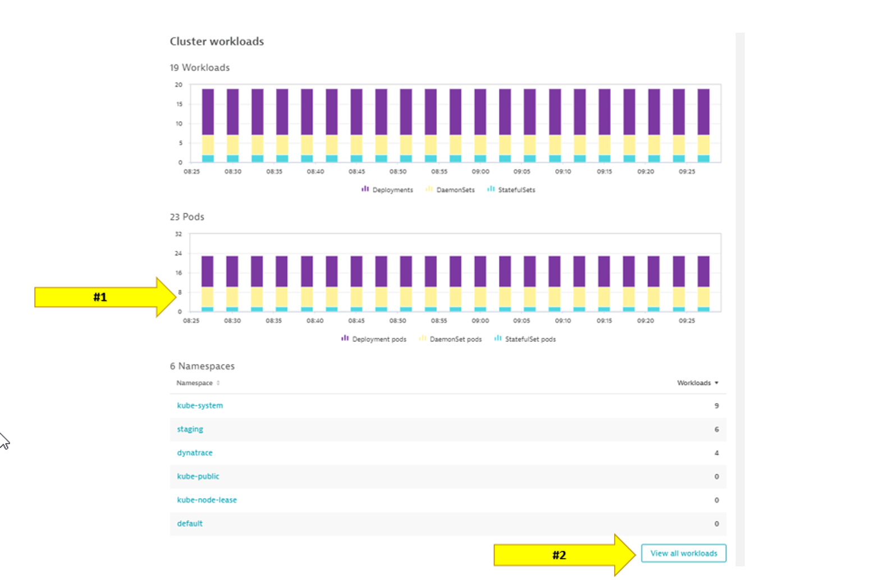
      - In the filter, pick namespace then staging
            

      **4 - Kubernetes workload**
      - Pick the frontend to drill into.
         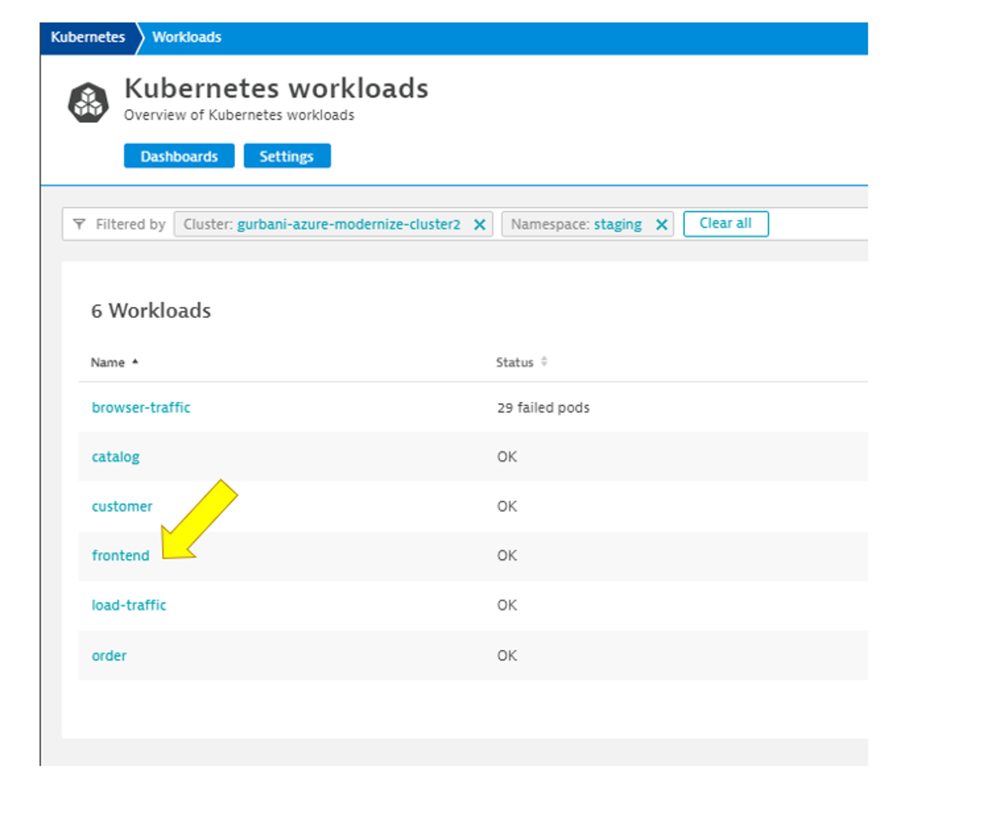
      - Review the workload overview page to look at various metrics related to the workload.
      - Click on Kubernetes POD to look at POD utilization metrics.
         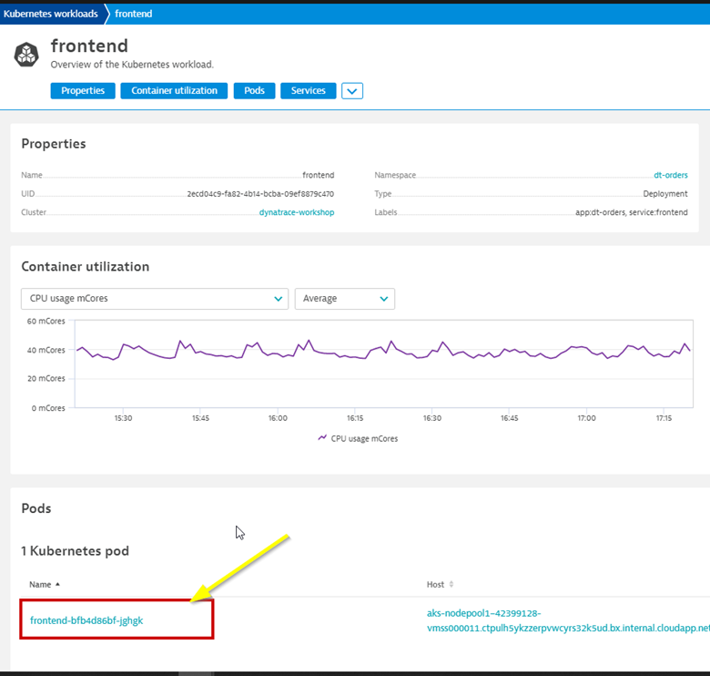

      **5 - POD** - Review the POD overview page to look at various metrics related to the POD
      - Click on Container next to look at container metrics      
         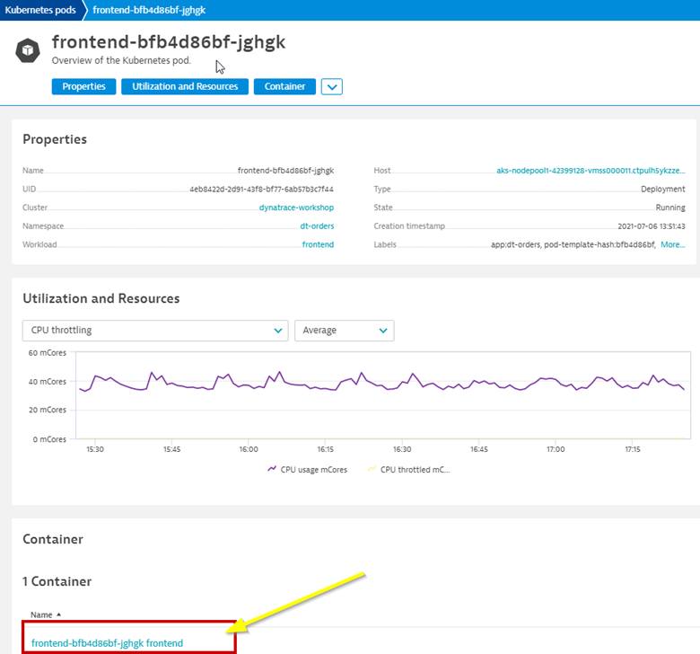
       

      **6 - Containers** - Referring to the diagram above, expand the properties and tags section to view:
      - Container information
      - Kubernetes information
      - In the info graphic, pick the service to open the services list
      - In the service list, click on k8-frontend service
      

      - Next click on 2 Services Icon to review the services running inside the container
      - Select the active front-end service.
      
      **7 - Service** - This view should now look familiar. In Lab 1, we looked at the service for the frontend and backend.  Notice how the Kubernetes information is also available in the service properties.  
            
      

## Analyze Service Backtrace on Kubernetes

Now that we've modernized the application and installed it on Kubernetes, we still need to trace the application transactions from front to back.  

Dynatrace understands your applications transactions from end to end. This transactional insight is visualized several ways like the backtrace.

The backtrace tree view represents the sequence of services that led to this service call, beginning with the page load or user action in the browser.

Dynatrace also gives you insight into what Kubernetes cluster, node, workload, and namespace that service is running on.

**👍 How this helps**

The service flow and service backtrace give you a complete picture of interdependency to the rest of the environment architecture at host, processes, services, and application perspectives.


### Tasks to complete this step
1. Review Services View for `order` service
   * Left Menu -> Applications & Microservices -> Services <br>
         
   * Top Menu -> filter by ``` dt-orders-k8 management ``` zone.
         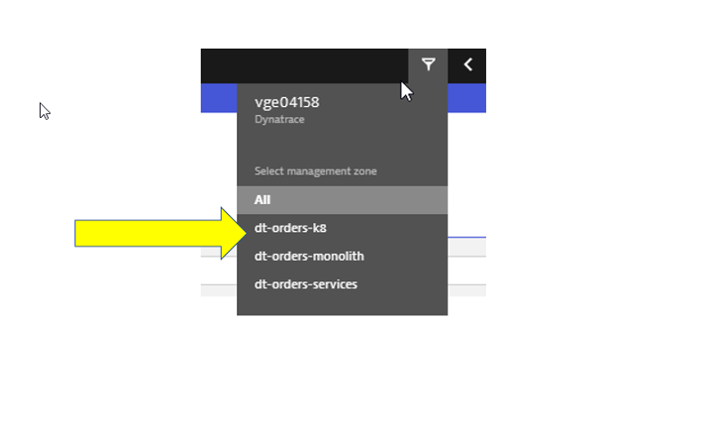
   * Pick the ``` order ``` service.
         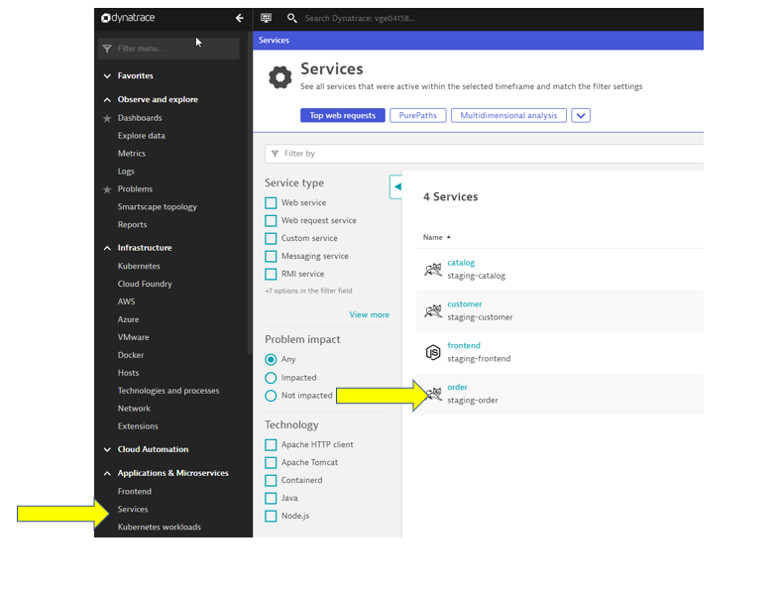
   * On this service, we can quickly review the inbound and outbound dependencies.
   * Referring to the picture, within the services infographic, click on the "services" square to get a list of the services that the order service calls.
         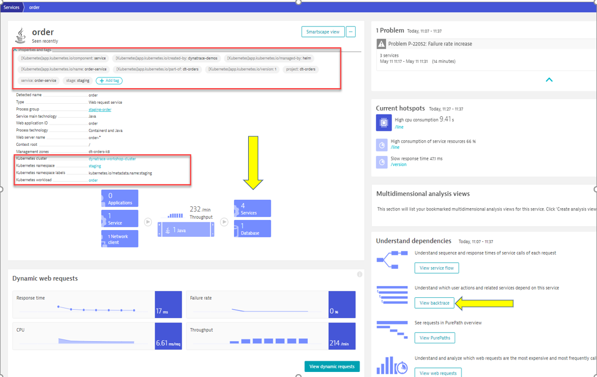

2. Review Backtrace View
   * To see the backtrace page, just click on the Analyze Backtrace button.
   * You should be on the service backtrace page where you will see information for this specific service.
   * This will get more interesting in the next lab, but for the monolith backend, we can see that the backtrace is as follows:
      1. The starting point is the backend
      1. Backend service is called by the front-end
      1. Front-end is a where end user requests start and the user sessions get captured 
      1. My web application is the default application that Dynatrace creates
         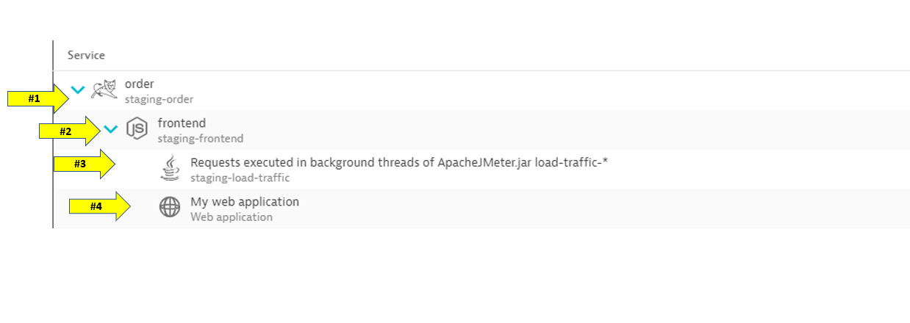

## Analyze Service flow on Kubernetes

In this step we will walk through the Service Flow view within Dynatrace  and see what's different now that its deployed on Kubernetes.

### Tasks to complete this step
1. Review Services View for `Frontend` service
   * Left Menu -> Applications & Microservices -> Services <br>
            
   * Top Menu -> filter by ``` dt-orders-k8 management ``` zone.
         
   * Pick the ``` frontend ``` service.
         
   * Just click on the view service flow button to open this.
         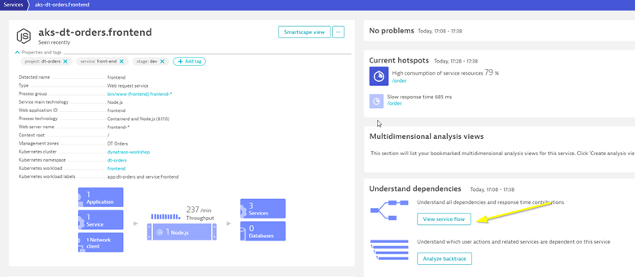 

2. Analyze Services view from Response time perspective
   - You should now be on the Service flow page.
   - Right away, we can see how this application is structured:
      * Frontend calls order, customer, and catalog service
      * Order service calls order and customer service
   - Something you would never know from the application web UI!
         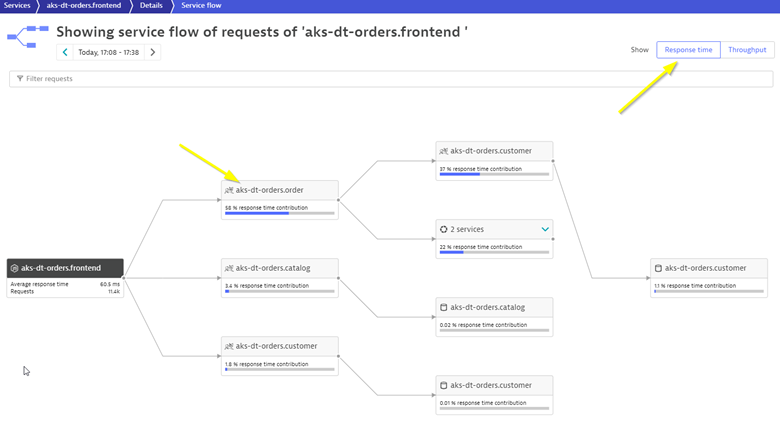

   - Refer to the picture above:
      1.	We are viewing the data from a Response time perspective. Shortly, we will review the Throughput perspective.
      2.	Click on the boxes to expand the response time metrics. Most of the response time is spent in the order service and the least in the customer services. And as in the simple version of the application, a very small amount of the response time is spent in the databases.

3. Analyze Services view from Throughput perspective
            

   - Refer to the picture above:
      1.	Change to the Throughput perspective by clicking on the box
      2.	Click on the boxes to expand the metrics to see the number of requests and average response times going to each service


**👍 How this helps**

Reviewing the architecture before and after changes is now as easy as a few clicks!


## Summary

While migrating to the cloud, you want to evaluate if your migration goes according to the plan, whether the services are still performing well or even better than before, and whether your new architecture is as efficient as the blueprint suggested. Dynatrace helps you validate all these steps automatically, which helps speed up the migration and validation process.

Having the ability to understand service flows enables us to make smarter re-architecture and re-platforming decisions.  With support for new technologies like Kubernetes, you have confidence to modernize with a platform that spans the old and the new. 

### Checklist

In this section, you should have completed the following:

   ✅ Installed Dynatrace Operator on Azure Kubernetes cluster

   ✅ Review real-time data now available for the sample application on Kubernetes

   ✅ Review Kubernetes dashboards within Dynatrace

   ✅ Review how Dynatrace helps with modernization planning


