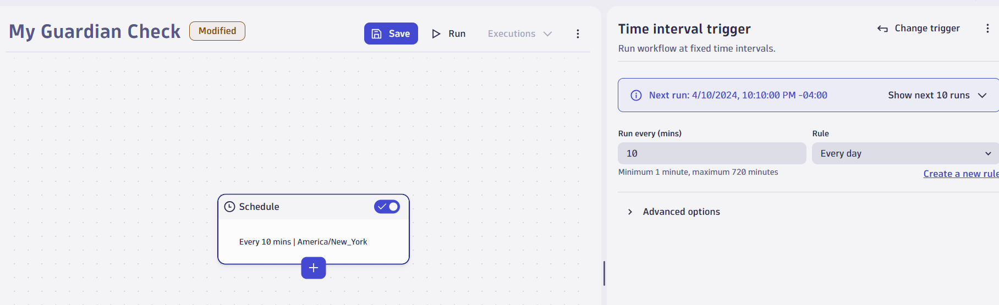
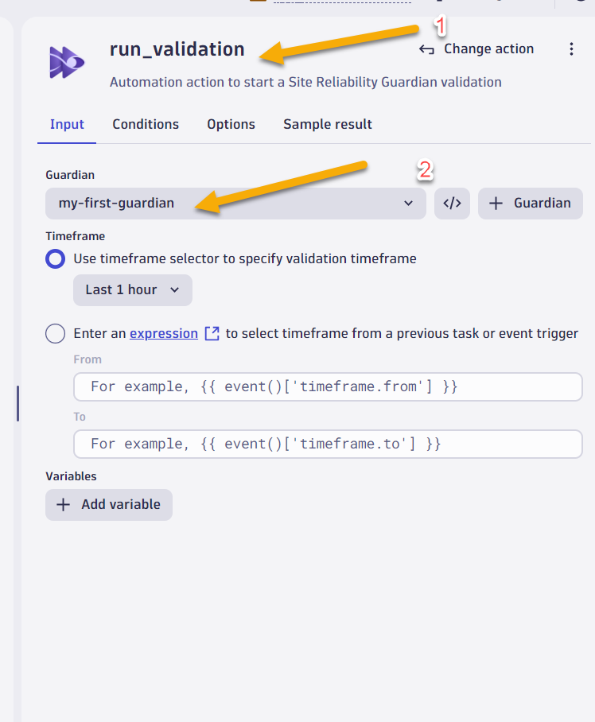

# Challenge 06 - Grail - SRE Guardian & Workflows  - Coach's Guide 

[< Previous Solution](./Solution-05.md) - **[Home](./README.md)** - [Next Solution >](./Solution-07.md)

## Notes & Guidance


## Detailed Steps

## Create the SRG

* Create a guardian
    * In Dynatrace from menu on the left, select Apps -> Site Reliability Guardian.
    * On the All Guardians overview page, select + Guardian.
    * Click on create without template. A new guardian is displayed in the editor.
    * Provide a name for the guardian: my-first-guardian
    * Add the following objective example by defining the name, a DQL, and specifying a target as well as a warning threshold.
        * Objective name: Error rate
        * Description: The error rate objective derives the number of error logs in ratio to the total number of log lines. The target is set to be less than 2% with a warning indicator at 1.5% of error logs.
        * DQL to calculate the error
            ```bash
               fetch logs
               | fieldsAdd errors = toLong(loglevel == "ERROR")
               | summarize errorRate = sum(errors)/count() *100 
            ```
            
        * Click on run query, select the last 1 hour to previw results of your current error rate.
    * Set thresholds for this objective:
        * Select Lower than the these numbers is good
        * Failure: 1
        * Warning: 0.4
    * Click on Create to create the guardian.
    * Click on Validate to perform a manual validation of the objective.

### Creating a workflow to execute the SRG

* Sign in to Dynatrace.
* In the Dynatrace Launcher, select Workflows.
* Select Add New workflow to create your first workflow. The Workflow editor opens.
* Select the workflow title ("Untitled Workflow") and customize the name e.g. "Guardian Check".
* In the Choose trigger section, select the Time interval trigger.
    * Set the Run every (min) parameter to 10 minutes and Rule parameter to everyday
        
    * To add the first task, select + on the trigger node of the workflow graph.
        
    * In the Choose action section, which lists all available actions for tasks, select "Site Reliability Guardian". The workflow now has its first task and shows the input configuration for that task on the right.
        * For the Guardian, select "my-first-guardian"
        * For the timeframe, select "Last 1 Hour"
        
* From the left menu click on save to save the workflow
    
* Select run to execute the workflow