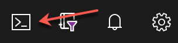

# Challenge 00 - Prerequisites - Ready, Set, GO!

**[Home](../README.md)** - [Next Challenge >](./Challenge-01.md)

<!-- 
**_This is a template for "Challenge Zero" which focuses on getting prerequisites set up for the hack. The italicized text provides hints & examples of what should or should NOT go in each section._**

**_We have included links to some common What The Hack pre-reqs in this template. All common prerequisite links go to the WTH-CommonPrerequisites page where there are more details on what each tool's purpose is._**

**_You should remove any common pre-reqs that are not required for your hack. Then add additional pre-reqs that are required for your hack in the Description section below._**

**_You should remove all italicized & sample text in this template and replace with your content._**
-->

## Introduction

 As a new engineer, you have been tasked with modernizing an e-commerce website for a company named "DT Hackers." The existing application was developed using Node.js and runs on Azure virtual machines. However, the goal now is to containerize the application for deployment on Kubernetes. Your initial task is to deploy the application to an Azure VM to gain a comprehensive understanding of the application and use Dynatrace to analyze its downstream dependencies.

 Subsequently, you need to devise a strategy for migrating the application to run on an [Azure Kubernetes Services](https://azure.microsoft.com/en-us/products/kubernetes-service) cluster.  Throughout this process, you'll utilize Dynatrace to monitor the application on Azure VM. After migrating to AKS, you'll compare the product functionality and assess the ease of monitoring and managing the application with Dynatrace. This comparison will help you streamline the migration and modernization of the application.

 You will present the deployed solution to the company's leadership upon successful migration for approval. The aim is to showcase how quickly and easily full stack observability can be achieved in minutes, with all metrics, logs, and traces for all Azure workloads being monitored in context using Dynatrace. The goal is to achieve fully automated, AI-assisted observability across the Azure environment.

## Common Prerequisites

We have compiled a list of common tools and software that will come in handy to complete most What The Hack Azure-based hacks!

You might not need all of them for the hack you are participating in. However, if you work with Azure on a regular basis, these are all things you should consider having in your toolbox.

<!-- If you are editing this template manually, be aware that these links are only designed to work if this Markdown file is in the /xxx-HackName/Student/ folder of your hack. -->

- [Azure Subscription](../../000-HowToHack/WTH-Common-Prerequisites.md#azure-subscription)
- [Managing Cloud Resources](../../000-HowToHack/WTH-Common-Prerequisites.md#managing-cloud-resources)
  - [Azure Portal](../../000-HowToHack/WTH-Common-Prerequisites.md#azure-portal)
  - [Azure CLI](../../000-HowToHack/WTH-Common-Prerequisites.md#azure-cli)
    - [Note for Windows Users](../../000-HowToHack/WTH-Common-Prerequisites.md#note-for-windows-users)
    - [Azure PowerShell CmdLets](../../000-HowToHack/WTH-Common-Prerequisites.md#azure-powershell-cmdlets)
  - [Azure Cloud Shell](../../000-HowToHack/WTH-Common-Prerequisites.md#azure-cloud-shell)


## Additional Pre-requisites

- Coach must validate if the [Dynatrace Azure Workshop Github repo](https://github.com/dt-alliances-workshops/azure-modernization-dt-orders-setup/) is accessible. 

- In this hack we'll use [Azure Native Dynatrace Service](https://www.dynatrace.com/news/blog/using-dynatrace-on-microsoft-azure/), a seamless way to provision and manage Dynatrace in the Azure Portal.  We will begin free trial through the Azure Marketplace.  Please familiarize your self with the docs below
    - [Dynatrace Docs](https://docs.dynatrace.com/docs/setup-and-configuration/setup-on-cloud-platforms/microsoft-azure-services/azure-platform/azure-native-integration)
    - [Microsoft Docs](https://learn.microsoft.com/en-us/azure/partner-solutions/dynatrace/dynatrace-overview)

## Description
<!--
_This section should clearly state any additional prerequisite tools that need to be installed or set up in the Azure environment that the student will hack in._

_While ordered lists are generally not welcome in What The Hack challenge descriptions, you can use one here in Challenge Zero IF and only IF the steps you are asking the student to perform are not core to the learning objectives of the hack._

_For example, if the hack is on IoT Devices and you want the student to deploy an ARM/Bicep template that sets up the environment they will hack in without them needing to understand how ARM/Bicep templates work, you can provide step-by-step instructions on how to deploy the ARM/Bicep template._

_Optionally, you may provide resource files such as a sample application, code snippets, or templates as learning aids for the students. These files are stored in the hack's `Student/Resources` folder. It is the coach's responsibility to package these resources into a Resources.zip file and provide it to the students at the start of the hack. You should leave the sample text below in that refers to the Resources.zip file._

**\*NOTE:** Do NOT provide direct links to files or folders in the What The Hack repository from the student guide. Instead, you should refer to the Resources.zip file provided by the coach.\*

**\*NOTE:** Any direct links to the What The Hack repo will be flagged for review during the review process by the WTH V-Team, including exception cases.\*

_Sample challenge zero text for the IoT Hack Of The Century:_
-->

Now that you have the common pre-requisites installed, there are prerequisites specific to this hack.

Your coach will provide you with a Resources.zip file that contains resources you will need to complete the hack. If you plan to work locally, you should unpack it on your workstation. If you plan to use the Azure Cloud Shell, you should upload it to the Cloud Shell and unpack it there.

Please install these additional tools:

1) Sign-up for free trail of [Azure Native Dynatrace Service via Marketplace](https://azuremarketplace.microsoft.com/en-US/marketplace/apps/dynatrace.dynatrace_portal_integration?tab=Overview) with full feature set of our all-in-one performance monitoring platform to monitor Azure.
   - Create the Free Trial using the `Dynatrace for Azure Trial` plan
        
   -  Refer to the guide [to create new Dynatrace Azure resource](https://learn.microsoft.com/en-us/azure/partner-solutions/dynatrace/dynatrace-create#create-a-dynatrace-resource-in-azure) once you choose the free trial public plan.

1) Familiarize yourself with [Azure CLI](https://learn.microsoft.com/en-us/azure/cloud-shell/overview).  We'll be using the BASH shell to deploy our Azure resources

### Dynatrace Prep

 For this challenge, you will deploy the DTOrders application and its underlying Azure VM resources to Azure using a set of pre-developed scripts. Once the application and its infrastructure are deployed, you will complete the hack's jumping in and fully analyze the application within Dynatrace.


- If not already done so, go to the [Azure Native Dynatrace Service via Marketplace](https://azuremarketplace.microsoft.com/en-US/marketplace/apps/dynatrace.dynatrace_portal_integration?tab=Overview) and request a free trial tenant
- Login to the Dynatrace tenant and create a Dynatrace API Access token with the following scopes, after reviewing [docs](https://www.dynatrace.com/support/help/dynatrace-api/basics/dynatrace-api-authentication#create-token) on how to create it
    - Write API Token 

- In a separate notepad, please write down the following things needed in a future step below  
  1) Keep the API token safe somewhere to be used in future step below, it will be following format: **dt0c01.ABC12345DEFGHI**
  2) Dynatrace tenant url, it should be in format link this: ``https://ABC.apps.dynatrace.com``
- 
### Azure Portal Prep
 - Login to Azure Portal and click on the **Cloud Shell** button on the menu in upper right hand corner 
    - Note: If you get a prompt to to select Bash or Powershell, please select **Bash**
- Lookup your [Azure subscription ID](https://learn.microsoft.com/en-us/azure/azure-portal/get-subscription-tenant-id) and save that off in the notepad where you have your dynatrace info
- Within your Azure Cloud Shell window, run a command to clone workshop scripts.
    ```bash    
    git clone https://github.com/dt-alliances-workshops/azure-modernization-dt-orders-setup.git
    ```
- Within Azure Cloud Shell window, change directory to  "azure-modernization-dt-orders-setup/provision-scripts" folder and run input-credentials.sh
    ```bash
    cd ~/azure-modernization-dt-orders-setup/provision-scripts
    ./input-credentials.sh
    ```
  > ***🛈 Note:*** When you run input-credentials.sh, it will prompt you to input Azure subscription id, Dynatrace Environment Url, Dynatrace API token and your last name.
- Run the script to provision the workshop Azure resources
     ```bash
    cd ~/azure-modernization-dt-orders-setup/provision-scripts
    ./provision.sh wth
    ```
- Validate provisioning completed
    ``` ...
    ...
    =============================================
    Provisioning workshop resources COMPLETE
    =============================================
    ```


## Success Criteria

To complete this challenge successfully, you should be able to:

- Once provisioning script has completed you will see a total of 12 resources within the resource group `<lastname>-dynatrace-azure-modernize-wth`.
- Validate the Sample Application DT Orders is accessible
    - Once the deployment has completed, navigate to the Public IP Address resource, dt-orders-monolithPublicIP , in the Azure Portal.
    - In the Overview blade, copy the IP address to your clipboard.
    - Open a web browser, paste your IP address in the address bar and press ENTER. Your browser should render the DT Orders site. 


## Learning Resources

- [Dynatrace API Token basics](https://www.dynatrace.com/support/help/dynatrace-api/basics/dynatrace-api-authentication)
- [Dynatrace natively available in the Azure portal ](https://www.dynatrace.com/news/blog/using-dynatrace-on-microsoft-azure/)
- [Dynatrace in the Azure Portal](https://www.dynatrace.com/support/help/get-started/saas/azure-native-integration)

- [Dynatrace Monaco](https://dynatrace.github.io/dynatrace-monitoring-as-code/)
