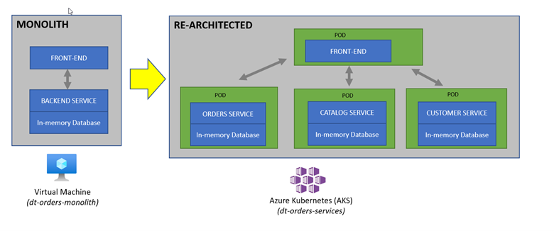

# Challenge 02 - Dynatrace Observability on AKS

[< Previous Challenge](./Challenge-01.md) - **[Home](../README.md)** - [Next Challenge >](./Challenge-03.md)


## Pre-requisites
- Ensure all Azure resources are provisioned from Challenge 0 , including the AKS cluster `dynatrace-azure-wth-cluster`

## Introduction

Re-hosting (also referred to as lift and shift) is a common migration use case. Re-architecture and Re-platform are steps that break the traditional architectures and replace individual components with cloud services and microservices.

We just learned how we can get great information on services, processes and user requests using Dynatrace and OneAgent. This helps us now decide what individual features or complete applications based on business benefits we need to migrate and modernize. The idea here is to focus on feature-based business benefit with functional migration.

### Modernize the Sample App
As we saw earlier, the sample application is a three-tiered application --> frontend, backend, database.

For our hack, another version of the application exists that breaks out each of these backend services into separate services. By putting these services into container images, we gain the ability to deploy the service into modern platforms like Azure Kubernetes such as the one shown below.



## Description
### Objectives of this Challenge
- Review how the sample application went from a simple architecture to multiple services

- Install the Dynatrace Operator and sample application

-  Examine the transformed application using service flows and back traces

### Tasks
1. Run the following command to fetch the AKS credentials for your cluster.
    ```shell
    az aks get-credentials --name "<aks-cluster-name>" --resource-group "<resource-group-name>"
    ```
    >💡**Hint:**  Refer back to Azure Portal under `<lastname>-dynatrace-azure-modernize-wth` resource group for aks cluster name
1. Deploy the Dynatrace Kubernetes Operator
    - Deploy Dynatrace Operator on the AKS cluster [via cluster extensions](https://learn.microsoft.com/en-us/azure/aks/cluster-extensions) blade. 

<!-- 
1. Deploy Kubernetes Dynatrace Operator
    - Deploy Dynatrace Operator on the AKS Cluster using 7 steps of the Automated mode 
        >💡**Hint:** On Step 6, when you download the **dynakube.yaml**, you can use Upload/Download feature within Azure cloudshell to upload the file
            
-->

1. Deploy sample application
    ```bash
    cd ~/azure-modernization-dt-orders-setup/app-scripts
    ./start-k8.sh

1. Access the sample application running on Kubernetes in you browser
    >💡**Hint:** To get the external IP for application type the following command

        kubectl -n staging get svc        


1. Review Dynatrace data for Kubernetes
    - Navigate to Kubernetes cluster utilization screen; from the navigation menu, go to **Infrastructure** and select **Kubernetes** and click on `dynatrace-azure-wth-cluster` cluster.  
        - What are the total number of CPU cores for your cluster?
        - What are the total number of workloads running on your cluster?
    - Navigate to Kubernetes workloads screen; from the navigation menu, go to **Application & Microservices** and select **Kubernetes workloads** and filter on `dynatrace-azure-wth-cluster` cluster and namespace `staging`.  
        - What is the average response time for  `frontend` workload over the last 30 minutes 
    - Navigate to the Kubernetes service screen for `frontend` workload
        >💡**Hint:** You can get this screen from the previous step under the Kubernetes services section.
        - What is the hostname where this workload's pod is running?
        - What labels are associated with this service under Properties and Tags section?          

1. Navigate to the `order` service screen and click on `Analyze backtrace`
    - Identify the service that calls the `order` service?   

1. Navigate to the `frontend` service screen running on Kubernetes and click on `View Service flow`
    - Identify three downstream services the frontend relies on?
    - Identify  the response time for `customer` service
    - Identify the throughput value for `catalog` service 

## Success Criteria

1. You have successfully fetched the AKS credentials against the cluster
2. You have a successfully installed the Dynatrace Operator on the AKS cluster and able to see metrics in Dynatrace UI.
3. You have successfully deployed the sample app to the AKS cluster.
1. You can access the sample application in your browser.
1. You are able to  identify the following data in the Kubernetes screens
    1) Identify total number of CPU cores for your cluster
    2) Identify total number of workloads running on your cluster
    3) Identify average response time for  `frontend` workload over the last 30 minutes
    4) Identify hostname where the workload pod is running
    5) Identify labels are associated with this frontend service under Properties and Tags section
1. You have successfully identified the the service that calls the order service?
1. You have successfully identified three downstream services the `frontend` service relies on, response time for `customer` database service and throughput value for `catalog` service.

## Learning Resources

- [Dynatrace Operator documentation](https://www.dynatrace.com/support/help/setup-and-configuration/setup-on-container-platforms/kubernetes/get-started-with-kubernetes-monitoring)
- [Deploy Dynatrace Operator on the AKS Cluster using 7 steps of Automated mode](https://www.dynatrace.com/support/help/setup-and-configuration/setup-on-container-platforms/kubernetes/get-started-with-kubernetes-monitoring#expand--instructions-for-automated-mode--2)
- [Dynatrace Operator blog](https://www.dynatrace.com/news/blog/new-dynatrace-operator-elevates-cloud-native-observability-for-kubernetes/)
- [Kubernetes cluster utilization dashboard](https://www.dynatrace.com/support/help/how-to-use-dynatrace/infrastructure-monitoring/container-platform-monitoring/kubernetes-monitoring/monitor-cluster-utilization-kubernetes)
-[Kubernetes Workloads dashboard](https://www.dynatrace.com/support/help/how-to-use-dynatrace/infrastructure-monitoring/container-platform-monitoring/kubernetes-monitoring/monitor-workloads-kubernetes)
- [Kubernetes Service Metrics](https://www.dynatrace.com/support/help/how-to-use-dynatrace/infrastructure-monitoring/container-platform-monitoring/kubernetes-monitoring/monitor-services-kubernetes)
- [Kubernetes Cluster overview Dashboard](https://www.dynatrace.com/support/help/how-to-use-dynatrace/infrastructure-monitoring/container-platform-monitoring/kubernetes-monitoring/monitor-metrics-kubernetes)
## Tips


## Advanced Challenges (Optional)

