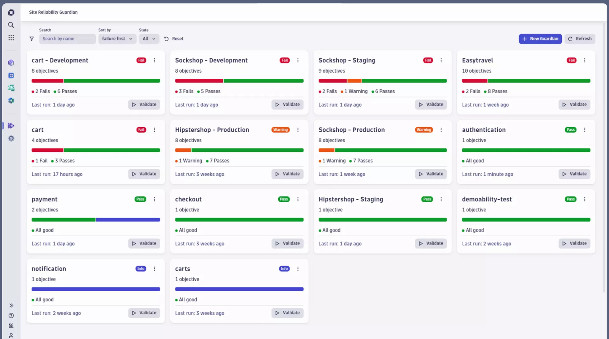

# Challenge 05 - Azure Grail - Dashboards & Notebooks

[< Previous Challenge](./Challenge-04.md) - **[Home](../README.md)** - [Next Challenge >](./Challenge-06.md)

 

## Pre-requisites (Optional)
None

## Introduction
The Site Reliability Guardian provides an automated change impact analysis to validate service availability, performance, and capacity objectives across various systems. This enables DevOps platform engineers to make the right release decisions for new versions and empowers SREs to apply Service-Level Objectives (SLOs) for their critical services.

While the Dynatrace Site Reliability Guardian simplifies the adoption of DevOps and SRE best practices to ensure reliable, secure, and high-quality releases in general, the provisioned workflow is key for automating those best practices in particular. Learn in this sample how the workflow will act on changes in your environment and how it will perform a validation to make the right decision in a releasing or progressive delivery process.

In this hack, you will learn more about the workflow leveraged by the [Site Reliability Guardian](https://docs.dynatrace.com/docs/platform-modules/automations/site-reliability-guardian).




Workflows is one of the built-in apps shipped with Dynatrace. A series of actions are assembled to build processes in a graphical representation. Those workflows can automatically be triggered by events in Dynatrace, either on a schedule or manually.

Workflows let you: 
- Automatically react to Davis events or security problems.
- Schedule reports in line with holidays and work hours.
- Orchestrate IT processes across your entire IT landscape.
- Connect to both cloud and locally gated services.
- Combine out-of-the-box integrations with custom code.
- Visualize automated processes in a graphical workflow interface.
- Get live monitoring and a full audit trail of any automation execution.
- Define flow logic with custom conditions, automatic retries, loops, and parallel processing.

## Description

## Objectives
- In this hack we'll create Site Reliability Guardian (SRG) and a Workflow to automate change impact analysis of your application service.

### Tasks

1. Create a Guardian.
    - Add an error rate objective to the Guardian.  Use the following DQL to calculate the error rate
    ```bash
    fetch logs
    | fieldsAdd errors = toLong(loglevel == "ERROR")
    | summarize errorRate = sum(errors)/count() * 100
    ```
    - Set the following thresholds for the objective
        - `Select Lower than the these numbers is good`
        - Failure: 1
        - Warning: 0.4
1. Create a workflow to run every 10 minutes to trigger the SRG.


## Success Criteria
- Workflow executes the SRG
## Learning Resources
- [Quickstart](https://docs.dynatrace.com/docs/platform-modules/automations/workflows/quickstart) examples on how to build Workflows in Dynatrace
## Tips