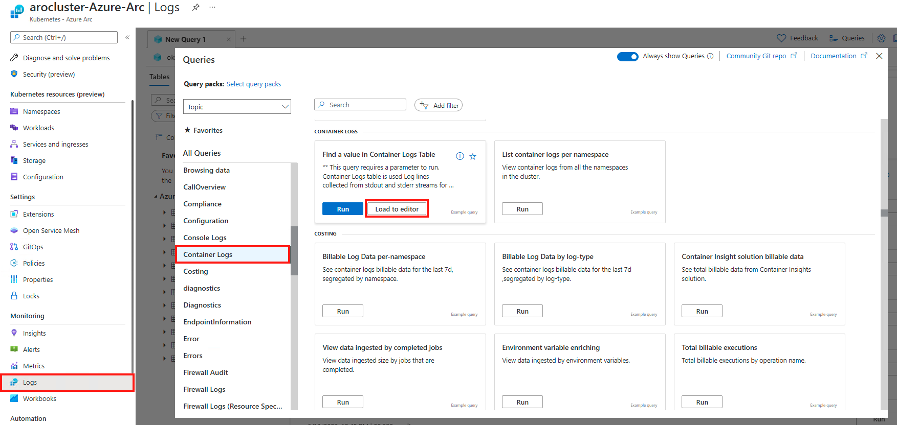
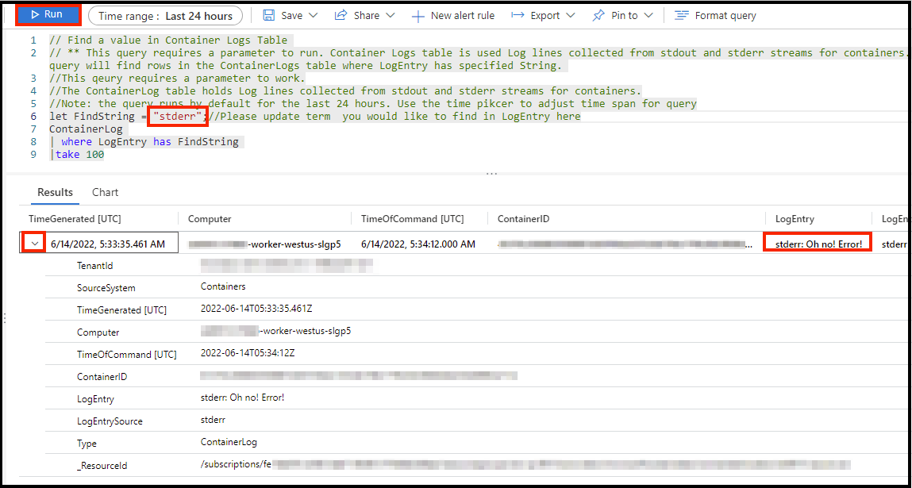

# Challenge 03 - Logging and Metrics - Coach's Guide 

[< Previous Solution](./Solution-02.md) - **[Home](./README.md)** - [Next Solution >](./Solution-04.md)

## Notes & Guidance
- The aim of this challenge is to have students explore the logging tools and debug the application to figure out what is wrong. In later challenges, we will fix these bugs, but for now, the students just need to find them using logging tools.
  - **NOTE:** The students **ARE NOT** supposed to fix the broken application in this challenge!

Just to reiterate the errors in the application:
  - The backend API is broken because we will need to deploy a MongoDB backend and configure the environment variables on the deployment (Challenge 4 & 5)
  - The frontend application is broken because we will need to configure our environment variables on the deployment to point to our backend API (Challenge 5)

## Getting logs from CLI
- Get Pod Names
  - In the CLI, retrieve the name of the frontend pods to view pod logs using the command:
  `oc get pods -o name`
    - It was successful if you see something like
    ```
    pod/rating-web-build
    pod/rating-web-5bfcbdbff6-h8755
    pod/rating-api-build
    pod/rating-api-7699b66cf5-7ch4w 
    ```
- Get Errors from CLI
  - To look at the frontend pod logs, we can use the command `oc logs [pod name]` which as an example, would look like:
  ```
  oc logs pod/rating-api-7699b66cf5-7ch4w 
  ```
  - The error will show that there is no mongoDB connected, with an error beginning with `process.env.MONGODB_URI is undefined`

## Getting logs from ARO Web Console
- Make sure you are under the Administrator tab (shown on the top-left, there is also a Developer tab)
- Navigate to workloads from the menu on the left-hand side
- Under Workloads, navigate to Pods
- In Pods, there is a Logs tab (in between Environment and Events)
- In this tab, the logs will be shown

### View metrics and logs by integrating with Azure Arc
You can use Azure services for metrics and logging by enabling your ARO cluster with Azure Arc. The instructions for setting this up can be found at the following locations. Perform them in the following order. These are prerequisites for this part of the lab.

1. [Connect an existing cluster to Azure Arc](https://docs.microsoft.com/en-us/azure/azure-arc/kubernetes/quickstart-connect-cluster?tabs=azure-cli)
1. [Azure Monitor Container Insights for Azure Arc-enabled Kubernetes clusters](https://docs.microsoft.com/en-us/azure/azure-monitor/containers/container-insights-enable-arc-enabled-clusters?toc=%2Fazure%2Fazure-arc%2Fkubernetes%2Ftoc.json&bc=%2Fazure%2Fazure-arc%2Fkubernetes%2Fbreadcrumb%2Ftoc.json)

> Note: These also have some small prerequisites. Make sure to read those too. Also, when it asks for the "Cluster Name" for the CLI commands, it will most likely be the name of the Arc enabled cluster name and NOT the name of your ARO cluster.
Once you have completed the above steps, if you are not already in Container Insights, then type "Azure Arc" in the search bar from the Home screen and select "Kubernetes - Azure Arc".


Select the Arc connected cluster you just created, then select "Insights".


You will see a page with all sorts of metrics for the cluster.




This will populate a query that requires a parameter to search for. Let's look for our error entry. Type "stderr" in the location for `FindString`, then click run.  You should see one line returned that contains the message you inputted earlier. You can also click the twist for more information.



Feel free to spend a few minutes exploring logs with the pre-created queries or try your own to see how robust the service is.