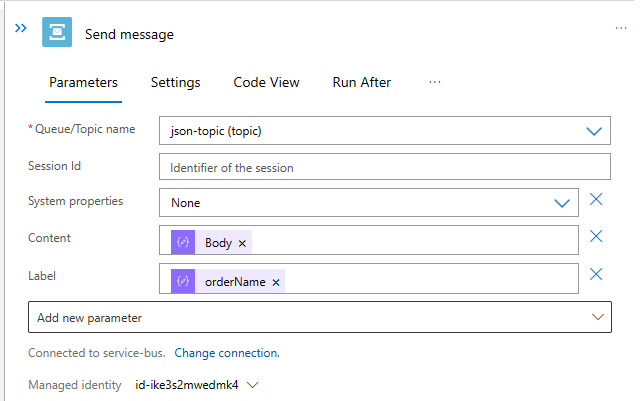
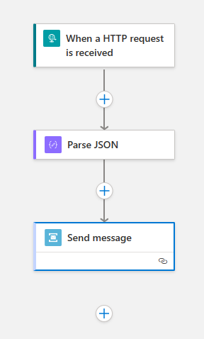
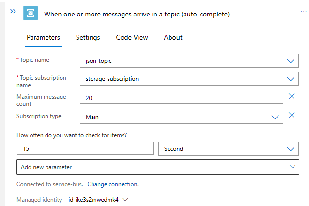
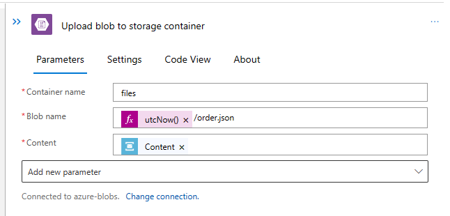
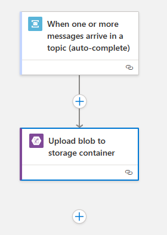
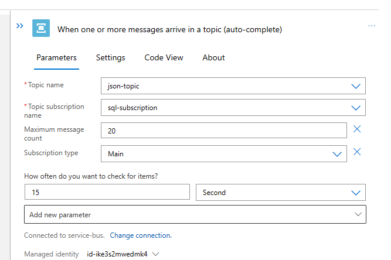
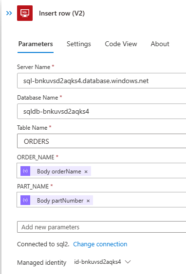
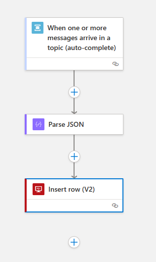

# Challenge 03 - Modularize & use Service Bus for integration - Coach's Guide 

[< Previous Solution](./Solution-02.md) - **[Home](./README.md)** - [Next Solution >](./Solution-04.md)

## Notes & Guidance

### `json` workflow

1.  Modify the `json` workflow and remove the `Upload blob` & `Insert row` steps. 

1.  Add a `Service Bus->Send Message` (under the `Azure` tab) step to put message on Service Bus topic `json-topic`.

1.  Set the `Authentication Type` to `Logic Apps Managed Identity`.

1.  Set the `Namespace Endpoint` to the Service Bus namespace endpoint (e.g. `sb://<namespace>.servicebus.windows.net/`).

1.  Set the `Queue/Topic name` to `json-topic (topic)`.

1.  Under the `Add new parameter`, check the boxes for `Content` and `Label`.

1.  Set the `Content` to the `body` field from the JSON input.

1.  Set the `Label` to the `name` field from the JSON input.

    The `Send message` action should look like this:

    

1.  Save the workflow.

    The overall workflow should look similar to this:

    

### `storage` workflow

1.  Create a new Logic App workflow called `storage`.

1.  Add a `Service Bus->When a message is received in a topic (auto-complete)` (under the `Azure` tab) trigger.

1.  Set the `Topic name` to `json-topic`.

1.  Set the `Subscription name` to `storage-subscription`.

    The `When a message is recieved in a topic (auto-complete)` trigger should look like this:

    

1.  Add a `Blob Storage->Create blob` (under the `Azure` tab) step.

1.  Set the `Blob container` to `files`.

1.  Set the `Blob name` to `utcNow()/order.json`.

1.  Set the `Blob content` to `Content` from the `When a message is recieved in a topic (auto-complete)` trigger.

    The `Upload blob` action should look like this:

    

1.  Save the workflow.

    The overall workflow should look similar to this:

        

### `sql` workflow

1.  Add a `Service Bus->When a message is received in a topic (auto-complete)` (under the `Azure` tab) trigger.

1.  Set the `Topic name` to `json-topic`.

1.  Set the `Subscription name` to `sql-subscription`.

    The `When a message is recieved in a topic (auto-complete)` trigger should look like this:

    

1.  Add a `Parse JSON` action & set the `Schema` similar to the following:

    ```json
    {
        "type": "object",
        "properties": {
            "orderName": {
                "type": "string"
            },
            "partNumber": {
                "type": "string"
            }
        }
    }
    ```

1.  Use the `decodeBase64()` function to decode the `Content` from the `When a message is recieved in a topic (auto-complete)` trigger. 

    ```decodeBase64(triggerBody()?['ContentData'])```

    The `Parse JSON` action should look like this:

    

1.  Add a `SQL->Insert row (V2)` (under the `Azure` tab) action after the `Parse JSON` action.

1.  Set the `Authentication Type` to `Logic Apps Managed Identity`.

1.  Set the `Server name` to the SQL server name.

1.  Set the `Database name` to the SQL database name.

1.  Set the `Table name` to `ORDERS`.

1.  Set the `ORDER_NAME` to `orderName` from the `Parse JSON` action.

1.  Set the `PART_NUMBER` to `partNumber` from the `Parse JSON` action.

    The `Insert row (V2)` action should look like this:

    

1.  Save the workflow.

    The overall workflow should look similar to this:

    

### Testing

1.  Test the `json` workflow by sending a `HTTP POST` to the endpoint and ensure that the message is received by the `storage` and `sql` workflows. Ensure that the message is saved to the `files` Blob container and the `ORDERS` table in the SQL database.

## Troubleshooting