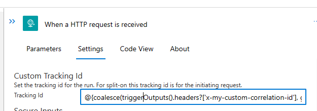
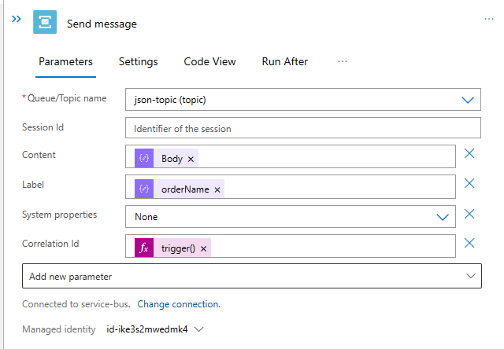
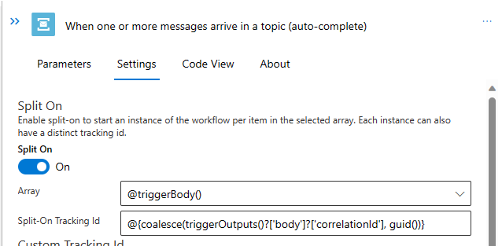
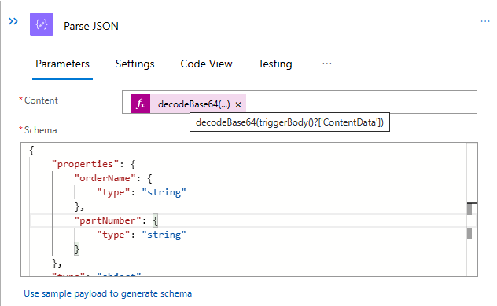
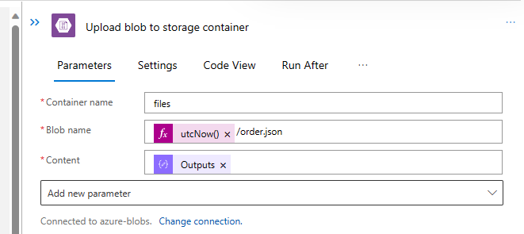
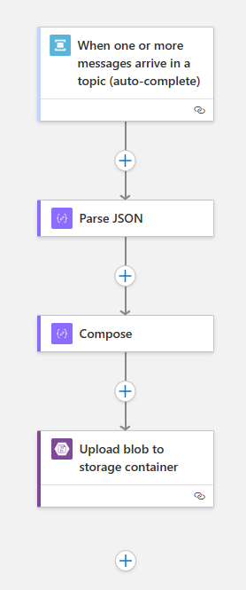
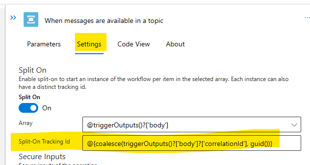
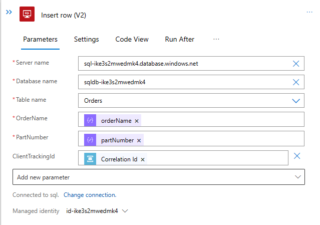
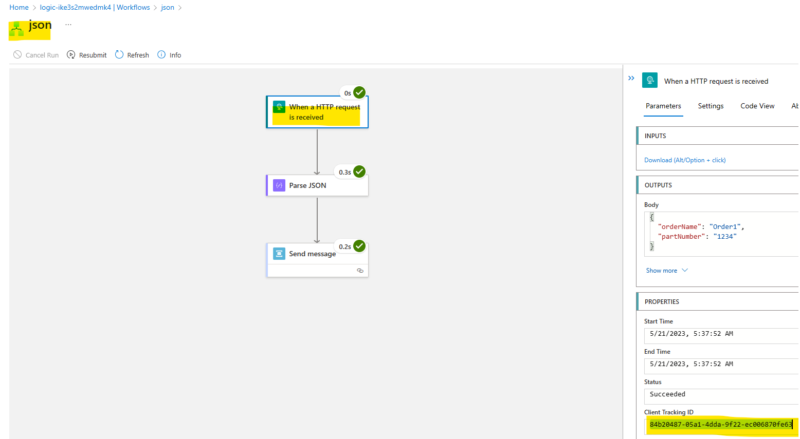
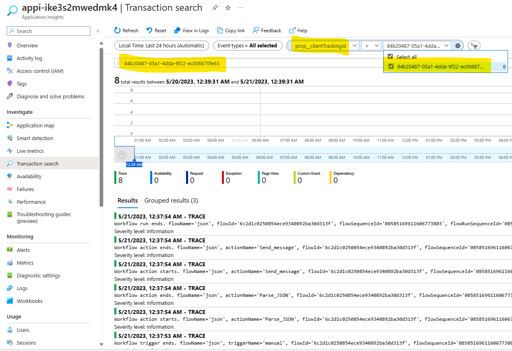

# Challenge 04 - Monitor end-to-end workflow - Coach's Guide 

[< Previous Solution](./Solution-03.md) - **[Home](./README.md)** - [Next Solution >](./Solution-05.md)

## Notes & Guidance

### `json` workflow

1.  Open the `json` workflow

1.  Select the `When a HTTP request is received` trigger & click on the `Settings` tab.

1.  Paste the following code in the `Tracking Id` field:

    ```
    @{coalesce(triggerOutputs().headers?['x-my-custom-correlation-id'], guid())}
    ```

    The `When a HTTP request is received` trigger should look like the following.

    

1.  Select the `Send message` action.

1.  Click on `Add new parameter` and select `Correlation Id`.

1.  Add the following code in the `Correlation Id` field (via the `Expression` tab):

    ```
    trigger().clientTrackingId
    ```

    The `Send message` action should look like the following.

    

1.  Save the workflow.

### `storage` workflow

1.  Open the `storage` workflow

1.  Select the `When messages are available in a topic` trigger & click on the `Settings` tab.

1.  Paste the following code in the `Split-On Tracking Id` field:

    ```
    @{coalesce(triggerOutputs()?['body']?['correlationId'], guid())}
    ```

    The `When messages are available in a topic` trigger should look like the following.

    

1.  Add a `Parse JSON` action & set the `Schema` similar to the following:

    ```json
    {
        "type": "object",
        "properties": {
            "orderName": {
                "type": "string"
            },
            "partNumber": {
                "type": "string"
            }
        }
    }
    ```

1.  Use the `decodeBase64()` function to decode the `Content` from the `When a message is recieved in a topic (auto-complete)` trigger. 

    ```decodeBase64(triggerBody()?['ContentData'])```

    The `Parse JSON` action should look like this:

    

1.  Add a `Compose` action to the workflow to create a new JSON document to insert into Blob Storage. The `Inputs` field should be similar to the following (in the read-only Code View after adding the fields):

    ```json
    {
        "orderName": "@{body('Parse_JSON')?['orderName']}",
        "partNumber": "@{body('Parse_JSON')?['partNumber']}",
        "clientTrackingId": "@{triggerBody()?['CorrelationId']}"
    }
    ```

    The `Compose` action should look like this:

    

1.  Modify the `Upload blob` action to use the `Compose->Outputs` action as the `Content` input.

    The `Upload blob` action should look like this:

    

1.  Save the workflow.

    The overall workflow should look like this:

    

### `sql` workflow

1.  Open the `sql` workflow

1.  Select the `When messages are available in a topic` trigger & click on the `Settings` tab.

1.  Paste the following code in the `Split-On Tracking Id` field:

    ```
    @{coalesce(triggerOutputs()?['body']?['correlationId'], guid())}
    ```

    The `When messages are available in a topic` trigger should look like the following.

    

1.  Modify the `Insert row (V2)` action to populate the `CLIENT_TRACKING_ID` with the `Correlation Id` from the `When a message is recieved in a topic (auto-complete)` trigger.

    The `Insert row (V2)` action should look like this:

    

1.  Save the workflow.

## Testing

1.  Test the `json` workflow by sending a `HTTP POST` to the endpoint and ensure that the message is received by the `storage` and `sql` workflows. Ensure that the message is saved to the `files` Blob container and the `ORDERS` table in the SQL database. Ensure the new `ClientTrackingId` is populated both places.

## Transaction Search

1.  Copy the `ClientTrackingId` from the most recent run of the `json` workflow.

    

1.  Open the `Transaction Search` blade of Application Insights in the `Azure Portal`.

1. Filter based upon a `prop__clientTrackingId`.

    