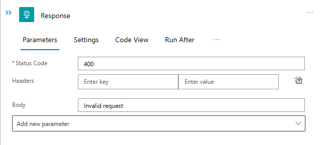
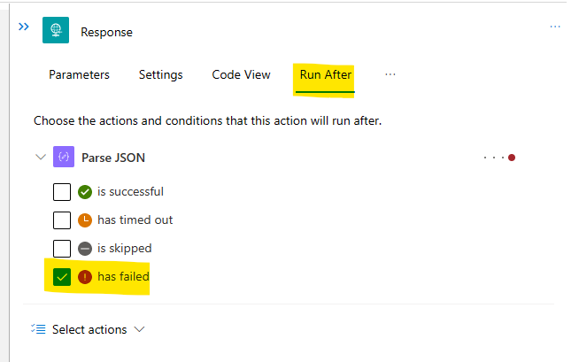
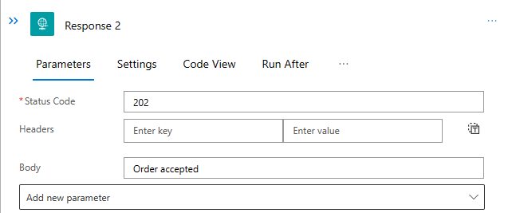
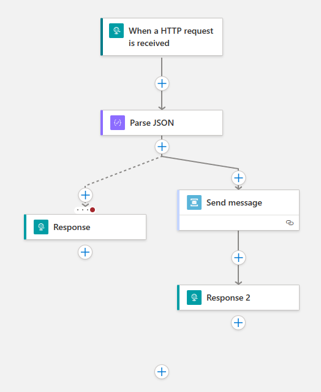
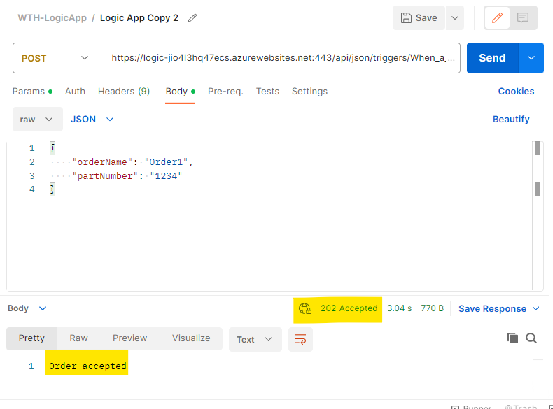
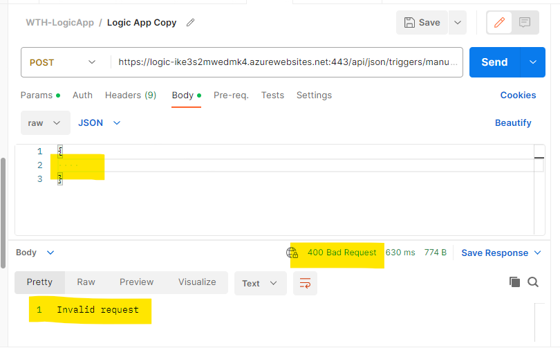

# Challenge 05 - Validation & Custom Response - Coach's Guide 

[< Previous Solution](./Solution-04.md) - **[Home](./README.md)** - [Next Solution >](./Solution-06.md)

## Notes & Guidance

1.  Open the `json` workflow

1.  Select the `Parse JSON` action.

1.  Modify the `Schema` section with the following JSON.

    ```json
    {
        "properties": {
            "orderName": {
                "type": "string"
            },
            "partNumber": {
                "type": "string"
            }
        },
        "required": [
            "orderName",
            "partNumber"
        ],
        "type": "object"
    }
    ```

1.  Add a parallel branch after the `Parse JSON` task

1.  Add a `Response` action to the new branch

1.  Set the `Status Code` to `400`

1.  Set the `Body` to `Invalid request`

    The `Response` action should look like the following.

    

1.  Click on the `Run After` tab.

1.  Expand the `Parse JSON` section

1.  Ensure only the `has failed` checkbox is checked.

    The `Response` action should look like the following.

    

1.  Add another `Response` action after the `Send message` action

1.  Set the `Status Code` to `202`

1.  Set the `Body` to `Order created`

    The `Response` action should look like the following.

    

    The overall workflow should look like something the following.

    

1.  Save the workflow.

## Testing

1.  In Postman, call the HTTP endpoint and verify that you get the new `Order accepted` response message & a `202` status code.

    

1.  In Postman, call the HTTP endpoint with an invalid JSON payload and verify that you get the new `Invalid request` response message & a `400` status code.

    