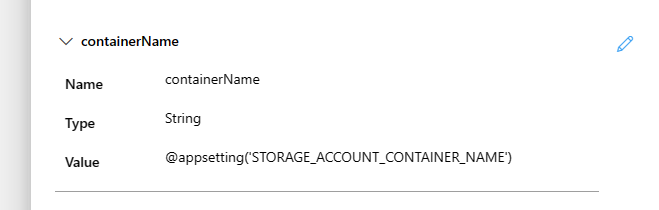

# Challenge 06 - Parameterize with app settings - Coach's Guide 

[< Previous Solution](./Solution-05.md) - **[Home](./README.md)** - [Next Solution >](./Solution-07.md)

## Notes & Guidance

1.  Look at the `Configuration` blade of the Logic App

1.  Note the name & value of the `STORAGE_ACCOUNT_CONTAINER_NAME` app setting

1.  Open the `storage` workflow & `Designer` view

1.  Add a parameter to the `storage` workflow

1.  Set the `Name` to `containerName`

1.  Set the `Type` to `String`

1.  Set the `Value` to `@appsetting('STORAGE_ACCOUNT_CONTAINER_NAME')`

    The `storage` workflow should look like the following.

    

    >NOTE: You will need to remove the double quotes surrounding this value if the Logic App designer adds them. You may have to play with this a bit get it to save without them (let it add them, save the workflow, then remove them & save again).

1.  Click the `X` in the top right corner to close the editor

1.  Click on the `Upload blob to storage container` action and modify the `Container name` to use the new parameter

    The `Upload blob to storage container` action should look like the following.

    

1.  Save & test your workflow to ensure it still works
