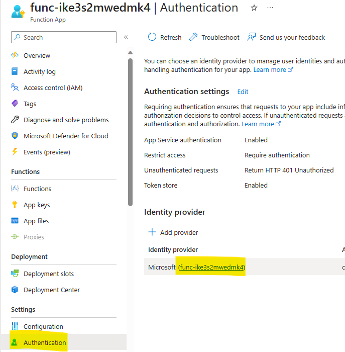
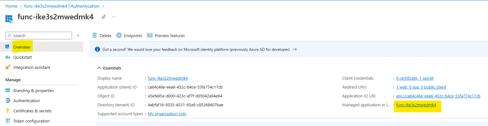
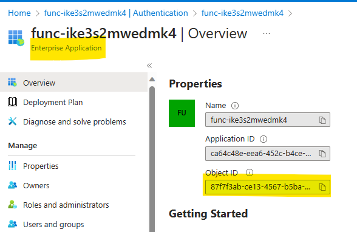
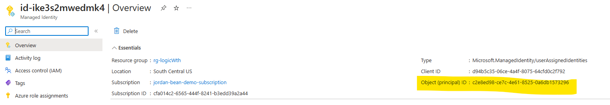
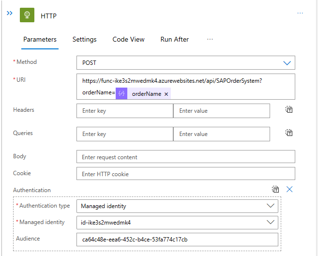
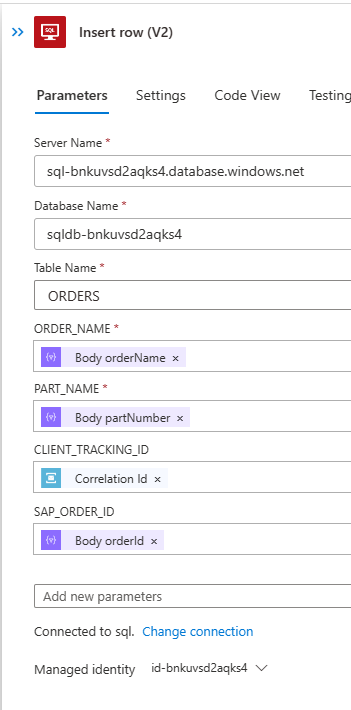

# Challenge 07 - Authenticate with AzureAD when calling custom API - Coach's Guide 

[< Previous Solution](./Solution-06.md) - **[Home](./README.md)** - [Next Solution >](./Solution-08.md)

## Notes & Guidance

### Easy Auth

1.  Open the Azure Function in the Azure portal.

1.  Click on the `Authentication` blade.

1.  Click on the `Add identity provider` button.

1.  Select `Microsoft` from the list of identity providers.

1.  For `Tenant type`, select `Workforce`

1.  For `App Registration Type`, select `Create new app registration`

1.  For `App registration name`, leave it as the name of the Function App.

1.  For `Supported account types`, select `Current tenant - Single tenant`.

1.  For `Restict access`, select `Require authentication`.

1.  For `Unauthenticated requests`, select `HTTP 401 Unauthorized: recommended for APIs`.

1.  Click on the `OK` button.

1.  Copy the `App (client) ID` for use later.

1.  Click on the `func-<suffix>` link under the `Identity provider` section for a shortcut to the App Registration.

    

1.  Click on the `func-<suffix>` link under the `Managed application in...` section for a shortcut to the Enterprise App.

    

1.  Copy the `Object ID` of the `Enterprise App` (service principal).

    

### Managed Identity

1.  Open the Managed Identity in the Azure portal.

1.  Copy the `Object ID` of the Managed Identity.

    

### Grant the Managed Identity access to the Function App

1.  Open Cloud Shell (PowerShell) in the Azure portal.

1.  Authenticate with the Azure AD cmdlets

    ```powershell
    Connect-AzureAD
    ```

1.  Execute the following command to grant the Managed Identity access to the Function App (substitute your own values).

    ```powershell
    New-AzureADServiceAppRoleAssignment -ObjectId {MANAGED-IDENTITY-OBJECT-ID} -Id 00000000-0000-0000-0000-000000000000 -PrincipalId {MANAGED-IDENTITY-OBJECT-ID} -ResourceId {ENTERPRISE-APP-OBJECT-ID}
    ```

### Call the Function App from the `sql` workflow

1.  Open the `sql` workflow in the Logic App Designer.

1.  Add a new `HTTP` action after the existing `Parse JSON` action.

1.  Set the `Method` to `POST`.

1.  Set the `URI` to the URL of the Azure Function. Add the query parameter `orderName` and set the value to the `orderName` property from the `Parse JSON` action.

    ```
    https://func-ike3s2mwedmk4.azurewebsites.net/api/SAPOrderSystem?orderName=@{body('Parse_JSON')?['orderName']}
    ```

1.  Click on `Add new parameter` and check the box for `Authentication`.

1.  Set the `Authentication type` to `Managed Identity`.

1.  Select the `Managed Identity` that was created for the Logic App.

1.  Set the `Audience` to the `App (client) ID` copied earlier from the Azure Function

    The completed `HTTP` action should look like the following.

    

1.  Add another `Parse JSON` task after the `HTTP` action.

1.  Set the `Content` to the `Body` property of the `HTTP` action.

1.  Use the following schema for the new `Parse JSON` action.

    ```json
    {
        "OrderId": 323434,
        "OrderName": "order1"
    }
    ```

1.  Modify the `Insert row (V2)` action and add the new parameter for the `SAPOrderId` property from the `Parse JSON` action.

    The completed `Insert row (V2)` action should look like the following.

    

1.  Save the Logic App.

## Testing

1.  Send a new request and check the database to see if the `SAPOrderId` was populated. You can also check the Azure Function logs to see if the request was received.