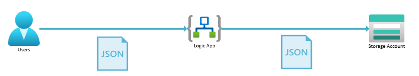

# Challenge 01 - Process JSON input data & write to Storage

[< Previous Challenge](./Challenge-00.md) - **[Home](../README.md)** - [Next Challenge >](./Challenge-02.md)

## Introduction

In this challenge, you will be setting up a Logic App as a REST API endpoint for customers to submit their orders for parts to your company. The Logic App will accept a JSON payload from the caller, parse the JSON, and write the JSON to a Blob Storage account.

## Description

You will be setting up a new Logic App workflow to enable the following architecture.



- Create a new Logic App workflow in the Azure portal named `json` of type `Stateful`.
- Add a new `When a HTTP request is received` trigger to the workflow to accept a JSON payload from the caller.
- Add a new `Parse JSON` trigger to the workflow (use the `Use sample payload to generate schema` option to generate the schema based upon the JSON payload below)
- Add a new `Upload blob to storage container` action to the workflow to write a JSON file to the Blob Storage account that ends in `files` and has a container named `files`.  
- Call the URL of the Logic App from Postman, passing in the JSON payload below:
    ```json
    {
        "orderName": "Order1",
        "partNumber": "1234"
    }
    ```
- Look at the `Overview->Run History` of the `json` workflow run and verify that the JSON file was written to the Blob Storage account.

## Success Criteria

To complete this challenge successfully, you should be able to:
- Verify that you were able to create a new Logic App workflow in the Azure portal.
- Verify that you were able to trigger this workflow off of a HTTP REST API request.
- Verify that you were able to parse the JSON payload from the caller & write the order as a JSON file to Blob Storage.

## Learning Resources

- [Create an example Standard workflow in single-tenant Azure Logic Apps with the Azure portal](https://learn.microsoft.com/en-us/azure/logic-apps/create-single-tenant-workflows-azure-portal?tabs=standard)

## Tips

- Recommendation is to use the `Built-in` connector for `Azure Blob Storage`
- You will have to create a `Connection` to the Blob Storage account the first time you use this connector. Use the `Storage account connection string` as the `authentication type` for this challenge. You can get the Storage Account connection string from the Azure portal (under `Access keys`).
- Use `utcNow()/order.json` as the filename so you get unique filenames (note the use of the `utcNow()` function, use the `Expression` tab to add the function, then the suffix as text).
- Use the `Body` of the `Parse JSON` action as the `Content` in the `Upload blob to storage container` action.
- Look at the `When a HTTP request is received` trigger after saving the workflow to get the URL to call from Postman.