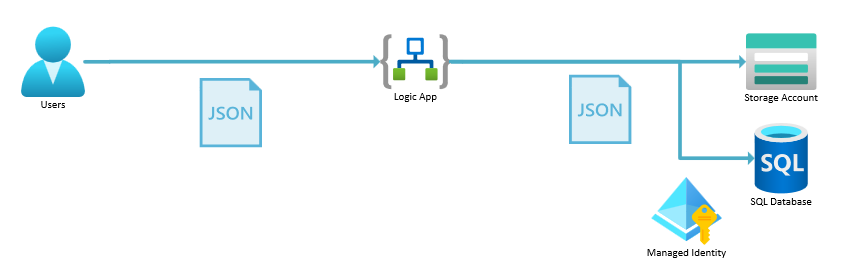

# Challenge 02 - Write to SQL

[< Previous Challenge](./Challenge-01.md) - **[Home](../README.md)** - [Next Challenge >](./Challenge-03.md)

## Introduction

In this challenge, you will add a new action to the workflow to write the data from the JSON input into a table in `SQL`.

## Description

You will be setting up a new Logic App workflow to enable the following architecture.



- Login to the `SQL` database in the Azure portal & create a table similar to below
    ```sql
    CREATE TABLE [dbo].[ORDERS] (
      [ID]                 [int]           IDENTITY(1,1) NOT NULL,
      [ORDER_NAME]         [nvarchar](50)                NOT NULL,
      [PART_NAME]          [nvarchar](50)                NOT NULL,
      [CLIENT_TRACKING_ID] [nvarchar](50),
      [SAP_ORDER_ID]       [nvarchar](50),
      [CREATE_DATE]        [datetime]      DEFAULT(getdate())
    );
    GO;
    ```
- Create a `SQL ID` for the the `Managed Identity` (user-assigned managed identity) of the Logic App to login to the `SQL` database and grant it access to the tables in the database (replace `id-ike2s2mwedmk4` with the name of your managed identity from the Azure portal).
  ```sql
  CREATE USER [id-ike3s2mwedmk4] FROM EXTERNAL PROVIDER;
  ALTER ROLE [db_owner] ADD MEMBER [id-ike3s2mwedmk4];
  GO;
  ```
- Add a new `Sql Server` action to the `json` workflow to insert the data from the JSON input into a table in `SQL` (`OrderName` & `PartNumber` columns)
- Save & test your updated workflow to ensure it writes to both the Blob Storage account & `SQL` database

## Success Criteria

To complete this challenge successfully, you should be able to:
- Verify that the `ORDERS` table was created in the `SQL` database
- Verify that the managed identity of the Logic App has a `SQL ID` & access to the `ORDERS` table
- Verify that the `json` workflow writes to both the Blob Storage account & `SQL` database

## Learning Resources

- [Connect to an SQL database from workflows in Azure Logic Apps](https://learn.microsoft.com/en-us/azure/connectors/connectors-create-api-sqlazure?tabs=standard)
- [Create SQL ID for managed identity](https://learn.microsoft.com/en-us/azure/app-service/tutorial-connect-msi-sql-database?tabs=windowsclient%2Cef%2Cdotnet#grant-permissions-to-managed-identity)

## Tips

- Use the `Insert row (V2)` Logic Apps action (under `Azure`) & `Logic Apps Managed Identity` connection type to do the insert into the database.
- Note that the `Server name` is the _FQDN_ of the `SQL Server` (not just its name)
- Note that the `Database name` is the just name of the DB (not a FQDN and not including the server name)
- It is likely that you will see an error when trying to use the Logic Apps drop-down to select a DB after entering the `SQL Server FQDN` in the Logic Apps designer. This is because you didn't assign a role the managed identity at the _server_ level (not the _DB_ level). This prevents the managed identity from being able to list all the DBs on the server. You can work around this by manually entering the DB name in the drop-down field.
- You should be able to login to the `SQL` database using Azure AD authentication to execute the `SQL` commands.
- You should be able to use the `Query editor` in the Azure portal to interact with the database (but you could use `SQL Server Management Studio` if you prefer) 
- It is easiest to grant the managed identity `db_owner` role on the DB (for testing purposes). In production, you should grant it the least privileges required to do its job.
- Make sure the `Managed identity` field of the connector is set to use the `user assigned managed identity` in the SQL connector (similar to `id-bnkuvsd2aqks4`, not `System assigned managed identity`)