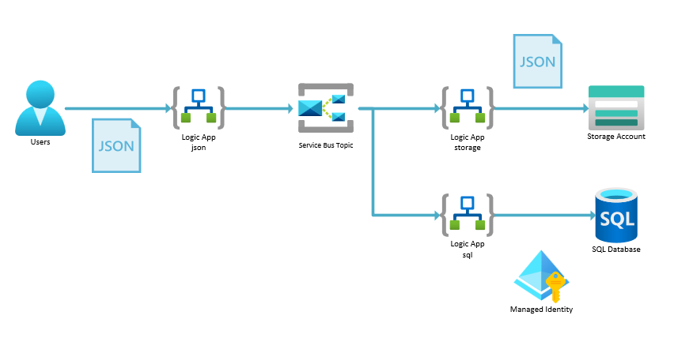

# Challenge 03 - Modularize & use Service Bus for integration

[< Previous Challenge](./Challenge-02.md) - **[Home](../README.md)** - [Next Challenge >](./Challenge-04.md)

## Introduction

When you first start using Logic Apps, it is very easy to make them too complex & hard to understand, with lots of branching logic & loops.

It is very common to instead _chain_ multiple small Logic Apps together. This makes them easier to understand & maintain. It also gives you more flexibility & scalability. A common pattern is to use a Service Bus topic to decouple the Logic Apps.

## Description

In this challenge, you will modularize the Logic App from the previous challenge & use a Service Bus topic to decouple the Logic Apps.

You will be _creating_ 3 Logic App workflows to enable the following architecture.

You will need to have 3 Logic App workflows named as follows:

- `json` - This will receive the `HTTP POST` from the caller & put a message on the Service Bus topic
  - Add a step to send a message on a Service Bus topic `json-topic`
  - Set the `Content` to the `Body` field from the JSON input
  - Set the `Label` to the `orderName` field from the JSON input
  - Remove the old steps to upload to Blob Storage & insert into `SQL`
- `storage` - This will receive the message from the Service Bus topic & upload to Blob Storage via the `storage-subscription` Service Bus subscription.
- `sql` - This will receive the message from the Service Bus topic, _decode/parse_ the JSON content from the `json` workflow & insert into `SQL` via the `sql-subscription` Service Bus subscription.

- Test and see if the blob is uploaded to the storage account & the `SQL` database has a new row

## Success Criteria

To complete this challenge successfully, you should be able to:
- Verify that the original `json` workflow now just accepts the `HTTP POST` & puts a message on the Service Bus topic
- Verify a new `storage` workflow has been created & receives the message from the Service Bus topic & uploads to Blob Storage
- Verify a new `sql` workflow has been created & receives the message from the Service Bus topic & inserts into `SQL`

## Learning Resources

- [Enterprise integration using message broker and events](https://learn.microsoft.com/en-us/azure/architecture/example-scenario/integration/queues-events)
- [Service Bus Topics & subscriptions](https://learn.microsoft.com/en-us/azure/service-bus-messaging/service-bus-queues-topics-subscriptions#topics-and-subscriptions)
- [Connect to Azure Service Bus from workflows in Azure Logic Apps](https://learn.microsoft.com/en-us/azure/connectors/connectors-create-api-servicebus?tabs=standard)

## Tips
- Use the `Service Bus->Send message` action (under the `Azure` tab) to put a message on the Service Bus topic. Set the `Authentication Type` to `Logic Apps Managed Identity`.
- The format of the `Namespace Endpoint` is `sb://<namespace>.servicebus.windows.net/`
- Use the `decodeBase64()` function to decode the JSON content from the Service Bus message in the `storage` and `sql` workflows (use the `Expression` tab in the `Insert row` action & then click on the `Dynamic content` tab to select the `Content`)