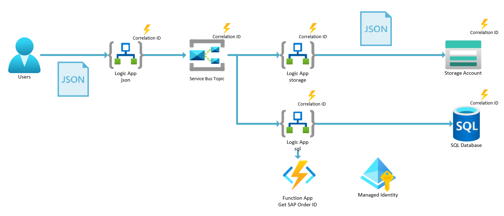

# Challenge 07 - Authenticate with AzureAD when calling custom API

[< Previous Challenge](./Challenge-06.md) - **[Home](../README.md)** - [Next Challenge >](./Challenge-08.md)

## Introduction

It is very common for Logic Apps to need to call out to other APIs as part of the workflow. These APIs are often protected via OAuth2. 

## Description

In this challenge, you will learn how to call out to a custom API that is protected by Azure Active Directory.

The architecture of the solution is as follows:



- Review the code for the pseudo-SAP order system (especially how to call it)
  - Look in the `src/api` directory
  - Try to call the endpoint that is deployed to Azure using Postman to get a feel for how to call it
    - `POST https://<function-app-name>.azurewebsites.net/api/SAPOrderSystem?orderName=order1`
- Enable `EasyAuth` on the Azure Function to simulate having to authenticate against an `OAuth2` endpoint to get an SAP order number
  - Use the `Microsoft` identity provider (which will automatically create an app registration in your tenant)
  - Enable the `HTTP 401 Unauthorized: recommended for APIs` option
  - Copy the `App (client) ID` for use later.
- Get the following info out of `Azure Active Directory` so you can assign the `Managed Identity` access to call your `Function App`
  - The `Object ID` of the `Enterprise App` (service principal) that was created when you enabled `EasyAuth` on the Function App (same name as the Function App)
- Get the `Object ID` of the `Managed Identity` that was created by the deployment script
- Grant the `Managed Identity` access to call the `Azure Function`
- Modify the `sql` Logic App workflow to call out to the Azure Function to get the SAP order number
  - Add a `HTTP` action to the workflow & call the Azure Function (using `Managed identity` authentication)
  - Add a `Parse JSON` action to parse the `body` results of the call to the SAP order number function
  - Add the results of the call to the SAP order number system to the row that is being inserted into the database (the `SAP_ORDER_ID` column)

## Success Criteria

To complete this challenge successfully, you should be able to:
- Verify that Easy Auth has been enabled to protect the Azure Function
- Verify the `sql` Logic App workflow is calling the Azure Function to get the SAP order number
- Verify the `sql` Logic App workflow is inserting the SAP order number into the database

## Learning Resources

- [Run Azure Functions locally](https://learn.microsoft.com/en-us/azure/azure-functions/functions-develop-local)
- [Easy Auth](https://learn.microsoft.com/en-us/azure/app-service/overview-authentication-authorization)

## Tips
- Use the `func start` command to run the Azure Function locally
- Go to the `Enterprise Applications` blade in Azure Active Directory to find the `Object ID` of the `Enterprise App` (service principal) that was created when you enabled `EasyAuth` on the Function App (same name as the Function App)
- Use the following command to grant the Managed Identity access to the Function App service principal (you can run this in the Cloud Shell, substitute your own values)
  ```powershell
  Connect-AzureAD
  ```

  ```powershell
  New-AzureADServiceAppRoleAssignment -ObjectId {MANAGED-IDENTITY-OBJECT-ID} -Id 00000000-0000-0000-0000-000000000000 -PrincipalId {MANAGED-IDENTITY-OBJECT-ID} -ResourceId {ENTERPRISE-APP-OBJECT-ID}
  ```
  
- The `audience` of the Managed Identity authentication will be the `App (client) ID` of the Function App
