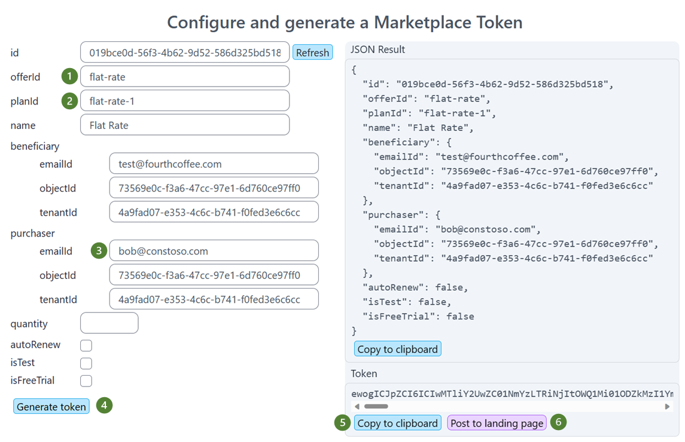
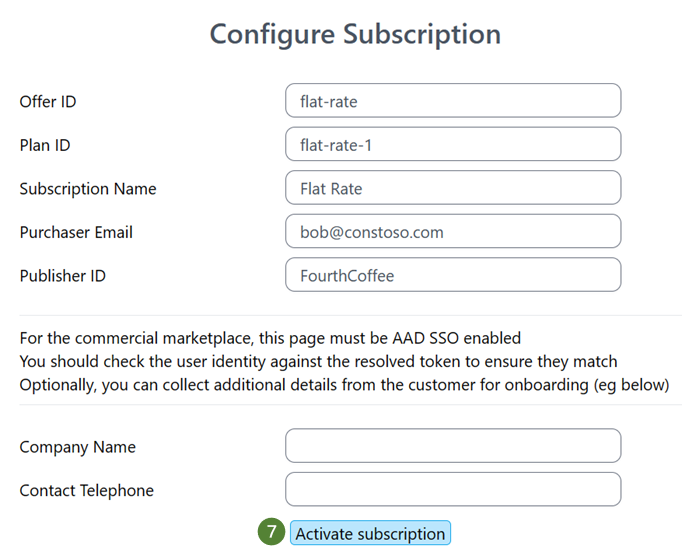
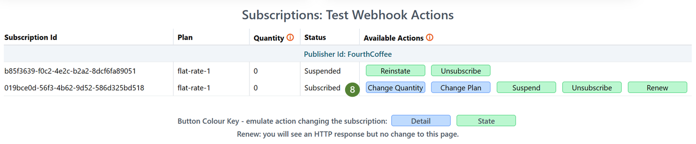
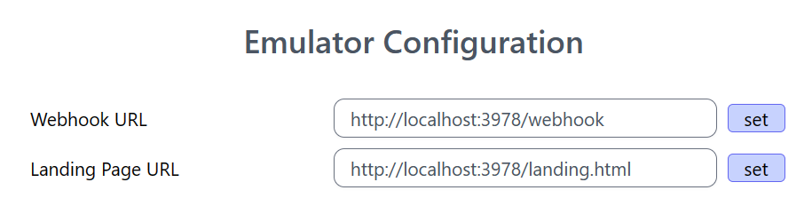

# Challenge 03 - Emulate! - Coach's Guide 

[< Previous Solution](./Solution-02.md) - **[Home](./README.md)** - [Next Solution >](./Solution-04.md)

## Notes & Guidance

**Using the emulator**
- navigate to the Emulator in a browser
- enter the offerId and planId
- optionally enter a friendly name for the plan
- enter the email address
- click **Generate Token** - until this point the panel on the right will be empty
- under Token on the right click **Copy to Clipboard**
- paste the copied token into a Base64 Decoder
  - [GCHQ's CyberChef](https://gchq.github.io/CyberChef/) (provided in th student resources documentation)
  - [Base64 Decode](https://www.base64decode.org/) 
- click **Post to landing page**

- on the **Landing Page** click to **Active subscription**

- go to the **Subscriptions** page
- use the buttons to work through the subscription states
- Webhook and API statuses are displayed in the top right

**Troubleshooting:**
If the emulator is running and there is a problem with the emulator operations check the student's config settings on the URL / port settings.

