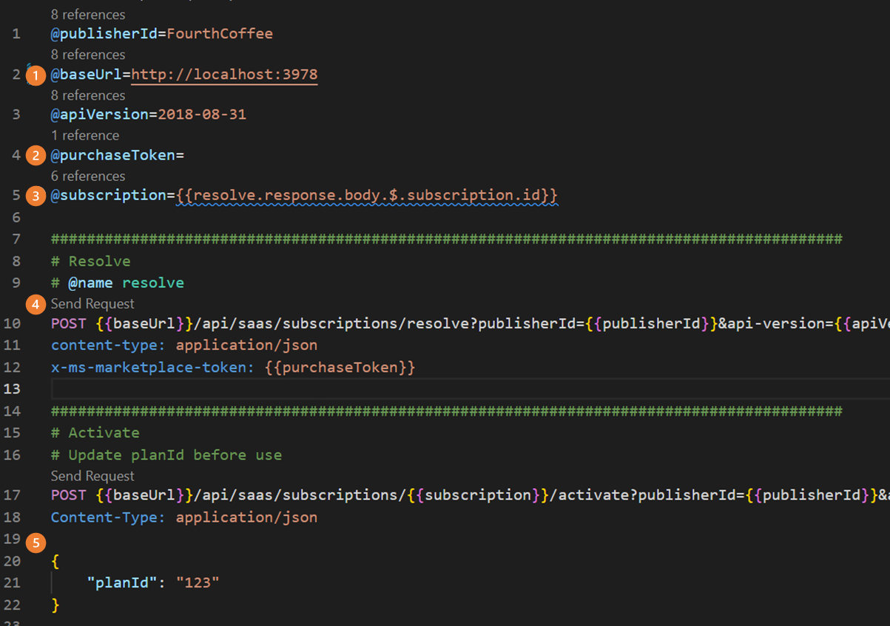
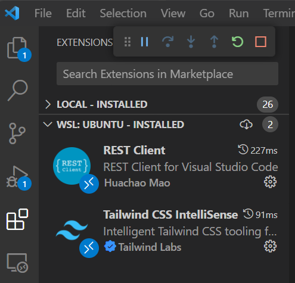

# Challenge 06 - Exploring the APIs - Coach's Guide 

[< Previous Solution](./Solution-05.md) - **[Home](./README.md)** - [Next Solution >](./Solution-07.md)

## Notes & Guidance

There is no code to write in this challenge just walking through the API calls in **VS Code**. 

**Key Points to note**
- the challenge uses a file in the Emulator: `rest_calls/subscription-apis.http`
- the baseURL should be updated to the correst host
- the purchaseToken is copied from the Emulator UI
- the subscription will be updated for some API calls
- to call the APIs click **Send Request**
- some API call will require variables to be updated in the request body

**Troubleshooting:**
If the emulator is running and there is a problem with the emulator operations check the student's config settings on the URL / port settings.

If the REST Calls are not working makre sure the **REST Client** is installed in VS Code, it should be listed in Extensions.

