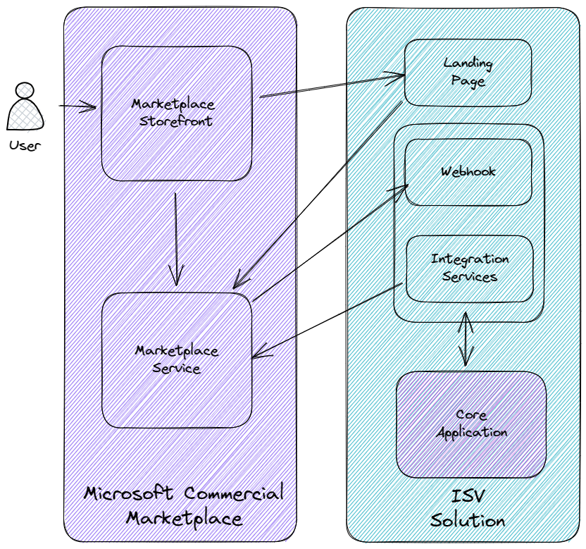

# Challenge 01 - Creating a landing page

[< Previous Challenge](./Challenge-00.md) - **[Home](../README.md)** - [Next Challenge >](./Challenge-02.md)

## Introduction

There are 4 principle actors in the process that manages the lifecycle of transactable SaaS offers in the marketplace:

- The marketplace itself (and the storefront the user interacts with eg the Azure portal, AppSource)
- A landing page for your solution for new customer onboarding
- A webhook for your solution to listen for messages from the marketplace
- An "integrations services" component that can call marketplace APIs on behalf of your application

We will cover all these areas in this *What The Hack*. In this challenge we will start with the landing page which
is critical to the new customer onboarding experience.

When a customer indicates their intention to purchase your solution in the marketplace, they are directed to your
landing page. The query string contains a token that is used to understand some basic details about the customer and
their desired purchase. The landing page is also your opportunity to capture any additional information as part of the
onboarding journey and confirm the customer's purchase.

## Description

In this challenge you will configure an initial landing page for your solution.

A skeleton application that will be used throughout the hack can be found in the `/Challenge01` folder of the
`Resources.zip` file provided by your coach. In this challenge you will be working on the `landing.html` file which
can be found in the `src/client` folder.

There are a number of Javascript stub methods in `landing.html`. In this challenge we will only be concerned with the
function `queryButtonClick`.

Your task is to update the function `queryButtonClick()` in `landing.html` to:

- Extract the query parameters from the URL
- Extract the value of the query string parameter `token`
- Assign that value to the variable `token` (already declared at block scope)
- Set the text property of the `
` html element with id `raw-token` to the value of the `token` variable
- Note, jQuery is already referenced on the page for you to use if you would like

## Success Criteria

To complete this challenge successfully, you should be able to:

- Verify that your landing page ("What the hack - Landing Page") displays when you hit F5 / Run + Debug
- Change the URL to `http://localhost:3000/?token=my-token`
- Verify that "my-token" is displayed in the "Click here to see the raw token" area when a user clicks the "Get token
from query string" button

## Learning Resources

- [Build the landing page for your transactable SaaS offer in the commercial marketplace](https://learn.microsoft.com/azure/marketplace/azure-ad-transactable-saas-landing-page)
- [Managing the SaaS subscription life cycle](https://learn.microsoft.com/azure/marketplace/partner-center-portal/pc-saas-fulfillment-life-cycle)
- [How can I get query string values in JavaScript?](https://stackoverflow.com/questions/901115/how-can-i-get-query-string-values-in-javascript)
- [URLSearchParams at MDN](https://developer.mozilla.org/docs/Web/API/URLSearchParams)
- [jQuery Docs](https://api.jquery.com/category/manipulation/dom-insertion-inside/)
