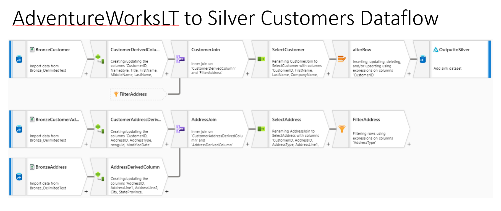
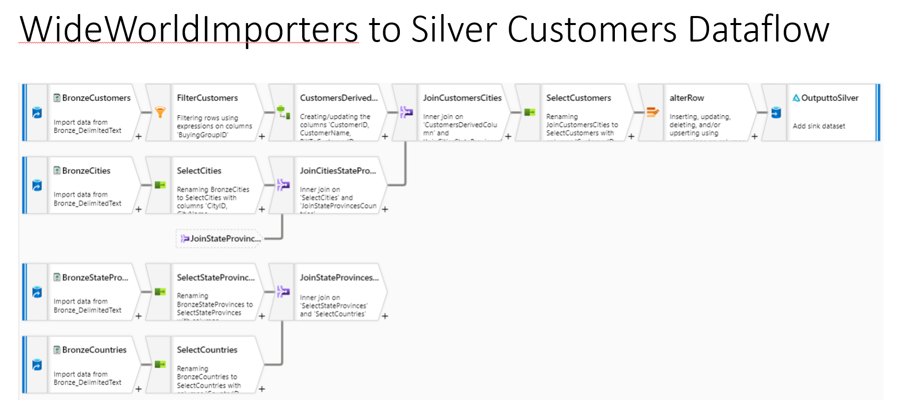

# Challenge 02 - Standardizing on Silver - Coach's Guide 

[< Previous Solution](./Solution-01.md) - **[Home](./README.md)** - [Next Solution >](./Solution-03.md)

## Notes & Guidance

Most of the students would gravitate towards using Azure Synapse Dataflows for this challenge.  
Based on the requirements of the challenge, it would be a good idea for them to familiraize themselves with the transformation options available.  
Example dataflows for both data sets are provided below as a reference:
  

  

  
__Bonus Challenge__:  
For the bonus challenge, we can use a GetMetadata or a similar pipeline object in Azure Synapse to check for files being present and copy over the file(s) at the end (or start) of a pipeline run.
