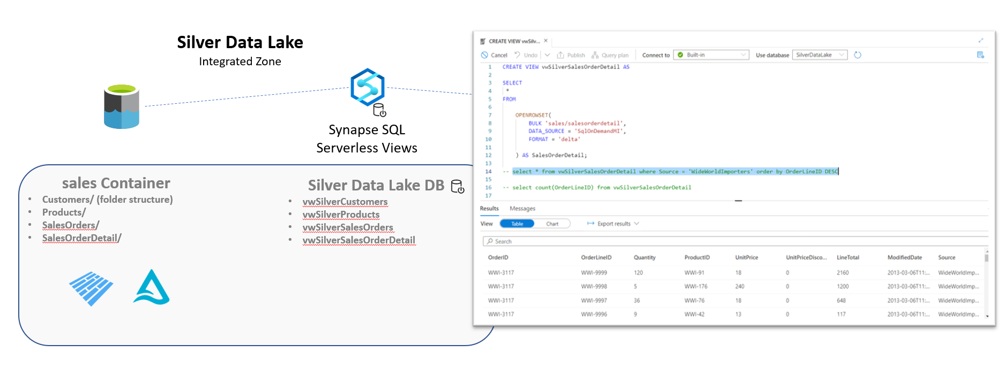

# Challenge 03 - Go for the Gold - Coach's Guide 

[< Previous Solution](./Solution-02.md) - **[Home](./README.md)** - [Next Solution >](./Solution-04.md)

## Notes & Guidance

Most of the focus in this challenge would be in setting up the Dedicated Pools, Databricks SQL or the Power BI Datamarts.   

For Column Level Security / Data Masking in Power BI Datamarts there is no way to do this dynamically.  Thus the users will most likely have to do some sort of replace values, etc. within the Power Qeury editor when brining the data into the Power BI Datamart.

__Bonus Challenge__:  
For the bonus challenges, the possible answers to those questions are:
- Azure Synapse Database Templates  
  [What are Azure Synapse database templates?](https://learn.microsoft.com/en-us/azure/synapse-analytics/database-designer/overview-database-templates)
- Using Azure Synapse Serverless SQL Views  
  [Create and use views using serverless SQL pool in Azure Synapse Analytics](https://learn.microsoft.com/en-us/azure/synapse-analytics/sql/create-use-views)  
  Details on what that would look like are added below.
  

  