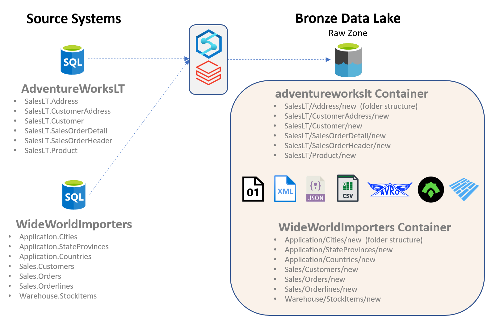

# Challenge 01 - Building Out the Bronze

[< Previous Challenge](./Challenge-00.md) - **[Home](../README.md)** - [Next Challenge >](./Challenge-02.md)

## Introduction

We are now ready to setup the environment and populate the data into the Bronze Data Layer.  For this challenge, we want to bring in the data "as is".  No data transformation is needed at this layer.

## Description

- __Environmental Setup__  
  We need to setup the proper environment for the Hackathon. Thus, we need everyone on the team to have access to the Azure Synapse and Databricks environments. Also, any ancillary resources such as Power BI, the Azure Storage Accounts and Key Vault.

- __Hydration of Data in the Bronze Data Lake__  
  For this challenge we will be working with two data sets, AdventureWorks and WideWorldImporters. Your coaches should provide with the details needed to connect to them.  
  The main goal is to use Azure Synapse and/or Azure Databricks and find ways to copy data from both the AdventureWorks and WideWorldImporters database.  While there are many tables in these databases, we will ask the team to either concentrate on either the customer data or the sales order data.  There is no need to do both.  
  If you are copying the customer data, we would ask that you only grab the customer and address information. If you are copying the sales order data, please copy in the product, sales order header and sales order detail information.   
    

  
Things to keep in mind about data in the Raw Zone:
- __Organized by Source__  
  Have a look at the above diagram to get an idea of what your storage organization would be like.
- __Data Landed in Native Format​__  
  In an effort to load data as-is, we often keep the data format in the Raw Layer the same as it is in the source. This means our Raw Layer often has CSV and TXTs, depending on the type of source.  
  That being said, if we manage to bring in the data in Parquet format instead, that would be an added bonus.
- __Additonal Checks__  
  - Schema Validated​  
  - Lake Hierarchy Applied​  
  - Timeliness Assessed​  
  - Elements Tagged​  
  - Completeness and Accuracy Accepted  
  

## Success Criteria
To complete this challenge successfully, you should be able to:

- Validate that all resources exist in one Resource Group and are tagged appropriately.
- Validate that all team members have proper access to all the assets; Storage Accounts, Synapse and Databricks Workspaces, etc.
- Showcase the data copied into the Bronze layer and be able to articulate the file type and folder structure and the reasons for your choices.
- Showcase that no credentials are stored in an Azure Synapse Linked Service or a Databricks Notebook.

## Learning Resources

The following links may be useful to achieving the success crieria listed above.

- [Azure Synapse access control](https://docs.microsoft.com/en-us/azure/synapse-analytics/security/synapse-workspace-access-control-overview) 
- [Use Azure Key Vault secrets in pipeline activities](https://docs.microsoft.com/en-us/azure/data-factory/how-to-use-azure-key-vault-secrets-pipeline-activities)
- [Databricks - Manage Users](https://learn.microsoft.com/en-us/azure/databricks/administration-guide/users-groups/users)
- [Access Azure Blob Storage using Azure Databricks and Azure Key Vault](https://learn.microsoft.com/en-us/azure/key-vault/general/integrate-databricks-blob-storage)

