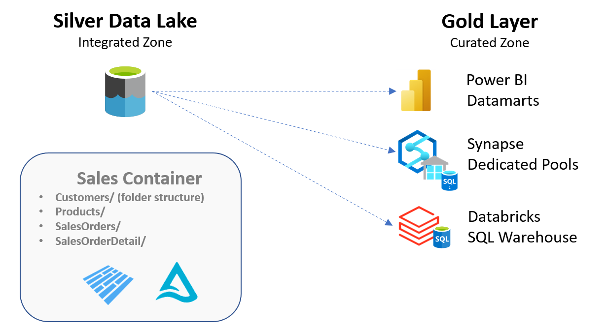

# Challenge 03 - Go for the Gold

[< Previous Challenge](./Challenge-02.md) - **[Home](../README.md)** - [Next Challenge >](./Challenge-04.md)

## Introduction
Now that we have our data arranged into more standardized and integrated datasets, it's time for the final push into the Gold Layer, also know as the Curated Layer, which is in most cases the last leg of our data transformation journey.   

In the Gold Layer we expect the data to be ready for consumption for the business users and downstream systems.  Thus, the consumers of this data can just plug into the data and expect row level security, data masking, data aggregation, etc. to be incorporated. 

## Description
Some of the things we try to achieve within the Gold layer are
- __Consumer Specific Data Models__  
  One of the ways of getting the data ready for consumption is molding it into a data model that allows for quick and efficient access while being scalable as well. This can be achieved by using Azure Synapse Dedicated Pools, Databricks SQL or PowerBI Data marts, depending on your use cases.
- __Enforce Quality__  
  We have introduced some standardizations on the Silver Layer already but it's important to remember that the Gold layer will be the version of truth that is exposed to customer dashboards and other downstream reporting systems. So, we want to make sure that the data is consumable and clean, not just in terms of the data quality of specific fields but in terms of the entire data presented. We can do things like adding filters to reduce the amount of data being pushed forward if it does not benefit that consumer's use cases and we can aggregate data where applicable too.
- __Security__  
  Since the Gold Layer will be the go-to place for most of the organization to get their data, it's a good idea to focus on the security of this data too. Things like Row Level Security and Data Masking are often used here in addition to the normal Role Based Access Control mechanisms. 
  
The above steps can be achieved using Azure Databricks and/or Azure Synapse and/or Power BI.
A visual representation of the ask is shown below.  
  
 
  
## Success Criteria
To complete this challenge successfully, you should be able to:
- Validate that all the data has been transformed and has been loaded into the Gold layer in the appropriate data models using the points in the discussion above.
- Showcase row level security within the data.  It is up to the team to decide on how this will be implemented with regards to the table and how it is divided amongst users.
- Showcase how this data can also be accessed for reporting, when needed.

## Learning Resources
The following links may be useful to achieving the success crieria listed above.
- [What is dedicated SQL pool?](https://learn.microsoft.com/en-us/azure/synapse-analytics/sql-data-warehouse/sql-data-warehouse-overview-what-is) 
- [Load data into dedicated SQL pool](https://learn.microsoft.com/en-us/azure/synapse-analytics/quickstart-copy-activity-load-sql-pool)
- [Introduction to datamarts](https://learn.microsoft.com/en-us/power-bi/transform-model/datamarts/datamarts-overview)
- [What is Databricks SQL?](https://learn.microsoft.com/en-us/azure/databricks/scenarios/what-is-azure-databricks-sql)

## Bonus Challenge  
- Brainstorm and discover a quick and easy way to make use of pre-made data models to help support this challenge.
- Brainstorm and find a quicker way to access the Silver Layer data in-place without pushing to a physical model-based Gold Layer.
  